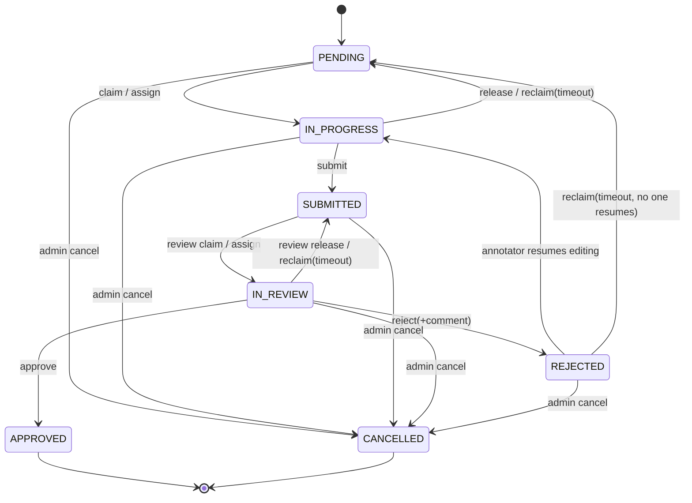

# smart-label 架构设计方案

> 本文档由架构设计 workflow 自动生成（7个子系统并行设计 + 3方案视频/IMU同步引擎竞标评审 + 汇总），供团队讨论拍板使用。

> 当前阶段：**仅设计，未写代码**。落地前需要先收口"开放问题"一节列出的关键分歧。

---

## 已拍板决策（收口 4 项最高优先级分歧）

### 决策① Clip 切片：异步队列 + 完成通知

采纳 `clip_ffmpeg` 子系统的队列表方案（`clip_groups` + `clip_jobs`），而不是 `db_schema` 的扁平表：

```sql
CREATE TABLE clip_jobs (
  id              BIGINT UNSIGNED AUTO_INCREMENT PRIMARY KEY,
  sample_id       BIGINT UNSIGNED NOT NULL,
  task_id         BIGINT UNSIGNED NULL COMMENT '人工框选来源任务，AI批量生成时为空',
  clip_source     ENUM('ai','human') NOT NULL,
  start_time_ms   INT UNSIGNED NOT NULL,
  end_time_ms     INT UNSIGNED NOT NULL,
  camera_channel  TINYINT UNSIGNED NOT NULL COMMENT '1/2/3，三路各生成一条job',
  status          ENUM('queued','processing','done','failed') NOT NULL DEFAULT 'queued',
  priority        TINYINT NOT NULL DEFAULT 5 COMMENT '交互式框选=10，AI批量=1，防止批量任务饿死实时请求',
  clip_file_path  VARCHAR(500) NULL COMMENT '完成后落盘的NAS相对路径',
  error_message   VARCHAR(500) NULL,
  requested_by    BIGINT UNSIGNED NULL,
  created_at      DATETIME NOT NULL DEFAULT CURRENT_TIMESTAMP,
  finished_at     DATETIME NULL,
  UNIQUE KEY uq_clip_dedup (sample_id, clip_source, camera_channel, start_time_ms, end_time_ms),
  KEY idx_clip_status_priority (status, priority DESC, created_at)
) ENGINE=InnoDB DEFAULT CHARSET=utf8mb4;
```

- 独立 worker 进程用 `SELECT ... FOR UPDATE SKIP LOCKED` 按 `(status='queued') ORDER BY priority DESC` 抢占任务，可多实例横向扩展
- **完成通知**：不引入 Redis/WebSocket，用 **SSE（Server-Sent Events）**——FastAPI 原生支持单向推送，前端框选提交后打开一个 `/api/clips/jobs/{group_id}/events` 长连接，worker 完成后写库的同时向内存里的连接注册表 push 一条事件；退化方案是前端每 2 秀轮询一次 `/api/clips/jobs/{group_id}` 状态接口，SSE 连接断开时自动降级为轮询，不引入额外基础设施

### 决策② 任务粒度：整段任务 + 可切分短任务并存

`tasks` 表增加可空的时间段边界字段，`NULL` 代表整段样本（长任务），非空代表该样本的一个子时间段（短任务）：

```sql
ALTER TABLE tasks
  ADD COLUMN segment_start_ms INT UNSIGNED NULL COMMENT 'NULL=覆盖整个样本（长任务）；非NULL=样本内子时间段（短任务）',
  ADD COLUMN segment_end_ms   INT UNSIGNED NULL,
  ADD COLUMN parent_task_id   BIGINT UNSIGNED NULL COMMENT '若由长任务拆分而来，指向被拆分的原任务，便于溯源',
  ADD CONSTRAINT chk_segment_range CHECK (
    (segment_start_ms IS NULL AND segment_end_ms IS NULL) OR
    (segment_start_ms IS NOT NULL AND segment_end_ms IS NOT NULL AND segment_end_ms > segment_start_ms)
  );
```

- 同一个 `sample_id` 下可以同时存在 1 个长任务 + N 个短任务，互不冲突（各自独立的行锁/状态机）
- 管理员在"样本详情"页可以：直接分配整段长任务；或框选时间段批量生成多个短任务（短任务生成时若与已有短任务时间段重叠需要提示，避免同一段被重复标注）

### 决策③ 标签不允许时间重叠

`annotation_label_items` 同一份标注记录（`annotation_record_id`）内，任意两条标签的 `[start_time_ms, end_time_ms)` 不能有交集——这是应用层强制校验（MySQL 无原生区间排他约束），落在 `annotation_service.py` 的保存/提交校验里：保存草稿时允许暂时重叠（画到一半的中间态），但**提交（submit）时强制校验非重叠**，有重叠则拒绝提交并返回冲突的具体标签 id 对，前端据此高亮提示。

### 决策④ 行为标签体系：管理员自定义 + 预留分层字段

不再假设标签是写死的 ENUM，改为独立的标签定义表，管理员通过后台 CRUD 维护：

```sql
CREATE TABLE label_definitions (
  id           BIGINT UNSIGNED AUTO_INCREMENT PRIMARY KEY,
  code         VARCHAR(50)  NOT NULL COMMENT '英文标识，如 scratch，供AI/API使用',
  display_name VARCHAR(50)  NOT NULL COMMENT '中文显示名，如 抓挠',
  color        VARCHAR(20)  NULL COMMENT '标注UI显示色，如 #F44336',
  parent_id    BIGINT UNSIGNED NULL COMMENT '预留分层字段，当前阶段一律为NULL（不启用分层），后续需要时直接可用',
  sort_order   SMALLINT NOT NULL DEFAULT 0,
  is_active    TINYINT(1) NOT NULL DEFAULT 1 COMMENT '停用后不再出现在标注UI，但历史标注记录仍保留引用',
  created_by   BIGINT UNSIGNED NOT NULL,
  created_at   DATETIME NOT NULL DEFAULT CURRENT_TIMESTAMP,
  UNIQUE KEY uq_label_code (code),
  KEY idx_label_parent (parent_id),
  CONSTRAINT fk_label_parent FOREIGN KEY (parent_id) REFERENCES label_definitions(id)
) ENGINE=InnoDB DEFAULT CHARSET=utf8mb4;
```

`annotation_label_items.label_id` 改为外键指向 `label_definitions.id`（而不是存字符串），管理端提供标签的增删改查页面（对应前端 `admin/label-definitions/` 模块，需要补进目录结构）。

### 决策⑤ AI 预标注 JSON 格式：参考 Label Studio 导出结构

AI 侧生成 `data_labeled_ai/` 下的 JSON，格式对齐 Label Studio 的 `timeserieslabels` 导出结构，便于团队已有的 AI 推理脚本（`export_yolo.py` 那条线）复用经验，同时保留置信度等 smart-label 需要的字段：

```json
{
  "sample_code": "26060315",
  "model_version": "behavior_cls_v1",
  "generated_at": "2026-06-03T15:20:00Z",
  "result": [
    {
      "id": "seg_0001",
      "type": "timeserieslabels",
      "value": {
        "start_time_ms": 12340,
        "end_time_ms": 15670,
        "label_code": "scratch",
        "confidence": 0.87
      }
    },
    {
      "id": "seg_0002",
      "type": "timeserieslabels",
      "value": {
        "start_time_ms": 20100,
        "end_time_ms": 24300,
        "label_code": "sleep",
        "confidence": 0.95
      }
    }
  ]
}
```

后端 `POST /api/samples/{id}/ai-labels` 接口接收该文件、校验 `label_code` 是否存在于 `label_definitions`、按上面决策③的非重叠规则校验后，落盘到 NAS 并写入 `annotation_records`（`source_type='ai_generated'`）+ 逐条 `annotation_label_items`（`source_type='ai_generated'`, `is_modified=0`）。

### 决策⑥ 账号注册：无公开注册页，管理员手动建号

服务外网可访问，但用户固定是内部5-7人+外包3人，不做自助注册审核流程：

- **首个管理员**：一次性 CLI 脚本 `scripts/create_admin.py`（部署时手动运行一次，交互式输入用户名/密码，直接写库），不经过 Web 界面，避免"谁先注册谁是管理员"的竞态风险
- **其他账号**：管理员登录后台"用户管理"页手动创建（用户名+角色+是否外包），系统生成随机临时密码，管理员通过其他渠道（微信/邮件）告知，首次登录强制修改密码（`users` 表加 `must_change_password TINYINT(1)` 字段）
- 不提供任何公开的 `/register` 接口或页面

### 决策⑦ 端口与超时参数

- **端口分配**：后端 8283，前端 8284（与现有 Label Studio 的 8181-8183 错开）
- **任务超时回收**：标注任务 48 小时、审核任务 24 小时未收到心跳自动回收为待分配；前端每 30 分钟发一次心跳（`PATCH /api/tasks/{id}/heartbeat`）推迟 `lock_expires_at`，后台定时任务扫描过期任务批量回收

---

## 架构总览

## 总体架构

smart-label 是一个独立的三层 Web 应用：React(TS) SPA → FastAPI 单体后端（模块化路由+服务层）→ MySQL 8.0（仅存路径索引与业务状态）+ NAS（/home/toky/ai_data/，存全部真值大文件）。全程无 Redis；所有"需要异步/去重/防抖"的能力都用 MySQL 的 SELECT...FOR UPDATE [SKIP LOCKED]、命名锁 GET_LOCK，以及 FastAPI 进程内 APScheduler 或独立 worker 进程实现，与"任务并发抢占防重复"这条既定原则保持同一套技术语言。

安全边界：前端永远不接触 NAS 真实路径，只持有数据库主键(file_id)。JSON/业务接口走 Authorization: Bearer（短时 JWT + MySQL 存储的可轮换 refresh token，用 token_version 字段替代 Redis 黑名单做秒级强制失效）；`<video>` 原生标签无法带 Header，用"进入任务页时换取一个按 task_id 限定 file_ids 范围的短期媒体签名 token 拼在 URL query"解决，验证阶段纯本地验签不查库。数据隔离不靠各接口各自加 WHERE，而是收敛到唯一入口函数 apply_task_scope(query, user)，annotator 强制过滤到自己名下任务，越权访问一律返回 404。

任务状态机与并发：核心表 tasks/annotation_records/review_records 以状态机（待分配→标注中→已提交→审核中→已通过/驳回重标）驱动，认领用单条原子 UPDATE...WHERE status='PENDING'（InnoDB 行锁天然防止两人抢同一任务），公共任务池用 FOR UPDATE SKIP LOCKED 避免互相阻塞；心跳续期与草稿保存拆成两个接口，避免"只看不动手"被误判超时；后台超时回收、clip 生成、IMU 入库三处各自独立设计了"MySQL 队列 + worker 轮询"的无 Redis 异步机制，属于同一模式的三次独立实例化（见开放问题）。

3路视频+IMU同步引擎（已完成方案评审，结论已采纳为基线）：放弃全自绘 Canvas/WebGL 引擎与三状态库并存方案（对 8-10 人非专职前端团队工程成本过高），选择"uPlot(Canvas) 渲染 IMU 六轴曲线 + 原生 `<video>`×3 + requestVideoFrameCallback 驱动的自研 TimeSyncController"为骨架：高频时间路径（~60Hz 播放头广播、曲线游标、视频缩放）完全绕开 React reconciliation（Zustand transient subscribe / ref 直写 canvas / CSS transform 合成层操作），仅离散事件（play/pause、提交草稿）进入 React 常规渲染路径；辅以强制虚拟化长列表、`contain:layout style paint` 兜底重排范围、全局仅保留一处经读写分离改造的 ResizeObserver。这三条对策分别结构性对应 Chrome DevTools 诊断出的 ResizeObserver 强制回流、pointerover 大范围样式重算、Layout 占主线程过高（INP 581ms）三个 Label Studio 病灶根源，而非头痛医头。

IMU 降采样：CSV 入库时转为列式二进制缓存(Parquet)并预计算一份全时长概览(约2000点)，缩放/平移/滑块窗口统一调用同一个 /series 接口，在缓存上做窗口切片+自研"跨通道联合选点 LTTB"（六轴共享同一组真实采样点，满足 uPlot 多 series 共享 x 轴的硬约束，也保证点击曲线跳转视频的时间精度）。

Clip 切片：框选后立即返回 202+group_id，不阻塞请求线程；独立常驻 ffmpeg worker 池用 SKIP LOCKED 抢占任务，优先 `-c copy` 流复制（速度快，代价是关键帧对齐误差），产物 ffprobe 校验后原子 rename 落盘；AI 批量生成与人工交互共用同一张队列表，用 priority 字段防止批量任务饿死交互式请求。

统计看板：当前数据量级（8-10 名标注员，年增万级任务、十万级标签记录）下直接实时 SQL 聚合 + 组合索引即可，不建预聚合表，仅用进程内 TTL 缓存应对重复刷新；达到千万行量级或查询 P95 超预算再升级为每日快照表。

与现有基础设施的关系：smart-label 是全新代码，建议以 smart-label/backend 与 smart-label/frontend 落在仓库根目录下的独立 smart-label/ 子目录中，不改动、不复用现有 label_studio/ 目录下的任何脚本或数据；两套系统在迁移期可并行运行，端口、数据库、Nginx 配置需要与现有 label_studio 的 8181-8183 端口段错开分配（属于下方开放问题）。

需要特别提醒：本次提交的 7 份子系统设计文档是并行独立完成的，对同一批核心表（样本/任务/审核/切片/标签溯源）给出的字段、状态数量、是否含队列表等细节存在不完全兼容之处（如 db_schema 的 samples/tasks 与 task_workflow 的 raw_samples/annotation_tasks，5态 vs 7态状态机；db_schema 的扁平 clip_segments 与 clip_ffmpeg 子系统的 clip_groups+clip_jobs 队列表；db_schema 的 annotation_label_items 与 stats_dashboard 反推假设的 annotation_labels 字段粒度不同）。这些差异背后往往对应真正的产品/复杂度取舍（是否需要独立的审核认领步骤、是否需要作废状态、clip 生成要做到多鲁棒），已整理进下方开放问题清单第 1 条，需要用户拍板后才能收口成一份唯一权威 schema 交付开发。


---

## 建议目录结构

```
label_infra/                          # 仓库根目录（已存在，不改动）
├── label_studio/                     # 已有 Label Studio 部署（不改动，迁移期保留作为回退方案）
├── data/                             # 已有运行时数据（不改动）
├── win/                              # 已有（不改动）
├── README.md                         # 已有（不改动）
└── smart-label/                      # 【新增】smart-label 独立子项目根目录，与上述目录完全隔离
    ├── README.md                     # smart-label 专属说明（部署/启动方式）
    ├── .gitignore                    # node_modules/ __pycache__/ .env dist/ 等
    │
    ├── docs/                         # 架构与决策文档（本次评审产出物的落地位置）
    │   ├── architecture-proposal.md  # 本次架构评审文档本体（各子系统设计摘要 + 开放问题清单 + 拍板结果）
    │   ├── nas-layout.md             # NAS固定目录规范存档（data_raw/data_labeled_*/clip_cache/* + 待批准的扩展项如 imu_cache）
    │   ├── adr/                      # 关键架构决策记录（Architecture Decision Record，一项决策一文件）
    │   │   ├── 0001-schema-reconciliation.md      # 各子系统表结构分歧的最终收口结果
    │   │   ├── 0002-task-granularity.md           # 任务粒度拍板结果（整段样本 vs 切分时间段）
    │   │   ├── 0003-sync-engine-baseline.md       # 3路视频+IMU同步引擎评审结论存档（uPlot+原生video+rVFC）
    │   │   ├── 0004-background-jobs-topology.md   # 无Redis后台任务（超时回收/clip生成/IMU入库）是否统一
    │   │   └── 0005-clip-precision-tradeoff.md    # clip切片帧精度 vs 性能取舍拍板结果
    │   ├── db/
    │   │   ├── schema.sql             # 唯一权威建表SQL（收口各子系统分歧后的定稿版本，与alembic head同步）
    │   │   ├── er-diagram.md          # ER关系图（mermaid），供快速审阅表间关系
    │   │   └── seed_admin.sql         # 初始管理员账号种子数据
    │   └── api/
    │       └── openapi.snapshot.yaml  # 后端启动后自动生成openapi.json的最近导出快照，供前端对齐字段
    │
    ├── backend/                       # FastAPI 后端
    │   ├── pyproject.toml             # fastapi / sqlalchemy[asyncio] / alembic / pyjwt / passlib[bcrypt] /
    │   │                               # apscheduler / aiofiles / pandas or polars / pyarrow / cachetools
    │   ├── alembic.ini
    │   ├── alembic/
    │   │   ├── env.py
    │   │   └── versions/              # 数据库迁移脚本，唯一的schema变更入口，禁止手改线上表结构
    │   ├── app/
    │   │   ├── main.py                # FastAPI app入口：挂载路由 + CORS/CSRF/Gzip中间件
    │   │   ├── core/
    │   │   │   ├── config.py          # Settings：NAS_ROOT、MySQL DSN、JWT密钥、各类TTL配置
    │   │   │   ├── security.py        # 登录JWT：access token签发 + refresh token轮换/重用检测
    │   │   │   ├── media_token.py     # 媒体流专用短期签名token（<video>标签走query string鉴权）
    │   │   │   └── deps.py            # get_current_user / require_role(*roles) / get_db 等公共依赖
    │   │   ├── db/
    │   │   │   ├── session.py         # SQLAlchemy engine/session管理
    │   │   │   └── base.py
    │   │   ├── models/                # SQLAlchemy ORM模型，与 docs/db/schema.sql 保持唯一权威一致
    │   │   │   ├── user.py            # users（角色ENUM + is_outsourced）
    │   │   │   ├── sample.py          # 原始样本（3路视频+IMU CSV路径索引）
    │   │   │   ├── task.py            # 任务状态机（含locked_by/lock_expires_at软锁字段）
    │   │   │   ├── annotation.py      # annotation_records + annotation_label_items（标签级溯源）
    │   │   │   ├── review.py          # review_records（按轮次留痕）
    │   │   │   ├── clip.py            # clip切片相关表（队列化方案 vs 扁平表方案，取决于ADR-0005前的收口结果）
    │   │   │   ├── imu.py             # imu_files（降采样缓存元数据：sample_rate/channel_range/status）
    │   │   │   ├── media_file.py      # 统一NAS路径索引，供文件流代理use
    │   │   │   ├── background_job.py  # 【待ADR-0004拍板】若采用统一异步任务表，落在这里
    │   │   │   └── audit_log.py
    │   │   ├── schemas/               # Pydantic请求/响应模型，与models/一一对应
    │   │   ├── api/
    │   │   │   └── v1/
    │   │   │       ├── router.py      # 汇总挂载所有子路由
    │   │   │       ├── auth.py        # /api/auth/login|refresh|logout|admin/force-logout
    │   │   │       ├── users.py       # 用户/角色管理（admin）
    │   │   │       ├── samples.py     # 样本导入/查询（admin）
    │   │   │       ├── tasks.py       # 认领/指派/心跳/草稿/提交（三角色共用，统一走task_scope过滤）
    │   │   │       ├── reviews.py     # 审核认领/通过/驳回
    │   │   │       ├── media.py       # /api/media/{id}/stream|download —— Range代理，核心安全边界
    │   │   │       ├── imu.py         # /api/imu/{id}/meta|series —— LTTB降采样
    │   │   │       ├── clips.py       # /api/clips/requests —— 框选生成clip + 状态轮询
    │   │   │       └── dashboard.py   # 统计看板（admin）
    │   │   ├── services/              # 业务逻辑层：路由层只做参数校验+调用，不直接拼SQL
    │   │   │   ├── task_scope.py      # 【核心安全组件】apply_task_scope()，数据隔离唯一入口
    │   │   │   ├── task_service.py    # 认领/指派/状态流转/超时判定
    │   │   │   ├── annotation_service.py
    │   │   │   ├── review_service.py
    │   │   │   ├── media_resolver.py  # DB路径索引→NAS真实路径，含路径穿越二次校验
    │   │   │   ├── range_stream.py    # 手写 HTTP Range/206 分段流式响应（aiofiles分块读）
    │   │   │   ├── imu_downsample.py  # 多轴联合LTTB算法（numpy向量化）
    │   │   │   ├── clip_service.py    # clip去重量化(500ms bucket)、下单、状态查询
    │   │   │   └── dashboard_service.py # 工作量/完成率/驳回率/AI标签修改比例聚合查询
    │   │   ├── workers/               # 独立于API请求线程运行的后台常驻/定时任务
    │   │   │   ├── scheduler.py       # APScheduler：任务超时回收（GET_LOCK防多实例重复执行）
    │   │   │   ├── clip_ffmpeg_worker.py  # ffmpeg切片生成worker（SKIP LOCKED抢占式取任务，可多实例）
    │   │   │   └── imu_ingest_worker.py   # CSV→Parquet二进制缓存 + 概览金字塔生成
    │   │   ├── middleware/            # Gzip压缩、CSRF自定义头校验、访问日志脱敏（媒体token不落明文日志）
    │   │   └── utils/
    │   ├── tests/
    │   │   ├── test_task_locking.py   # 并发抢占/超时回收专项测试
    │   │   ├── test_media_security.py # 路径穿越/越权访问专项测试
    │   │   └── ...
    │   ├── scripts/
    │   │   ├── import_samples_from_nas.py  # 扫描NAS data_raw生成samples+tasks
    │   │   └── create_admin.py             # 初始管理员账号创建
    │   ├── Dockerfile
    │   └── .env.example
    │
    ├── frontend/                      # React + TypeScript
    │   ├── package.json               # react/react-dom/typescript/vite/zustand/@tanstack/react-query/
    │   │                               # @tanstack/react-virtual/uplot/react-router
    │   ├── vite.config.ts
    │   ├── tsconfig.json
    │   ├── index.html
    │   ├── public/
    │   ├── src/
    │   │   ├── main.tsx
    │   │   ├── app/
    │   │   │   ├── App.tsx
    │   │   │   ├── routes.tsx         # 按角色分路由+守卫（仅UI层隐藏，非安全边界，真正隔离在后端）
    │   │   │   └── providers.tsx      # QueryClientProvider等全局Provider
    │   │   ├── features/
    │   │   │   ├── auth/              # 登录、access token静默刷新（互斥队列防并发refresh误判重用）
    │   │   │   ├── annotation-workspace/   # 核心标注/审核工作台，对应"同步引擎"评审结论落地
    │   │   │   │   ├── sync/
    │   │   │   │   │   ├── TimeSyncController.ts      # 纯TS类：虚拟主时钟+漂移校正+缓冲门控，可独立单测
    │   │   │   │   │   └── useTimeSyncController.ts   # React Context包装，向组件树提供单例
    │   │   │   │   ├── state/
    │   │   │   │   │   └── playerStore.ts             # Zustand；高频currentTime仅供transient subscribe读取
    │   │   │   │   ├── video/
    │   │   │   │   │   ├── SyncedVideoPanel.tsx        # 单路视频：独立画面缩放(CSS transform，纯ref不进state)
    │   │   │   │   │   └── MasterTimelineStrip.tsx     # 视频区共享主时间轴，承担框选生成clip
    │   │   │   │   ├── imu-chart/
    │   │   │   │   │   ├── ImuChart.tsx                # uPlot包装：初始化一次，此后全走指令式API
    │   │   │   │   │   ├── uplotOptions.ts
    │   │   │   │   │   └── useImuData.ts               # React Query封装LTTB下钻请求
    │   │   │   │   └── shared/
    │   │   │   │       ├── resizeBatcher.ts            # 唯一允许的ResizeObserver：读写分离+rAF批处理
    │   │   │   │       └── useDebouncedValue.ts
    │   │   │   ├── tasks/              # 任务列表/我的任务/认领/草稿保存/提交（annotator视角）
    │   │   │   ├── review/             # 审核队列/审核详情/通过驳回（reviewer视角）
    │   │   │   ├── admin/
    │   │   │   │   ├── samples/        # 样本导入管理
    │   │   │   │   ├── users/          # 用户/角色管理
    │   │   │   │   ├── task-assignment/ # 任务分配看板
    │   │   │   │   └── dashboard/      # 统计看板（工作量/完成率/驳回率/AI标签修改比例）
    │   │   │   └── clips/              # clip预览组件（任务详情页/审核页复用）
    │   │   ├── components/             # 跨feature通用UI组件（含虚拟化列表封装）
    │   │   ├── api/                    # API client + react-query hooks，与后端api/v1路由一一对应
    │   │   ├── stores/                 # 非高频Zustand store（登录态、当前任务、工具模式等）
    │   │   ├── hooks/
    │   │   ├── types/                  # 与后端schemas对齐的TS类型定义
    │   │   └── styles/
    │   ├── tests/
    │   └── Dockerfile
    │
    └── deploy/                        # 部署与运维配置，独立于backend/frontend业务代码
        ├── docker-compose.yml         # mysql + backend api + workers(scheduler/clip/imu) + frontend nginx
        ├── nginx/
        │   └── smart-label.conf       # 反代配置，Range头透传；预留X-Accel-Redirect location（中期优化项）
        ├── systemd/                   # 不用docker-compose时的可选systemd unit文件
        │   ├── smart-label-api.service
        │   ├── smart-label-scheduler.service    # 任务超时回收，必须唯一单实例运行
        │   ├── smart-label-clip-worker.service  # ffmpeg切片worker，可多实例横向扩展
        │   └── smart-label-imu-worker.service
        └── env/
            ├── .env.example
            └── .env.production.example
```


---

## 视频 + IMU 同步引擎：三方案竞标评审（核心决策）

这是压垮 Label Studio 的部分（ResizeObserver 强制回流、pointerover 触发 85%+ DOM 样式重算、Layout 占主线程 20-28% 导致 INP 581ms），因此单独拉出三个独立方案对比评审，而不是直接指派一个方案。


### 方案：TimelineEngine：中央时钟总线 + 分层 Canvas/WebGL 自绘引擎（"React 管外壳，引擎管舞台"）

**概述**：核心思路是把"3路视频+IMU曲线"整个交互舞台从 React 的响应式渲染体系中完全剥离出来，做成一个独立的、由单一 requestAnimationFrame 主循环驱动的命令式引擎（TimelineEngine）。曲线、时间游标、悬停高亮、选区框全部用 Canvas（默认 2D，预留 WebGL 升级路径）以像素方式绘制，不再有任何"每个标注区域一个 DOM 节点 + CSS :hover"的结构；视频本体仍用原生 `<video>` 播放以吃满 GPU 解码/合成红利，缩放平移用 `transform`（合成器属性）而非改变布局尺寸；三路视频与曲线通过一个不可信任何单一时间源、带漂移纠正的"虚拟主时钟"双向联动。整个方案的纪律核心是"帧内读写分离 + 单一写入口"：所有几何测量只在 resize 时做一次且只读，所有可视更新集中在同一个 rAF 回调里一次性写入，React 只在低频离散语义事件（任务加载、草稿保存、提交、驳回）时才重渲染，播放/悬停/拖拽期间 React 树完全不动。这从结构上让 Label Studio 遇到的三个问题——ResizeObserver 强制回流、pointerover/pointerout 触发 85%+ DOM 样式重算、Layout 占主线程 20-28% 导致 INP 581ms——在新架构里都失去了产生的物质基础（没有海量标注 DOM 节点、没有读写交错的 RO 回调、没有随数据量增长的 React 树）。


**架构**


## 0. 设计预算（先定指标，再定架构）

| 指标 | 目标 | 对应 LS 问题 |
|---|---|---|
| 单次 pointer/click 事件处理器同步执行时间 | < 1ms（极端 < 2ms） | INP 581ms 的根因之一是事件处理器里塞了同步布局工作 |
| 单帧引擎绘制（rAF 回调，覆盖层） | < 2ms | Layout 占主线程 20-28% |
| 单帧引擎绘制（数据层，仅 zoom/pan 结束时） | < 8ms | 同上 |
| 舞台区（3路视频+曲线）常驻 DOM 节点数 | O(15)，不随标注/关键帧数量增长 | pointerover 触发 85%+ 样式重算 |
| ResizeObserver 实例数 | 舞台级 1 个（而非每个可交互元素 1 个） | ResizeObserver 强制回流 |
| INP | < 200ms（目标 < 100ms） | 581ms |
| 任何单任务时长 | < 50ms（长任务阈值） | 主线程被长任务阻塞导致输入延迟 |

这些数字不是事后验证指标，而是架构约束——下面每一节的设计都是在满足这些预算的前提下做出的。

---

## 1. 总体分层

```
React 层（外壳，低频离散渲染）
  ├─ 任务信息面板 / 工具栏按钮 / 提交驳回表单 / 统计面板
  └─ <StageHost>  ← 只挂载一次，把一个裸 DOM 容器交给引擎，此后不再管理其子树

TimelineEngine（命令式，vanilla TS class，脱离 React reconciliation）
  ├─ ClockBus              统一时间源 + 事件总线（无 MobX/Proxy，纯手写发布订阅）
  ├─ VideoSyncController    3路 <video> 的同步、漂移纠正、独立缩放
  ├─ IMUChartEngine         Canvas/WebGL 曲线渲染 + 交互 + 命中测试
  ├─ SelectionController    框选/clip 生成流程
  ├─ ResizeCoordinator      全局唯一 ResizeObserver 包装
  └─ FrameScheduler         唯一的 rAF 循环，所有"写"操作的单一入口
```

React 与引擎的边界只有两类：
1. **React → 引擎**：任务切换、模式切换（从零标注/AI预标注修改）等离散事件，调用引擎的命令式方法（`engine.loadTask(taskId)`）。
2. **引擎 → React**：通过 `useSyncExternalStore` 订阅一个**节流后**的快照（如"当前时间文本""选区起止""是否可提交"），快照更新频率由引擎内部限定在 ~10Hz，而不是每帧 60Hz——曲线和视频画面本身在引擎内部以 60fps 更新，但反映到 React 文本标签上完全不需要那么高频率，这一步就砍掉了 LS 里"每帧触发 React/MST 响应式更新→大范围 reconcile"的路径。

---

## 2. 三路视频同步引擎（VideoSyncController）

### 2.1 播放器载体：原生 `<video>`，不重造解码
三路视频**依然用原生 `<video>` 元素**播放，而不是把每帧 decode 到 canvas 再画——因为 3×720p 同步解码本身已经有相当的 CPU/GPU 开销，再叠加"每帧 drawImage 到 canvas"只会把预算白白烧掉，且失去浏览器对 `<video>` 的硬件解码/合成优待。"自己实现视频同步层"指的是**同步/时钟/独立缩放/覆盖指示这套协调逻辑自绘**，像素解码链路仍交给浏览器原生管线——这是刻意的性能取舍，会在 tradeoffs 中说明。

### 2.2 独立缩放（画面而非时间）：只用合成器属性
每路视频包一层固定尺寸的 `overflow:hidden` 容器，视频元素本体用
```
transform: translate(txpx, typx) scale(s);
transform-origin: 0 0;
```
做缩放平移。`transform` 是合成器属性，浏览器可以在**不跑 Layout、不跑 Paint** 的情况下单独在 GPU 合成线程更新——这正是绕开 Layout 占主线程 20-28% 这一问题的关键杠杆之一。缩放交互（滚轮/拖拽）的 pointer/wheel 处理器里只做：更新一个纯数字状态对象（scale/translate）→ 请求下一帧写入 transform；**不读取** `getBoundingClientRect`/`offsetWidth`（容器尺寸只在 resize 时缓存一次，平移边界钳制用缓存值计算）。缩放限位、宽高比换算全部是纯数学，没有任何 DOM 读操作插入到写操作之间。

### 2.3 虚拟主时钟 + 漂移纠正（而非以某一路 video 为绝对基准）
不依赖 `timeupdate` 事件（浏览器节流到约 4Hz，精度不够），改用 `requestVideoFrameCallback`（rVFC，Chromium/Safari 已支持，Firefox 做特性检测降级为 rAF+轮询 `currentTime`）在主路视频上驱动一个逻辑时钟 tick：
- 每个 rVFC 回调里只做**读**（三路 `video.currentTime`，纯 JS 属性访问，不触发布局）；
- 计算从路与主路的时间差；差值 < 80ms：不动（人眼不可辨）；80ms~500ms：用 `playbackRate` 做 ±2% 的柔性纠偏（避免生硬跳帧造成画面顿挫）；> 500ms（如刚发生过 seek）：硬 seek 对齐；
- 这一整套判断逻辑同步执行时间 < 1ms，且完全不涉及 DOM 几何。

### 2.4 单一写入口 + 来源标记，防止联动回环
任何"跳转时间"的请求（视频点击进度条 / 曲线点击 / 曲线框选）都必须走 `ClockBus.seek(time, source)`，`source` 是 `'video-N' | 'chart' | 'toolbar'`。三路视频与曲线各自的事件回调在收到"这是我自己发起的回声"时用 `source` 字段 + 一个 200ms 内的 generation 计数器直接短路，避免"视频A seek→总线广播→视频B/C seek→它们的 seeked 事件又反向广播"的死循环，这类回环若处理不好本身就是另一种隐藏的长任务/抖动来源。

### 2.5 HTTP Range 流式加载
`<video src>` 直接指向 FastAPI 的文件流代理端点，代理原样透传 `Range` 请求头与 `206 Partial Content` 响应（`Accept-Ranges: bytes`），配合 `preload="metadata"`（先出画面尺寸/时长）+ 用户交互后升级 `preload="auto"`，拖动进度条走浏览器原生的分段请求缓冲，不需要自己实现 MSE 分片。三路视频各自独立发起 Range 请求，互不阻塞。

---

## 3. IMU 曲线自绘引擎（IMUChartEngine）

### 3.1 数据管线：后端 LTTB → 二进制传输 → 视口分片缓存
- 后端按"当前可视时间窗 + 目标像素宽度"做 LTTB 降采样（需求已定，见架构总方案），返回**二进制**（`Float32Array` 按列打包，而非 JSON 数组）以省掉 JSON.parse 和大量小对象 GC 的主线程开销；
- 前端按"时间窗分片"（类似地图瓦片）缓存已下载的降采样结果，小幅平移/小幅放大时优先用相邻缓存分片的数据重新局部 LTTB 精炼（在 Web Worker 里做，见 3.4），避免每次拖动都发网络请求；
- 六轴共用同一套时间窗与降采样策略，作为 6 条独立 path 绘制在同一坐标系。

### 3.2 分层 Canvas：把"贵"的重绘和"每帧都要"的重绘物理分开
这是本方案对"避免布局抖动/最大化控制渲染时机"最直接的回应——用**多个堆叠的 canvas**，各自的重绘触发条件完全不同：

| 层 | 内容 | 重绘时机 | 典型成本 |
|---|---|---|---|
| L0 静态层 | 网格线、坐标轴刻度文字 | 仅当时间窗/缩放级别变化时；文字用离屏缓存/位图化，避免每帧 `fillText` | 低频，可达几 ms 但不常发生 |
| L1 数据层 | 六轴折线本体 | 仅当数据/时间窗变化（zoom/pan 结束或数据到达）时重绘；拖拽过程中可用变换近似（见下）代替重绘 | 中等，< 8ms |
| L2 覆盖层 | 播放游标竖线、选区框、hover 高亮 | **每帧**（60fps，播放时）或每次 pointermove（拖拽/hover 时） | 极低，< 2ms（只是 clearRect + 画一条线/一个矩形） |

播放时曲线上的"当前时间竖线"只在 L2 上 `clearRect` 后重画一条竖线，L0/L1 完全不动——这与视频"合成器属性更新"是同一个思路的 canvas 版本：把高频变化的视觉元素隔离到成本最低的重绘单元里。拖拽平移曲线时，L1 甚至可以先用 `ctx.drawImage(offscreenSnapshot, dx, 0)`（对已渲染位图做平移搬运）做即时反馈，松手后再触发一次真正的重算重绘，这样拖拽过程中主线程成本进一步逼近于零。

### 3.3 交互与命中测试：全部是数学，没有 DOM 元素可言
- 滚轮缩放：`wheel` 监听器设 `{passive:false}`（唯一需要该设置的监听器）以便 `preventDefault`，计算新的时间窗围绕光标 x 位置缩放；
- 拖拽平移：`pointerdown/pointermove/pointerup`，增量平移时间窗；
- 滑块窗口：也画在 canvas 上（自绘迷你缩略图+可拖拽窗口手柄），不用原生 `<input type=range>`，避免再引入一类独立的、带自己 hover/focus 样式的 DOM 控件；
- 框选（拖框生成 clip 时间段）：记录 pointerdown/pointermove 的 x 坐标转换为时间戳，L2 层实时画选区矩形；
- hover 高亮（如指到某个 AI 标签片段）：**没有对应的 DOM 元素**，命中测试是纯 JS——把片段的时间区间存成一个按起始时间排序的数组/区间树，pointermove 时对光标时间做一次二分查找，命中就在 L2 重绘高亮框。整个"hover"效果从头到尾没有触发浏览器样式系统一次。

### 3.4 Worker 化：把计算和绘制都请出主线程
`IMUChartEngine` 的渲染上下文用 `canvas.transferControlToOffscreen()` 转交给一个专用 Web Worker，六轴曲线的局部 LTTB 精炼、路径构建、实际 `ctx.beginPath/lineTo` 绘制调用全部在 worker 线程执行；主线程只负责把 pointer/wheel 事件的极小必要字段（类型、坐标、时间戳）`postMessage` 给 worker，worker 算完再把"当前 hover 的片段 id"等少量结果回传给主线程用于（节流后的）React 展示。这样即使曲线绘制这类工作本身有一定成本，也不会计入"输入事件处理"的主线程耗时，直接服务于 INP。

### 3.5 Canvas2D vs WebGL：默认 2D，留好升级路径
LTTB 把每个视口内每轴的点数压到约 1-3 千点，六轴合计不到 2 万点，Canvas2D `lineTo` 路径批量绘制在这个量级下完全够用（< 2ms/帧）。方案默认用 **Canvas2D**（实现简单、调试容易、文本渲染质量好），但 `IMUChartEngine.Renderer` 定义为一个接口（`draw(viewport, data)`），预留 WebGL 实现（例如用 instanced 线段 + SDF 抗锯齿画粗线）作为可插拔的第二实现——如果未来六轴同屏 + 连续缩放动画在实测中出现帧率不达标，可以只替换 Renderer 而不动整个引擎的时钟/交互/数据管线。

---

## 4. 双向联动协议（ClockBus 状态机）

```
State = {
  playback: 'playing' | 'paused',
  currentTimeSec: number,
  zoomWindow: { startSec, endSec },
  selection: { startSec, endSec } | null,
  lastSeekSource: 'video' | 'chart' | 'toolbar' | null,
}
```

- **视频 → 曲线**：VideoSyncController 的 rVFC tick 更新 `currentTimeSec`（内部，不经过 React）→ IMUChartEngine 订阅该字段变化，仅重绘 L2 游标线；
- **曲线 → 视频**：点击/框选曲线 → 换算出时间戳 → `ClockBus.seek(time, 'chart')` → VideoSyncController 对三路视频下发 `currentTime = time`（配合 2.4 的来源标记防回环）；
- **框选 → clip 生成**：拖框过程本身高频（pointermove）但只驱动 L2 重绘，**不触碰 React**；只有 `pointerup`（离散、低频）才把 `selection` 通过节流后的快照同步给 React，弹出"生成 10 秒 clip / 提交标注"确认面板，点击后调用后端 ffmpeg 切片接口。这一步严格划清了"高频交互"和"低频语义状态"的边界，是避免"每次鼠标移动都触发一次 React 渲染"的核心纪律。

---

## 5. 尺寸自适应：全局唯一 ResizeObserver + 读写分离

这是直接对应 LS "ResizeObserver 触发强制回流"问题的设计：

- **只有一个** `ResizeObserver` 实例（`ResizeCoordinator`），观察舞台的两三个顶层容器（视频区容器、曲线容器），而不是像 LS 那样可能给每个可交互子元素都挂一个；
- 回调里**只读** `entry.contentBoxSize`/`entry.contentRect`（ResizeObserver 规范本身在触发回调前就已经算好这个值给你，读它不会再引发一次同步布局）；把这些数字存进 `ResizeCoordinator` 的普通对象里，**在回调内部不做任何 DOM 写操作**；
- 真正的"写"（`canvas.width/height` 按 `devicePixelRatio` 重设、视频容器 CSS 变量更新）推迟到**下一个 rAF**里统一执行，与其他每帧写操作合并成同一次样式/合成批次；
- 这样保证同一个任务里绝不会出现"读 rect → 写样式 → 又读 rect"的交替模式——这正是强制回流（forced synchronous layout / layout thrashing）的成因，也是 LS 疑似踩中的坑。

---

## 6. 事件与样式重算隔离（对应 pointerover/pointerout 85%+ 重算）

- 舞台内**没有"每个标注片段/关键帧一个 DOM 节点 + CSS :hover"**这种结构，取而代之的是 3.3 节的纯 JS 命中测试 + canvas 重绘，因此 `pointerover`/`pointerout` 在整个舞台里最多只需要考虑 O(10) 级别的真实 DOM 元素（视频容器、canvas 本身、工具栏按钮），不存在"隐藏元素/共享祖先选择器牵连大片子树重算"的可能性；
- 舞台之外确实需要 hover 的 DOM（工具栏图标、任务列表行等），每个都用 `contain: content`（或至少 `contain: layout style`）包裹，把样式失效范围钳制在元素自身，杜绝因为共享祖先/组合选择器导致失效范围扩散到大片无关子树；
- canvas 元素本身不挂 `:hover` 样式规则（视觉反馈完全通过重绘像素实现），避免 canvas 节点自己的状态切换触发哪怕一次自身的样式重算。

---

## 7. 调度与主线程预算（对应 Layout 占 20-28% → INP 581ms）

- **单一 FrameScheduler**：全应用只有一个 `requestAnimationFrame` 循环驱动所有可视写操作（曲线 L2 重绘、视频 transform 更新、必要的 canvas resize 写入），而不是每个子组件各自订阅 rAF——避免同一帧内出现多次分散的样式写入，从而只触发一次 recalc style + 一次 composite，而不是 N 次；
- **事件处理器"零同步重活"纪律**：pointerdown/pointermove/wheel 等处理器里只允许"写入普通 JS 对象/ref + 请求下一帧"，任何 `getBoundingClientRect`、`offsetWidth`、同步的大量数据处理都被禁止出现在事件处理器的调用栈里——这是直接针对 INP（输入到下一次绘制的延迟）设计的规则，因为 INP 的大头往往就是事件处理器自身的同步阻塞时间；
- **长任务分片**：任务切换时需要构建曲线命中测试索引、预取首屏数据等一次性较重的工作，用 `scheduler.postTask`（不支持时降级 `requestIdleCallback`/手动 `setTimeout(0)` 分片）切成 < 50ms 的小块，并在有条件时用 `navigator.scheduling.isInputPending()` 检测，一旦有用户输入排队就让出主线程；
- **content-visibility**：舞台之外的离屏面板（任务列表、评论区等）用 `content-visibility: auto` + 显式 `contain-intrinsic-size`，不可见时其 Layout/Paint 成本直接跳过，不占用整体主线程预算；
- **React 树规模恒定**：舞台区域对应的 React 组件数量、深度都不随标注数量/关键帧数量/IMU 采样点数增长（因为它们都被画进了 canvas 而非渲染成 React 元素），所以不存在"数据越多，reconcile 越慢"的隐患，这也是 LS（数据驱动大量 timeline region 组件）容易踩坑、而本方案天然规避的地方。

---

## 8. 模块清单（供评审对照的组件表）

| 模块 | 职责 | 是否参与 React reconciliation |
|---|---|---|
| `ClockBus` | 统一时间/播放状态、来源标记防回环 | 否 |
| `VideoSyncController` | 三路 video 播放控制、漂移纠正、独立缩放 | 否 |
| `IMUChartEngine`（+ Worker） | 分层 canvas 渲染、交互、命中测试、LTTB 精炼 | 否 |
| `SelectionController` | 框选状态、clip 生成请求编排 | 仅离散确认动作触发一次 React 更新 |
| `ResizeCoordinator` | 全局唯一 RO，读写分离 | 否 |
| `FrameScheduler` | 唯一 rAF 写入口 | 否 |
| `ReactBridge`（`useSyncExternalStore`） | 节流后的只读快照，供 UI 文本/按钮态展示 | 是，但频率被引擎钳制在 ~10Hz 且只在值变化超过阈值时才通知 |
| `<StageHost>` | 一次性挂载引擎、传递容器 ref | 挂载一次，之后不再重渲染子树 |


**如何规避 Label Studio 的坑**


逐条对应 Label Studio 的三个具体病灶，说明新架构为什么在结构上就不会重现：

**1. ResizeObserver 触发的强制回流（forced reflow）**
LS 的典型病因是：给大量元素（每个标注区域/波形块）各挂一个 ResizeObserver，回调里做"读布局（getBoundingClientRect/offsetWidth）→ 写样式 → 又读”的交错操作，触发同步布局（layout thrashing），且回调数量随标注数量线性增长。
本方案的对策（见架构第5节）：
  - 全局只有 1-2 个 ResizeObserver 实例，观察的是舞台的顶层容器，不随标注/关键帧/IMU数据量增长；
  - 回调体只使用 ResizeObserver 规范自带的 `contentRect`/`contentBoxSize`（这本身不触发同步布局），且**只读不写**；
  - 所有需要的"写"（canvas 尺寸重设、CSS 变量更新）一律推迟到下一帧的 `FrameScheduler` 里统一执行，与回调物理隔离，从根上切断"同一任务内读写交替"的可能性。
  结果：ResizeObserver 相关的强制布局在本架构里数量上界是 O(1)/次窗口尺寸变化，而不是 O(标注数量)/每次任一元素尺寸变化。

**2. pointerover/pointerout 触发 85%+ DOM 元素样式重算**
LS 的病因几乎可以肯定是：每个标注区域/关键帧/时间轴分段都是一个真实 DOM 节点，配合 CSS `:hover` 规则（很可能还有共享祖先选择器或深层 flex/grid 布局），一次 hover 导致浏览器为大片共享祖先/兄弟子树重新做样式匹配与计算，覆盖到接近全部 DOM。
本方案的对策（架构第3.3、第6节）：
  - 标注片段、关键帧、选区、hover 高亮**全部是 canvas 像素**，根本不存在对应的 DOM 节点，因此 pointerover/pointerout 事件语义上就没有"85%的 DOM 元素"可供失效——舞台内真实可交互 DOM 节点数量固定在 O(10) 量级，与标注数据规模完全解耦；
  - hover 反馈的实现路径是"命中测试（纯数组/区间查找）→ 在覆盖层 canvas 重绘几个像素"，这条路径完全不经过浏览器的 CSS 选择器匹配/样式重算/布局系统，属于纯粹的位图重绘 + 合成，天然不会波及文档其他部分；
  - 舞台外少数确实用 DOM `:hover` 的元素（工具栏按钮等）用 `contain: content` 隔离，失效范围被 CSS containment 硬性限制在元素自身，不会像 LS 那样因为祖先/兄弟选择器让失效范围扩散。

**3. Layout 占主线程 20-28%，INP 581ms**
这通常是前两个问题叠加"数据驱动的响应式框架（React+MST）在每次交互后对随数据量增长的组件树做 reconcile+DOM 写入"的复合结果：事件处理器同步触发了强制布局，又叠加了大范围重渲染带来的样式/布局工作，事件从"被处理"到"下一次绘制"之间的主线程占用远超 200ms 的 INP 良好线。
本方案的对策（架构第7节，并综合前两节）：
  - 事件处理器本身被限定为"零同步重活"：只写引用/普通对象，不读布局、不做重计算，执行时间 < 1ms 量级，直接压低 INP 里"处理时长"这一项；
  - 高频视觉更新（游标线、hover 高亮、缩放平移）全部走合成器属性（`transform`）或 canvas 位图重绘，二者都不需要主线程跑 Layout（`transform` 甚至可以完全在合成线程更新），从结构上把 Layout 从"每次交互都跑一遍、且随数据量变慢"变成"只有窗口尺寸真正变化时才跑一次，且成本恒定"；
  - React 树规模、深度不随标注/IMU数据量增长（数据都在 canvas 里，不是 React 元素），且引擎向 React 的更新已经过节流（~10Hz、且只在语义值变化时才通知），彻底移除了"每帧/每次 hover 都触发一次可能级联到大树的 reconcile"这条路径；
  - 曲线计算与绘制搬到 Worker（OffscreenCanvas + LTTB 精炼），进一步保证即使有计算量，也不占用"事件处理→下一帧绘制"这条 INP 关键路径上的主线程时间；
  - 唯一的写入口（`FrameScheduler`）保证每帧只有一次样式/合成批次，而不是像响应式框架那样可能在一次交互里触发多轮微任务/多次布局的连锁反应。
  结果：Layout 的触发频率和成本都从"随标注数据量和交互频率增长"变成"只在窗口 resize 时发生、成本恒定且极低"，事件处理器与绘制路径都不再包含会强制同步布局的操作，INP 的两个组成部分（处理时长、下一次绘制前的开销）都被架构性地压缩。


**取舍**


**工程成本与团队能力要求更高**：放弃图表库和"DOM+CSS即UI"的简单心智模型，自己维护时钟总线、分层 canvas、命中测试、Worker 通信协议、漂移纠正算法，初期开发量和调试难度明显高于直接用 uPlot/Chart.js 之类轻量图表库（uPlot 本身内部也是 canvas 实现、体积仅几十 KB，如果时间紧张可以作为"半自绘"折中方案，但会失去与视频时钟共享调度、与 WebGL 升级路径统一渲染管线等本方案特有的可控性）。团队需要有人熟悉 Canvas2D/WebGL、Web Worker、requestVideoFrameCallback 等相对小众的 API。

**测试与 QA 复杂度上升**：canvas 内容没有 DOM 结构，Playwright/Cypress 这类基于选择器的端到端测试无法直接断言"某个标注区域被 hover 高亮了"，需要额外建设测试专用的调试接口（如引擎暴露 `getHitTestResult()`、canvas 快照像素比对，或者一个仅测试环境启用的"影子 DOM 层"用于断言坐标），这是需要在测试策略里单独规划的成本。

**浏览器兼容性与降级复杂度**：`requestVideoFrameCallback`、`OffscreenCanvas.transferControlToOffscreen`、`scheduler.postTask` 在部分浏览器（尤其旧版 Firefox）上支持不完整，需要写降级路径（rVFC→rAF轮询currentTime，OffscreenCanvas→主线程绘制），这些降级分支平时较少触发、容易成为测试盲区，需要在浏览器矩阵里明确写清楚支持范围（本项目外网可访问且标注人员使用固定的内部/外包终端，实际上可以收窄到 1-2 款主流 Chromium 内核浏览器，从而把这块复杂度降到很低——建议在需求阶段就明确"标注端只支持 Chrome/Edge 最新版"）。

**视频不上 canvas 的取舍是双刃剑**：选择原生 `<video>` + transform 缩放而非把视频也画进 canvas，换来了解码性能和实现简单性，但代价是"在视频画面上直接叠加复杂逐帧标注可视化（如未来要在视频像素上画热力图/骨骼点）"这类需求会比纯 canvas 方案更难做（需要额外的覆盖层 canvas 对齐 transform，而不是直接在同一张画布上合成）。如果产品路线图明确会有这类"像素级叠加"需求，需要提前评估是否要在 clip 预览等次要场景引入按需的 canvas-video 模式（仅在暂停帧用 `drawImage` 截取，而非连续渲染，成本可控）。

**自绘意味着自担渲染正确性风险**：抗锯齿、DPI 适配（devicePixelRatio）、文字渲染清晰度、WebGL 上下文丢失（`webglcontextlost`）恢复等浏览器原生 DOM/CSS 会自动处理好的细节，全部要自己处理和测试；相应地也把"是否会重新踩上和 LS 类似的坑"的责任转移到了团队自己的代码纪律上——需要配套一份轻量的"性能护栏"（code review checklist + Chrome DevTools Trace 的 CI 抽查，检查长任务、forced reflow 警告、Layout Shift）而不是指望架构一次性解决问题后就不再需要关注。

**相对收益**：以上成本换来的是对渲染时机、内存布局、事件到绘制路径的完全确定性控制，理论上端到端消除了 LS 报告里的三个具体问题的成因（而不是缓解或绕过），且不受 Label Studio 未来版本 bug 修复节奏的制约；同时分层 canvas + 独立 Worker 的设计天然有 WebGL 升级路径，为未来数据量/交互复杂度进一步增长（更多轴、更长录制时长）预留了扩展空间。


### 方案：uPlot(Canvas) + 原生 <video> + requestVideoFrameCallback：主线程外驱动的双向联动引擎

**概述**：IMU 六轴曲线用 uPlot（纯 Canvas 渲染、无 DOM 节点承载数据点、~50KB）替代 Label Studio 的 TimeSeries 组件；3 路视频用原生 <video> + requestVideoFrameCallback 做帧级时间读取，配合一个独立于 React 渲染循环的轻量发布订阅"同步引擎"做主从时间广播。核心设计原则是：高频路径（视频帧回调、曲线光标移动）完全绕开 React 状态更新和 DOM 布局属性读写，只用 Canvas 重绘 + CSS transform（合成器层）表达，从而在结构上避免 Label Studio 暴露出的 ResizeObserver 强制回流、pointerover/pointerout 大范围样式重算、Layout 占主线程过高导致 INP 581ms 这三个具体问题，而不是靠"优化"缓解它们。


**架构**


## 1. 技术选型结论

| 候选 | 结论 | 理由 |
|---|---|---|
| **uPlot**（选用） | IMU 曲线主库 | 纯 Canvas 渲染，1个 canvas 元素承载任意点数（哪怕 50万点），不为每个数据点创建 DOM/SVG 节点；核心库 ~45KB gzip；内置 `setData` 增量更新、`setScale` 缩放、`setCursor` 光标快速重绘路径；插件架构完全开放，可插入自定义的框选（brush-select）和跨图联动逻辑，正好对应本项目"框选生成 clip + 视频跳转"的交互需求 |
| lightweight-charts（TradingView） | 备选，不作主选 | 同样 Canvas 渲染、性能优秀，但其数据模型和十字光标设计面向金融 OHLC/单值时间序列，6 轴叠加曲线 + 程序化帧级驱动光标（由视频 rVFC 回调驱动，而非鼠标）需要绕过其内部十字光标状态机改造成本高于 uPlot 的开放插件模型；作为团队更熟悉该库时的可选替代 |
| Label Studio 当前的 `TimeSeries`（d3/SVG 体系） | 弃用 | 是本次要解决的性能问题源头之一：SVG/DOM 承载数据点或大量覆盖层，天然进入"节点数越多、hover/resize 越贵"的陷阱 |

视频不引入 hls.js / MSE：源文件是 mp4（H.264），只要后端支持标准 HTTP Range（206 Partial Content）+ 文件本身用 `-movflags +faststart`（moov atom 前置）编码，原生 `<video src="...">` 就能让浏览器自己按需发 Range 请求拖动跳转，无需在前端自建分段缓冲逻辑，减少一整层可能引入 jank 的 JS 代码。三路播放器互相独立的 `<video>` 标签，天然利用浏览器/GPU 的硬件解码并行能力。

## 2. 组件与数据流总览

```
┌─────────────────────────────────────────────────────────────┐
│  SyncEngine（纯 JS/TS 单例，非 React 组件，非 MST）              │
│  - 不是 observable 深树，只有：masterTime, playState,           │
│    selection{t0,t1}, videoRefs[3], chartApi                   │
│  - 发布订阅：subscribe(key, cb) / publish(key, val)             │
└─────────────────────────────────────────────────────────────┘
        ▲ 高频（30-60Hz，rVFC 驱动，不经 React）        │ 低频（React state，4-10Hz 节流）
        │                                              ▼
┌───────────────┐  ┌───────────────┐  ┌───────────────┐   ┌─────────────────┐
│ VideoPanel #1  │  │ VideoPanel #2  │  │ VideoPanel #3  │   │ TimeReadout /    │
│ <video>+transform│ │ <video>+transform│ │ <video>+transform│  │ 其它低频 UI（React）│
│ 层（缩放/平移，   │  │ 层（缩放/平移，   │  │ 层（缩放/平移，   │   └─────────────────┘
│ 与同步引擎无关）  │  │ 与同步引擎无关）  │  │ 与同步引擎无关）  │
└───────────────┘  └───────────────┘  └───────────────┘
        │ 三路共用同一份 currentTime 语义，但各自控制 zoom/pan
        ▼
┌─────────────────────────────────────────────────────────────┐
│  IMUChartPanel（uPlot 实例，ref 持有，React 只挂载/卸载一次）      │
│  - 光标位置：u.setCursor(fast path)，Canvas 重绘，不碰 DOM 布局   │
│  - 框选：自定义 plugin，Canvas 覆盖层画选区，不新建 DOM 元素        │
│  - 缩放/平移：滚轮/拖拽 → u.setScale('x', {min,max}) → 触发       │
│    downsample 请求（debounce）→ FastAPI /imu/window?lttb=N       │
└─────────────────────────────────────────────────────────────┘
```

关键结构决策：**同步引擎是一个普通的、扁平的 JS 对象 + 发布订阅，而不是被 React 组件树 `observer()` 包裹的深层可观察状态**。Label Studio 用 MobX-State-Tree 把整棵标注区域树做成 Proxy 观察对象，任何字段变化都可能触发一批 observer 组件重新计算 render；本项目把"高频变化的量"（视频当前时间）从 React 状态里剥离出去，只在低频只读展示（如时间码文本、进度条百分比）时才落回 React state，且落回时做 4-10Hz 节流。这一条是后面第 6 节三个具体问题里"INP 581ms / Layout 20-28%"的直接对策。

## 3. 时间同步引擎：主从模型 + 帧回调驱动

**3.1 主从选举**
- 默认三路视频里指定一路为"主控"（如 video1），用户对任意一路做 play/pause/seek 操作时，该路临时升级为主控，其余两路降级为"跟随"，避免三路互相抢占产生环路。
- 主控视频挂 `requestVideoFrameCallback`（rVFC），回调中读取 `metadata.mediaTime`（比 `currentTime` 属性更接近真实渲染帧的时间戳），每次回调：
  1. 直接调用 `chart.setCursorX(mediaTime)`（uPlot 快速光标重绘路径，只重绘光标那一根竖线所在的 Canvas 区域，不触发数据系列重绘，也不触碰 DOM）；
  2. 回调结尾必须重新注册 `video.requestVideoFrameCallback(cb)`（rVFC 是一次性的，需要每帧手动续注册）。
- 跟随视频**不**挂 rVFC（避免 3× 的每帧回调开销），而是用较低频率（如 250ms 一次的 `timeupdate` 或轻量 `setInterval`）做**漂移校正**：`|follower.currentTime - master.mediaTime| > 阈值(建议 80~120ms)` 时才 `follower.currentTime = master.mediaTime`。阈值刻意设置得比"帧级精确"宽松，是为了避免频繁 seek 造成解码器抖动/卡顿——同步目标是"标注员肉眼看不出错位"，不是"逐帧锁存"。

**3.2 play/pause 传播 + 抗自环**
- 每个 video 元素维护一个 `isProgrammaticAction` 标志位。SyncEngine 对 follower 发起 `.play()/.pause()/.currentTime=` 前先置位，follower 自身的 `play/pause/seeking` 事件监听器看到该标志为真时直接跳过（不再向 SyncEngine 回报"我变化了"），避免 A 通知 B、B 又通知 A 的无限反馈环。
- `.play()` 返回 Promise：批量调用三路 `.play()` 后用 `Promise.allSettled` 等待，任何一路因缓冲不足被拒绝（常见于 Range 请求还没取到数据）时，暂停已经播放的其它两路并展示"缓冲中"提示，而不是任由三路播放进度各自失控地分叉。
- 缓冲前置校验：主控开始播放前检查三路 `video.readyState >= HAVE_FUTURE_DATA`，未达标时先暂停播放意图、显示 loading，不强行播放导致后续更大幅度的漂移校正（这本身也是在防止播放过程中产生突兀的 seek 造成的重排/丢帧）。

**3.3 图表 → 视频（点击/框选联动）**
- uPlot 自定义 cursor click 插件：监听 Canvas 上的 `pointerdown/pointerup`（只绑定在这一个 Canvas 元素上，不做事件委托到大容器），用 `u.posToVal(x, 'x')` 把像素坐标换算为时间值。
- 单击：`SyncEngine.seek(t)` → 对三路视频设置 `currentTime`（各自打上 `isProgrammaticAction` 标志）。
- 拖拽框选：自定义 brush 插件在覆盖 Canvas（与主图共享同一 Canvas 或叠加一个透明 Canvas，而非 DOM `<div>` 选区框）上绘制半透明矩形，`pointerup` 时得到 `[t0, t1]`，写入 `SyncEngine.selection`；UI 上出现"生成 clip"按钮（低频 React 状态，不影响热路径），点击后 POST `{t0, t1, videoIds}` 给后端 ffmpeg 切片任务。

## 4. IMU 图表实现细节

- **数据获取**：前端只请求"当前可视时间窗 + 目标点数"，如 `GET /api/imu/window?task_id=...&t0=...&t1=...&target_points=1800`（target_points 按图表容器 CSS 像素宽度 × devicePixelRatio 估算，通常 1.5~2× 屏幕像素宽度即可，不需要超过视觉分辨率的点数）。后端做 LTTB 降采样后返回。
- **传输格式**：返回**列式定长数值数组**（每轴一个数组，时间戳一个数组），前端直接构造 `Float64Array`/`Float32Array` 喂给 `uPlot.setData`；避免"数组套对象"的 JSON 结构，一是减少体积，二是减少 `JSON.parse` 之后还要做一次 `.map()` 转换对象数组为列式数组的主线程 CPU 开销（这类转换在几万点规模下也可能成为一次可感知的长任务）。数据量非常大时可进一步评估用二进制 ArrayBuffer 传输，省掉 JSON 解析本身。
- **缩放/平移交互**：滚轮缩放、拖拽平移都先在客户端对**已缓存的窗口数据**做即时的 `setScale` 视觉响应（不等网络），停止操作 150~250ms 后（debounce）才发起新的降采样请求替换为服务端精确数据；同时对相邻时间窗做预取缓存（LRU，比如缓存最近 5 个窗口），拖拽回退到已访问区域时可直接命中缓存不再等网络。
- **光标与联动竖线**：完全通过 uPlot 的 `cursor` 配置和 `u.setCursor()` API 驱动，这是 uPlot 提供的"只重绘光标层"的快速路径，代价是一次 Canvas 局部重绘，不触发浏览器的样式重算/布局阶段（这层与 DOM 完全无关）。
- **多轴显示**：6 个通道（加速度计 xyz + 陀螺仪 xyz）以 uPlot 多 series 共享一个 x 轴（时间）的方式叠加或分组显示，避免像当前 Label Studio 配置里每个 Channel 各自一个 `height="50"` 的独立渲染单元那样，让"一次时间窗刷新"变成"6 次独立组件更新"。

## 5. 视频独立缩放/平移层（画面缩放，非时间缩放）

- 每路视频外包一层 `<div class="video-viewport">`（`overflow:hidden`）+ 内层 `<div class="video-stage">` 包裹 `<video>`，缩放平移只对内层做 `transform: translate3d(x, y, 0) scale(s)`。
- 该 transform 完全是合成器（compositor）层的操作：只要给 `.video-stage` 加 `will-change: transform`（提升为独立合成层），浏览器可以在不重新计算布局、不重新计算样式、甚至不重新走绘制（repaint）阶段的情况下完成缩放/平移动画，全部工作发生在 GPU 合成阶段。
- 这与 Label Studio 疑似用 ResizeObserver 驱动"改变元素实际尺寸/触发内部 canvas 重建"的缩放实现方式是根本不同的路径——本方案的缩放**不涉及任何布局属性**（width/height/top/left 一律不动），天然不会进入"resize → 强制读取布局 → 触发回流"的链路。
- 手势处理：`wheel` 事件监听器只绑定在该视频面板的 `.video-viewport` 上（不是全局或大容器），且因为需要 `preventDefault()` 阻止页面滚动，显式设为非 passive，但作用域收得很窄；`pointerdown/pointermove/pointerup` 做平移拖拽，绑定同样限定在该元素本身。
- 缩放范围钳制（如 1x~4x）+ 平移边界钳制在纯数值计算里完成，不读取任何 `getBoundingClientRect`（缩放比例、容器尺寸在挂载时读取一次并缓存，只在真正的窗口/面板尺寸变化时才由下面第 6 节的批量 ResizeObserver 更新缓存值，日常缩放/拖拽操作完全走缓存值 + transform，不再做布局查询）。

## 6. 面板尺寸变化（分栏拖拽/窗口 resize）的处理纪律

- 全局只用**一个共享 ResizeObserver 实例**，观察 4 个顶层容器（3 个视频面板 + 1 个图表面板），而不是像素级地观察大量子元素/每条标注区域。
- ResizeObserver 回调本身只做一件事：把 RO 原生提供的 `entry.contentBoxSize`（浏览器已经算好的值，无需自己再 `getBoundingClientRect()` 去读）暂存到一个队列里，然后 `requestAnimationFrame` 里统一处理——即使一次分栏拖拽在几十毫秒内触发几十次 RO 回调，实际的"写"操作（`uplotInstance.setSize()`、更新视频 viewport 缓存尺寸）每帧最多执行一次，天然做了合并（coalesce）。
- 严格执行"本帧只读、下一帧才写"的批处理纪律：RO 回调这一步只读（且读的是 RO 自带数据，不主动触发同步布局查询），真正的尺寸写入（`setSize`/CSS 变量更新）放到下一帧，避免"读了 A 的布局又立刻写 B 的样式，再读 C 的布局"这种交替读写导致的强制同步布局（layout thrashing）。

## 7. Clip 预览的 hover 交互（列表可能出现的第二个 pointerover 密集场景）

- clip 列表（草稿区/审核区展示已生成的 10 秒切片）use 事件委托：整个列表容器只挂**一个** `pointerover`/`pointerout` 监听器，用 `event.target.closest('.clip-row')` 判断具体行，而不是给每一行单独挂监听器。
- hover 视觉反馈只用 CSS `:hover`（`background-color`/`color`/`box-shadow`，这些是 paint 阶段属性，不触发布局），不使用会改变盒模型的 hover 效果（如 hover 时改 padding/border-width/font-size 导致尺寸变化）。
- 长列表配合 `content-visibility: auto`（列表行）+ 每行 `contain: content`，视口外的行直接跳过布局/绘制计算。

## 8. 兼容性与降级

- `requestVideoFrameCallback` 在主流 Chromium/Firefox 已支持；对不支持的浏览器（极少数旧 Safari）降级为 `requestAnimationFrame` 循环里读 `video.currentTime`，精度略降（帧级 → ~16ms 级），但架构不变（依然在 React 渲染循环之外）。
- uPlot 依赖 Canvas 2D，无特殊兼容性问题。


**如何规避 Label Studio 的坑**


逐条对应用户列出的三个 Chrome DevTools 实测问题，说明"结构性避免"而非"事后优化"：

### 问题 1：ResizeObserver 触发的强制回流（forced reflow）

**LS 的典型成因**：RO 回调里读取布局属性（`offsetWidth`/`getBoundingClientRect`）来决定后续样式写入，且观察对象数量多（很可能是每个标注区域/每个可交互元素都挂了 RO），导致"读-写-读-写"交替，浏览器被迫在两次读之间同步刷新布局（layout thrashing），resize 一次引发多次强制同步布局。

**本方案如何结构性避免**：
1. **观察对象数量收敛到 4 个**（3 视频面板 + 1 图表面板），且用同一个 RO 实例，而不是随标注区域数量线性增长。
2. RO 回调**只读 RO 自带的 `contentBoxSize`**，不再主动调用 `getBoundingClientRect()`/`offsetWidth` 去二次查询布局——这一步本身就不构成"强制同步布局"的读。
3. 所有由 resize 触发的"写"（`uplot.setSize()`、缓存视频面板尺寸供 transform 计算使用）一律推迟到下一个 `requestAnimationFrame`，且一帧内只执行一次（合并多次 RO 触发），从根上切断"多次读写交替"的链路。
4. 视频缩放/平移**完全不经过 ResizeObserver**——用 CSS `transform`（合成器层），缩放动作本身不产生任何布局变化，也就没有什么可以被 RO 观察到、进而触发回流。
- **验证方法**：Performance 面板里对分栏拖拽/窗口 resize 录制，Layout Shift/Forced reflow (Recalculate Style / Layout 紫色条) 的触发次数应与 rAF 帧数同阶，而不是与 RO 原始回调次数同阶；Long Task 面板不应出现由 resize 引起的 >50ms 任务。

### 问题 2：pointerover/pointerout 触发 85%+ DOM 元素样式重算

**LS 的典型成因**：大概率是（a）监听器数量多——几乎每个可交互/标注元素各自绑定 hover 监听器；（b）hover 触发的 class 切换点位于树的较高层级，而对应 CSS 选择器影响面覆盖了大量后代元素，导致浏览器为保证正确性不得不对一大片子树重新做样式匹配和计算；（c）hover 效果本身可能改变了盒模型相关属性，二次触发布局。

**本方案如何结构性避免**：
1. **事件委托**：clip 列表、任务列表等一律在容器上挂**一个**委托监听器，配合 `closest()` 定位目标行，把监听器数量从"N 个元素各一个"降到"常数个"，从源头减少每次 hover 触发的 JS 执行面。
2. **hover 视觉效果限定为 paint-only 属性**（`background-color`、`color`、`box-shadow`、`outline`），明确禁止会改变几何尺寸的 hover 效果（padding/border-width/font-size），避免 hover 本身诱发布局。
3. **CSS Containment 边界**：每一行/每个面板显式加 `contain: content`（或 `contain: layout style paint`），这是对浏览器的强承诺——"这个子树内部的样式与布局变化不会影响子树外部"。有了这个边界，浏览器在做样式重算时可以把重算范围严格限制在被 `contain` 包裹的子树内，不需要为了保证正确性而向上/向外扩散到 85% 的 DOM——这是对"大范围样式重算"最直接的对策，而不是减少触发次数。
4. **`content-visibility: auto`** 应用于视口外的列表行：这些行在 hover 判定和样式重算阶段直接被跳过，因为它们根本没有参与当前的渲染树。
5. hover 状态不进入会导致大范围 React 重渲染的共享状态（如顶层 context/MST 观察树），保持在触发元素自身的局部状态或纯 CSS 层面，避免"一次 hover → 一次跨越大量组件的 re-render → 大量元素被重新计算样式"这种由状态管理层面放大出来的连锁反应。
- **验证方法**：Performance 面板对 hover 一行做录制，"Recalculate Style"这一步的 Affected Nodes 数应为个位数/十位数量级（该行及其直接父级），而不是随 DOM 总规模线性增长。

### 问题 3：Layout 占主线程 20-28%，INP 581ms

**LS 的典型成因**：高频事件（视频播放产生的时间更新、hover、resize）每次都级联触发"读布局属性 → React/MST 状态更新 → 组件重渲染（可能因深层可观察树而扇出到大量组件）→ 浏览器需要重新计算受影响子树的布局"，多个高频源叠加导致 Layout 阶段长期占用主线程，任一交互（点击/输入）都可能排在这些任务后面，抬高了 INP（Interaction to Next Paint，衡量"交互后到下一次绘制"的最坏延迟）。

**本方案如何结构性避免**：
1. **最高频的路径（30-60Hz 的视频帧回调 → 图表光标移动）完全不经过 React 状态更新**：`requestVideoFrameCallback` 回调直接调用 `uplot.setCursor()`，只触发 Canvas 局部重绘，不触发任何 DOM 属性写入、不触发 React `setState`、不触发 reconciliation，因此这条最高频的路径天生就不参与 Layout/Style 计算，也就不占用"Layout 20-28%"里的份额。
2. **需要展示给用户看的低频信息（时间码文本、进度）单独节流到 4-10Hz 才落回 React state**，与高频路径解耦，避免"每帧都触发一次 React commit"这种量级的主线程占用。
3. **同步引擎不用 MobX-State-Tree 式的深层可观察对象树**，改用扁平的发布订阅：一个值变化只通知真正订阅了它的极少数消费者，不存在"改一个字段、意外扇出到一大批 observer 组件重渲染"的放大效应——这正是要规避的、可能是 LS 里 Layout 占比高企的结构性原因之一。
4. **重活移出浏览器主线程**：LTTB 降采样在后端完成，前端只做 `setData` 这种 O(可见点数) 的 Canvas 绘制调用，不在主线程做大规模数值计算；网络传输用列式定长数值数组，避免大规模 `JSON.parse` 后再做对象转数组的二次开销占用主线程。
5. **视频缩放用 GPU 合成层 transform**，不产生布局；**resize 处理**做 rAF 合并（见问题 1）；**hover** 限定 paint-only 且用 containment 圈住重算范围（见问题 2）——三类高频交互源都被分别掐断了"触发 Layout"这一步，Layout 阶段自然不会像 LS 那样长期占用主线程的大份额。
6. **长任务拆分**：初始挂载 3 路视频 + 图表 + 任务列表等较重的一次性工作，通过分阶段挂载/`requestIdleCallback` 切片，避免出现单个 >50ms 的长任务挡在用户交互前面（长任务是拉高 INP 的另一个直接因素，即使与 Layout 无关也一并处理）。
- **验证目标**：INP 保持在"良好"区间（<200ms）；Performance 面板里 Layout/Recalculate Style 合计占比应显著低于 20%，且不与任一具体交互（点击播放/拖动进度/hover 列表）强相关地跳升。


**取舍**


- **工程量前置**：uPlot 不自带框选（brush-select）、跨图表联动光标这类交互，需要基于其插件 API 自行实现（预计需要 2 个自定义插件：cursor-drive 插件 + brush-select 插件）。这是用"更多定制代码"换"结构上不会重蹈 DOM 密集型图表库覆辙"，团队需要有能接受 Canvas 底层绘制思维的前端资源。
- **同步精度 vs 流畅度的取舍**：主从漂移校正阈值（建议 80~120ms）意味着三路视频不是逐帧锁存同步，而是"人眼不可见的近似同步"；如果未来需要逐帧级精确对齐（比如做跨镜头姿态测量而不只是行为标注），需要引入更严格的同步机制（如更小阈值 + 更频繁的强制 seek），但会增加 seek 频率、可能引入解码卡顿，是一个需要和标注/审核团队确认精度需求后再定的可调参数，不建议默认设为最严格。
- **视频缩放是"数字放大"而非"光学放大"**：CSS transform 缩放的上限是源分辨率（720p）决定的清晰度，超过一定倍数会出现模糊；如果后续需要看清更细节的动作（比如小幅度肢体动作），需要在编码阶段保留更高分辨率源或采用分级细节（tile/多分辨率）方案，属于超出本次前端引擎范围的额外成本。
- **后端 LTTB 降采样引入的网络往返延迟**：缩放/平移到未缓存过的新时间窗时，图表需要等一次网络请求（debounce 后）才能显示精确数据；已通过"先用缓存数据做即时视觉响应 + 预取相邻窗口"缓解，但极端情况下（连续快速大范围拖动）仍会有短暂的"先粗后精"过渡，是用户体验上需要提前对齐预期的点，而不是纯前端能完全消除的问题——它是"不能一次性传几十万点"这一约束的必然代价。
- **放弃 React 状态驱动高频路径，调试链路变长**：视频帧回调直接操作 uPlot 实例、不经过 React DevTools 可见的状态变化，意味着排查"曲线光标为什么没动"这类问题时不能只看 React 组件树，需要额外在 SyncEngine 里加日志/调试面板；这是用"可调试性的额外投入"换取"高频路径不产生 React 渲染开销"，建议在 SyncEngine 内置一个轻量的开发态事件日志（而非依赖 React DevTools）。
- **依赖后端能力就绪时间**：本前端引擎假设后端已提供 (a) 支持 Range 的视频流式代理接口、(b) `/imu/window` LTTB 降采样接口、(c) ffmpeg clip 切片任务接口；前端联调必须等这三者可用，架构评审通过后建议后端优先把这三个接口的最小可用版本（mock 数据也可）跑通，前后端可并行开发但集成节点由后端接口就绪时间决定。
- **兼容性降级**：`requestVideoFrameCallback` 在极少数旧浏览器不可用时降级为 rAF 轮询 `currentTime`，精度从"帧级"降到"约 16ms 级"，这个降级路径需要写但预计极少数用户会触发（内部+外包标注员的浏览器环境通常可控，可以直接要求使用现代 Chrome/Edge，从而完全不需要这条降级路径，是否需要保留由用户环境约束决定）。


### 方案：三层状态分离架构 + TimeBus 命令式热路径总线（Zustand 细粒度 slice + Jotai atomFamily + TanStack Query，Canvas 视频/曲线引擎旁路 React 渲染）

**概述**：核心思路：把"状态"按更新频率和影响范围严格分成三层——Hot Path（播放头时间、曲线游标、缩放/平移，60fps 级别，完全绕开 React，走一个独立的 TimeBus 命令式总线，直接写 Canvas/DOM transform）、Warm Path（播放/暂停、当前工具模式、待创建 clip 区间等离散交互状态，用 Zustand 多个小 store + 精确 selector 订阅，节流更新）、Cold Path（任务/标注/审核等服务端实体数据，用 TanStack Query 精确到实体的 query key 缓存，绝不整树失效）。视频用 3 个原生 `<video>`（不用 video.js/react-player 这类会引入自身 DOM 观察层的重封装），曲线用 uPlot（Canvas 绘制，非 SVG/非逐点 DOM），List 组件必须虚拟化 + Jotai atomFamily 做到"一行变化只重渲染这一行"。这套分层直接对应 Label Studio 的病因：MST 的隐式全局响应式导致一次 observable 变化牵连大范围重渲染/重排——本方案用显式、有边界的订阅取代隐式响应式，从架构层面切断"局部变化→全局重算"的传播路径。


**架构**


# 3路视频 + IMU 曲线双向联动 —— 前端核心引擎架构设计

## 0. 设计总纲：先诊断 Label Studio 的病根，再对症下药

Label Studio 的三个症状本质是同一个病根的三种表现：**MST（mobx-state-tree）的隐式深度响应式 + 未分层的单一状态树**，导致"任何一次微小状态变化（哪怕只是 hover 一下）都可能触发一条无法预测边界的响应链"，最终这条链落到 DOM 上就变成大范围 reflow/style recalc。

本方案的根本对策不是"把 MST 换成 Zustand 就完了"，而是**建立显式的、有边界的状态分层**，让每一类状态的"影响半径"在写代码的那一刻就是可推导的，而不是运行时才发现：

| 状态类型 | 更新频率 | 是否进入 React | 载体 |
|---|---|---|---|
| **Hot Path**：播放头时间、曲线游标位置、拖拽中的缩放/平移/框选预览 | 60fps / 逐 pointermove | **否，永不进入 React reconciliation** | `TimeBus`（自研发布订阅总线）+ Canvas 直绘 + CSS transform |
| **Warm Path**：播放/暂停、播放倍速、当前工具模式、已确认的 clip 选区、hover 高亮 id | 离散事件 / 节流 100-150ms | 是，但走精确 selector | Zustand（拆成多个小 store，非单一大 store） |
| **Cold Path**：任务列表、标注记录、标签本体、审核意见、用户信息 | 秒级/网络往返级 | 是，服务端缓存 | TanStack Query（精确到实体的 query key） |
| **高基数并行状态**：标注列表每一行、3 路视频各自的缩放状态 | 各自独立，互不影响 | 是，但每个实体一个原子 | Jotai `atomFamily` |

这张表是整个引擎的宪法：**任何新功能落地前，先问它属于哪一层，再决定用哪个工具。混用（比如把播放头时间塞进 Zustand 全局 store）是被明确禁止的反模式。**

---

## 1. 技术选型与职责边界

| 领域 | 选型 | 明确排除 | 排除理由 |
|---|---|---|---|
| 视频渲染 | 原生 3×`<video>` + 自研同步控制器 | video.js / react-player | 这类库自带内部状态机、DOM 事件重封装、UI overlay，等于在浏览器原生 `<video>` 之上再叠一层"观察者/响应式"逻辑，正是要规避的模式 |
| 曲线渲染 | **uPlot**（Canvas，~45KB） | Recharts / Victory / Nivo（SVG）、Chart.js（可用但对大数据集平移缩放优化弱） | SVG 图表库每个数据点/游标线都是一个真实 DOM 节点，缩放/平移时等价于批量增删 DOM + 触发 style/layout 重算，是 LS 问题的同构复现；Canvas 方案把"数据变化"限制在像素绘制层，不触碰 CSSOM |
| 客户端状态 | Zustand（多 store）+ Jotai（atomFamily，用于列表行/多视频面板） | MobX / MST | 明确排除 MST 这类隐式深度响应式方案——这是 LS 问题的根源，不是解决方案的一部分 |
| 服务端状态缓存 | TanStack Query v5 | 自建全局 store 存服务端数据 | Query 的 query-key 精确失效机制天然符合"精确订阅"哲学，避免一次 mutation 打穿整棵树 |
| 列表渲染 | `@tanstack/react-virtual` 强制虚拟化（>30 行必须虚拟化） | 直接 `.map()` 渲染全量 DOM | 从根上消除"85% DOM 参与重算"的可能性——可视区域外的行物理上不存在于 DOM 中 |

---

## 2. TimeBus：双向联动的核心机制（Hot Path 载体）

这是整个引擎里唯一"跨越"视频和曲线两个子系统的组件，刻意设计成**完全在 React 树之外**：

```ts
// engine/timeBus.ts —— 接口级设计，非实现
interface TimeBus {
  // 播放头当前时间（秒），由 master video 驱动
  subscribe(fn: (t: number, source: 'rAF' | 'seek') => void): () => void

  // 命令式跳转：3 路视频 + 曲线游标同时对齐，不经过任何 React state
  seek(t: number): void

  // 注册/切换主时钟视频（默认 video1 为 master，其余为 follower）
  attachMaster(el: HTMLVideoElement): void
  attachFollower(el: HTMLVideoElement): void

  start(): void   // 启动 rAF 轮询循环
  stop(): void
}
```

**关键设计点：**

1. **播放中（video → curve）**：`TimeBus` 内部维护一个 `requestAnimationFrame` 循环，每帧读取 master video 的 `currentTime`，直接调用订阅者回调——不经过 `setState`。曲线上的游标竖线由 uPlot 的自定义 plugin 在 `subscribe` 回调里**直接调用 Canvas 2D API 重绘**，全程不产生一次 DOM 变更、不产生一次 style 重算。
2. **交互跳转（curve → video）**：用户点击/框选曲线时间段，事件处理器计算出目标时间后调用 `TimeBus.seek(t)`，该方法**同步**给 3 个 `<video>` 元素设置 `.currentTime`（跳过 Zustand），并立即回调订阅者做一次曲线游标的即时重绘。整个操作是一次性的命令式调用，不触发列表/侧栏等无关组件的任何重渲染。
3. **只有"离散状态"才落到 Zustand**：`isPlaying`、`playbackRate` 这类低频状态，由 video 的原生 `play`/`pause`/`ratechange` 事件驱动，写入 Warm Path 的 `usePlaybackStore`，供播放/暂停按钮等零星几个组件订阅——每秒最多触发几次，不构成性能风险。
4. **数字时间读数（如"00:12:34"文本）**：如果 UI 需要显示可读时间文本，**不要**订阅 60fps 的 rAF 回调去 setState。做法是 `TimeBus` 内置一个节流器，按 ~4Hz（250ms）把时间写入一个极小的 Zustand slice，只有这个文本组件订阅它，`React.memo` 包裹，避免拖累其它组件。

---

## 3. 三路视频同步引擎

### 3.1 拉流与拖动不卡顿
- 后端 FastAPI 对视频文件走 `Range` 分段响应（206 Partial Content + `Accept-Ranges: bytes`），前端 `<video src>` 直接指向该代理端点（附短时效 token）；浏览器原生的缓冲/断点续传机制处理拖动 seek，不需要自建 MSE。
- NAS 入库时统一 `ffmpeg -movflags +faststart` 确保 moov box 前置，避免长视频 seek 时需要读到文件尾部索引导致的卡顿。

### 3.2 三路播放/暂停/跳转同步
- 指定 video1 为 master，video2/video3 为 follower。
- `play()`/`pause()` 在同一个事件循环 tick 内对三者同步调用（避免逐个 await 造成的可感知延迟差）。
- 漂移纠正：rAF 循环里比较 follower 与 master 的 `currentTime`，**只有漂移超过阈值（建议 80ms，约 2 帧@25fps）才做纠正性 seek**，避免频繁小幅 seek 造成解码卡顿——这是刻意的容差设计，而不是追求逐帧精确同步（帧级精确同步需要 WebCodecs 级别的自定义解码渲染，复杂度和收益不匹配当前需求，列入 tradeoffs）。

### 3.3 每路视频独立缩放（画面级，非时间级）——避免 ResizeObserver 陷阱
这是**直接对应 LS 第一个问题**的设计点：
- 每个 `<VideoPane>` 外层容器**固定尺寸**，用 CSS `aspect-ratio` 在样式层锁定宽高比（不依赖 JS 运行时测量），容器本身在缩放交互中**永不改变几何尺寸**。
- 缩放/平移只作用于容器内部的一个 wrapper div 的 `transform: translate3d(...) scale(...)`——这是**合成器（compositor-only）属性**，浏览器可以跳过布局（Layout）和绘制（Paint）阶段，只做合成，不会引发同层或兄弟节点的重排。
- 缩放交互态（拖拽中的实时 scale/translate 值）存在 `useRef`，**不触发 setState**；只有交互结束（`pointerup`）才把最终值写入一个按 `videoId` 隔离的 Jotai atom（用于给"重置缩放"按钮之类的零星 UI 读取），确保 video1 的缩放变化绝不会导致 video2/video3 组件重渲染。
- 全页面**只保留一个 ResizeObserver**（挂在最外层工作区容器上，用于把可用宽度喂给曲线组件做响应式布局），而不是像 LS 那样每个标注区域/每个 widget 各自挂一个。这个唯一的 ResizeObserver 的回调**只读不写**当前节点自身的尺寸，写入操作推迟到下一帧，避免"回调内读取导致强制同步布局（forced reflow）"。

---

## 4. IMU 曲线引擎

### 4.1 数据流与降采样协议
- 后端提供 `/api/imu/{fileId}/series?start=&end=&maxPoints=` 接口，返回 LTTB 降采样后的点集（建议视口内固定 ~1500-2500 点，与像素宽度量级匹配，多了没有视觉意义）。
- 前端用 TanStack Query 缓存，query key 为 `[fileId, roundedStart, roundedEnd, resolution桶]`，滚轮缩放/拖拽平移时按视口变化**节流请求**（wheel 事件本身节流 + `AbortController` 取消过期请求），避免"边缩边囤积几十万点"的内存问题——这与用户的后端降采样要求完全对齐，前端职责只是"按当前可见窗口去问后端要多少点"。
- 缩放层级切换时先展示"上一级缓存的粗粒度曲线"做过渡（不等待新请求返回就白屏），保证交互连续性。

### 4.2 渲染与游标——为什么选 Canvas（uPlot）而非 SVG/DOM 方案
- uPlot 把整条曲线画在一个 `<canvas>` 内，"增加一个数据点/移动游标线"是一次 `ctx.clearRect + ctx.stroke`，**不产生、不删除任何 DOM 节点**，因此天然不会触发 CSSOM 的 style 重算——这是对 LS "pointerover 触发 85% DOM 样式重算"问题最直接的架构级免疫：我们的曲线区域根本没有"85%的DOM"可供重算，因为数据本身不是 DOM。
- 游标竖线（视频播放时的当前时间指示）由 uPlot 自定义 plugin 在 `TimeBus.subscribe` 回调里直接 `requestAnimationFrame` 重绘，全程不经过 React。

### 4.3 交互：滚轮缩放 / 拖拽平移 / 滑块窗口 / 点击-跳转 / 框选-建 clip
- 提供一个显式的"工具模式"（Warm Path 状态，非高频）：`nav`（点击=跳转时间，拖拽=平移视口）与 `select`（拖拽=框选时间段用于生成 clip）两态切换，避免"点击跳转"和"拖拽建 clip"手势冲突。
- 拖拽中的选区预览矩形：用 uPlot plugin 在 `pointermove` 中直接绘制到 Canvas overlay（Hot Path，走 ref，不进 React state）；只有 `pointerup` 时才把最终 `{start, end}` 写入 Warm Path 的 `useClipDraftStore`，触发"生成 clip"侧边面板的**一次**、**边界明确**的重渲染（该 store 只被这一个面板订阅）。
- 滑块窗口（缩略图导航条）与主曲线视口做双向绑定，同样走"拖拽中 ref 直绘、松手才提交 store"的模式。

---

## 5. Store 切分与订阅规范（Warm/Cold Path 落地细则）

### 5.1 Zustand：多个小 store，而非一个大 store
```ts
usePlaybackStore   // isPlaying, playbackRate, activeMasterId
useToolModeStore   // 'nav' | 'select', 当前激活工具
useClipDraftStore  // 待创建 clip 的 {start,end}，仅创建面板订阅
useUiStore         // 侧栏折叠、面板布局等纯 UI 状态
```
拆多个 store 而不是一个 store 里划 slice 的原因：**即使 selector 写错/漏写 `shallow` 比较，订阅的爆炸半径也天然被限制在这个小 store 内**，不会因为一次疏忽把无关组件也拖进重渲染——这是"防御性架构"，把纪律要求转成结构约束，减少对团队每个人都严格遵守 selector 规范的依赖（考虑到内部 5-7 人 + 外包团队，代码规范执行力度会不均匀）。

### 5.2 Jotai atomFamily：高基数并行实体
```ts
const videoZoomAtomFamily = atomFamily((videoId: string) => atom({ scale: 1, x: 0, y: 0 }))
const annotationRowAtomFamily = atomFamily((annotationId: string) => atom<AnnotationRow>(...))
const hoveredIdAtom = atom<string | null>(null)  // 仅被"当前 hover 行"和"缩略图高亮"两个消费者读取
```
标注列表每一行编辑/hover，只会让`annotationRowAtomFamily(thisId)`的订阅者重渲染——这是对 **LS "标注区域列表渲染效率问题"** 的直接对照：LS 因为整个 region 列表挂在同一棵 MST 观察树下，改一条记录可能牵动整个列表的响应式重算；atomFamily 让每一行是独立的响应式单元，物理上无法互相牵连。

### 5.3 TanStack Query：服务端实体，精确失效
- Query key 精确到实体：`['task', taskId]`、`['annotations', taskId]`、`['review', taskId]`。
- Mutation（保存草稿/提交/审核）只 `invalidateQueries` 自己动过的 key，**禁止**用 `invalidateQueries()`（无参数，全量失效）这种偷懒写法——这条写进代码规范/PR checklist。

---

## 6. 组件树与渲染边界

```
<AnnotationWorkspace>                 订阅: taskId（几乎不变）
 ├─ <VideoSyncEngine>                 无 React state，持有 3 个 video ref + TimeBus 实例
 │   ├─ <VideoPane cam=1/>  React.memo, 订阅 videoZoomAtomFamily('1') + isPlaying
 │   ├─ <VideoPane cam=2/>  同上，彼此独立
 │   └─ <VideoPane cam=3/>
 ├─ <TransportControls/>              订阅 usePlaybackStore（节流）
 ├─ <ImuChartPane>                    内部持有 uPlot 实例（ref），无逐点 React 子节点
 ├─ <ClipDraftPanel/>                 仅订阅 useClipDraftStore
 ├─ <AnnotationList virtualized>      react-virtual，可视窗口外的行不在 DOM 中
 │   └─ <AnnotationRow id/>×N(可见)   订阅 annotationRowAtomFamily(id)
 └─ <ReviewPanel/>                    仅 reviewer 角色路由懒加载，普通标注不会加载其代码/DOM
```

硬性规则：**叶子组件的 props 只能是原始值或稳定引用；禁止把整个 store 对象或整个数组透传给子组件**——这条规则配合 `React.memo` 才能真正生效，否则 memo 形同虚设。

---

## 7. 性能预算与验收指标（用于向用户/团队拍板时的量化承诺）

| 指标 | Label Studio 现状 | smart-label 目标 | 测量方式 |
|---|---|---|---|
| INP | 581ms（差） | < 200ms（Good），常态 < 100ms | Chrome Performance panel / web-vitals 库上报 |
| Layout 占主线程比例 | 20-28% | < 5%（典型 hover/拖拽场景 10s 采样） | Performance panel Summary 面板 |
| Recalculate Style 触发范围 | 85%+ DOM | 单次 hover 只影响被 `contain` 包裹的单个行/面板 | Performance panel + `getComputedStyle` 调用栈抽查 |
| 单次交互 Long Task | 未知，但 INP 差说明存在 >200ms 阻塞 | 单个 Long Task < 50ms | Performance panel Long Tasks 标记 |
| 曲线缩放/平移帧率 | N/A | 稳定 60fps（Canvas 直绘） | Performance panel FPS meter |

验证方法建议纳入实施计划：POC 阶段用 Chrome DevTools 对"3路视频同步播放 + 曲线滚轮缩放 + 列表 hover"做 10 秒录制，产出前后对比截图作为架构评审的量化证据（而不只是口头承诺）。


**如何规避 Label Studio 的坑**


逐条对应用户点名的三个 Label Studio 具体问题：

**问题①：ResizeObserver 触发的强制回流（forced reflow）**
- 根因推断：LS 很可能为每个标注 widget/region 都挂了独立的 ResizeObserver（用于按容器尺寸重新计算标注框的相对坐标），且回调内部同步执行"读取多个兄弟节点的 `getBoundingClientRect`/`offsetWidth`"与"写入样式"交替进行，形成经典的读写交替强制同步布局。
- 本方案对策：
  1. **数量收敛**：全页面只保留 1 个 ResizeObserver（挂在最外层工作区，服务于曲线组件的响应式宽度），而不是 N 个（N=widget 数）。
  2. **消除需要观察的场景**：视频面板尺寸用 CSS `aspect-ratio` 在样式层锁定，不需要 JS 运行时测量就能保持比例，从根上减少了"为什么需要 ResizeObserver"的场景。
  3. **缩放/平移只用 compositor-only 属性**（`transform`），不改变 `width/height/top/left`，浏览器可以跳过 Layout 阶段直接合成，不存在"resize → 触发布局 → 触发下一轮 observer"的连锁。
  4. **读写分离纪律**：唯一保留的 ResizeObserver 回调只读不写，写入操作放到下一帧，杜绝同 tick 内读写交替。

**问题②：pointerover/pointerout 触发 85%+ DOM 大范围样式重算**
- 根因推断：LS 大概率是用 MST 的一个全局 observable（如"当前 hover 的 region id"）驱动一个 `autorun`/`reaction`，这个 reaction 遍历标注列表所有 DOM 节点去判断"是不是我，是的话加高亮类，不是的话去掉"，浏览器因此要对几乎全部相关节点重新计算样式；也可能叠加了作用范围过大的 CSS 选择器（如后代选择器 `.list :hover .region-item`）导致命中面过宽。
- 本方案对策：
  1. **只碰真正变化的节点**：hover 高亮用"把当前元素的一个 CSS 自定义属性设为 1"实现，而不是"遍历全部行，把旧的摘掉、新的加上"——事件处理器里只写一次 DOM，不写 N 次。
  2. **事件委托**：整个列表只在容器上挂一个 `pointerover`/`pointerout` 监听器，用 `event.target.closest()` 判断命中行，而不是给每一行各挂一份监听器（后者本身也是 LS 可能存在的另一个隐患点）。
  3. **CSS Containment 隔断重算范围**：每一行/每个独立面板加 `contain: layout style paint`（或 `content-visibility: auto`），浏览器的样式重算天然被限制在该"包含块"内，无法外溢到兄弟节点或全文档——即使某个组件不小心写错了代码触发了较大范围的 class 变化，`contain` 也能把爆炸半径兜住，这是比"纪律"更可靠的架构级保险丝。
  4. **hover 状态本身若要跨组件共享（例如列表 hover 联动缩略图高亮），只用一个极小的 Jotai atom**，且只有真正需要的 1-2 个消费者订阅它，不经过任何会牵连全局的响应式路径。

**问题③：Layout 占主线程 20-28%，导致 INP 581ms**
- 根因推断：这是①②两个问题的宏观后果，再叠加"标注区域列表未虚拟化"（DOM 节点总数本身就大，任何一次重算的绝对成本都高）以及"MST 响应式提交与 DOM 读写没有分帧/分批"，导致单次交互（一次 hover、一次 resize）在主线程上产生长任务，INP 的"处理延迟 + 呈现延迟"被拉长到 581ms。
- 本方案对策：
  1. **60fps 高频状态完全绕开 React commit 阶段**：播放头时间、曲线游标、拖拽中的缩放/框选全部走 `TimeBus` + Canvas 直绘 + ref，React 的 reconciliation/commit 只在离散、低频事件（播放/暂停、松手确认选区）时才发生，从时间维度上大幅减少"可能触发 Layout 的时刻"的密度。
  2. **列表强制虚拟化**：任何超过 ~30 行的列表用 `@tanstack/react-virtual`，可视区域外的行物理上不在 DOM 里，把"参与重算的 DOM 总量"从"全量数据"降到"视口内的 20-40 个节点"，无论标注数据量多大都恒定。
  3. **每个面板独立 containment**：视频区、曲线区、列表区、审核区互相之间用 `contain`/独立 stacking context 隔开，一个面板内部的状态变化在浏览器实现上不需要重新计算其它面板的布局树，这直接压低"Layout 阶段"在主线程的占比。
  4. **事件处理器本身保持轻量**：`pointerdown`/`click` 等 handler 内只允许"派发一个作用域很小的 Zustand action"，不允许在 handler 内做同步的大计算/大范围 DOM 读取；网络请求、非紧急计算一律推迟到微任务/`requestIdleCallback`，这是直接针对 INP 定义（输入处理延迟+呈现延迟）做的裁剪，保证单次交互的主线程占用可控在一帧预算内（目标 <50ms 长任务、INP <200ms）。

一句话总结：LS 的问题是"隐式响应式 + 无边界订阅 + 未虚拟化的大 DOM"三者叠加，本方案用"显式分层状态 + Canvas 承载高频数据 + 强制虚拟化 + CSS containment 兜底"四道独立防线，让同类问题即使个别代码写得不够严谨，也很难再扩散成全局性能事故。


**取舍**


1. **Hot Path 命令式代码的可维护性成本**：绕开 React 意味着 `TimeBus`、视频同步控制器、uPlot plugin 这部分是手写的命令式代码，比声明式 React 组件更难测试/更依赖工程师纪律。缓解措施：把这部分严格收敛到 `/engine/` 目录下的少数几个模块（timeBus.ts、videoSync.ts、imuChartPlugin.ts），对外只暴露"接口级"的 subscribe/seek/attach 方法，纯逻辑部分（漂移纠正阈值判断、LTTB 请求窗口计算）可以单独做单元测试，React 组件层保持"薄封装"。这部分代码建议由内部核心成员负责，不下放给外包标注人员对接的前端功能模块。

2. **多套状态方案并存的心智负担**：Zustand + Jotai + TanStack Query 三套工具同时存在，对 5-7 人团队来说需要明确的选型判断规则（"服务端数据→Query；高基数并行实体→Jotai atomFamily；其余交互状态→Zustand"），否则容易出现"到底该用哪个"的争论或误用。建议在项目 ADR（架构决策记录）里把这条规则写死，并在评审会上过一遍决策树。**简化选项**：如果团队认为三选一学习成本过高，可以退化为"全部用 Zustand，多 store 拆分 + selector 规范"的方案（放弃 Jotai），代价是列表行级别的订阅精度会略微下降（需要更依赖 selector 写得准确），但仍然优于单一大 store 方案，属于可接受的降级选项。

3. **uPlot 相比 Chart.js/ECharts 生态更小、API 偏底层**：定制曲线联动、框选、多轨叠加需要自己写 plugin，学习曲线比"开箱即用"的 React 图表库陡；换取的是性能上限更高、Bundle 更小。**备选方案**：如果团队更看重"内置交互组件丰富度"（如 ECharts 自带的 dataZoom/brush 组件），可以选 ECharts 的 Canvas 渲染模式作为二选一，但需要额外约束——避免使用 ECharts 的 SVG 渲染模式和其内置的一些基于 DOM tooltip 的特性，否则会重新引入 DOM 密集型渲染的风险；Bundle 体积也会从 uPlot 的 ~45KB 上升到 ECharts 的 ~500KB-1MB（按需引入后可压缩，但仍显著大于 uPlot）。

4. **视频同步精度是"足够好"而非"帧级精确"**：基于 rAF 轮询 + 阈值纠正（80ms）的同步方案，无法做到逐帧级别的绝对同步，在高速运动片段人工核验时可能感知到 1-2 帧的偏差。真正的帧级精确同步需要 WebCodecs 自定义解码渲染管线，工程复杂度和团队现有能力不匹配，性价比低，故此方案明确不做，作为已知限制记录在案，后续如有强需求可作为二期优化项。

5. **`content-visibility: auto` 的副作用**：会影响页面内查找（Ctrl+F）和某些辅助功能对不可见内容的可访问性，仅建议用在纯展示性列表行上，不用在包含关键可交互控件（如提交按钮）的容器上，且需要配合合理的 `contain-intrinsic-size` 估算值，否则滚动条会因为"预留高度不准"而跳动，需要在实现阶段针对标注列表的行高做一次实测校准。

6. **前期 POC 投入**：这套引擎（尤其是 TimeBus + 三视频同步 + uPlot 定制 plugin）本身有一定实现复杂度，建议作为独立 POC 先行验证（用 Chrome Performance 面板量化对比），再进入整体开发排期，避免把架构风险留到后期才暴露。


### 评审结论

**胜出方案：方案二：uPlot(Canvas) + 原生 <video> + requestVideoFrameCallback**


**评审理由**

评审的核心约束是团队画像：5-7名内部工程师 + 3名外包标注员（标注员是工具的使用者，不是开发者，因此实际维护该系统的长期是一支不到10人、且明确"非专职前端"的小团队）。据此评判三个方案：

**方案一（TimelineEngine 全自绘引擎）在工程上最"正确"但对这支团队风险最高，应排除作为整体基线。**
它要求团队从零实现一整套 Canvas 图表引擎：分层 Canvas、LTTB 在 Worker 内二次精炼、纯 JS 命中测试（区间树/二分查找）、自绘缩略图滑块、WebGL 升级路径、OffscreenCanvas 通信协议等。这相当于重新造一个 uPlot/lightweight-charts 级别的图表库，而不是使用一个。方案自己也承认"团队需要有人熟悉 Canvas2D/WebGL、Web Worker、requestVideoFrameCallback 等相对小众的 API"，以及"canvas 内容没有 DOM 结构，Playwright/Cypress 无法直接断言，需要额外建设测试专用调试接口"。对于一个非专职前端、长期维护、可能有外包/新人轮换的团队，这种自研渲染引擎的隐性维护成本（bug 修复、抗锯齿/DPI 细节、WebGL 上下文丢失恢复等"浏览器原生本该处理好的事情"现在要自己兜底）远超其性能上限带来的收益——而这里的数据规模（3路720p视频 + 6轴IMU降采样到千级点）根本不需要压榨到自绘引擎才能达标的性能天花板。

**方案三（三层状态分离 + Zustand/Jotai/TanStack Query 三件套）架构思想优秀，但组件选型对这支团队偏重。**
Hot/Warm/Cold 状态分层的诊断和纪律（把高频状态从响应式框架里剥离、CSS containment 兜底样式重算范围、强制虚拟化）是三个方案里对 Label Studio 病根分析最准确、防御最有结构性（不仅靠"团队自觉"，还靠 contain/虚拟化做兜底）的一份。但同时引入 Zustand + Jotai(atomFamily) + TanStack Query 三套状态方案，要求团队在"服务端数据→Query；高基数并行实体→Jotai；其余交互态→Zustand"之间做出准确判断，方案自己也承认"容易出现到底该用哪个的争论或误用"，并给出了"退化为纯 Zustand"的降级选项——这其实从侧面说明作者也认为默认配置对这类团队偏复杂。此外，一旦列表做了强制虚拟化（可视区域外行不进 DOM），Jotai atomFamily 带来的"单行精确订阅"边际收益会显著下降，属于可以后置、而非首发必须的优化。

**方案二在"结构性解决 LS 三个问题"和"团队可承受的工程量"之间取得了最好的平衡。**
它同样是"高频路径完全绕开 React"的正确骨架（rVFC 直接驱动 uPlot.setCursor()，图表游标/hover/框选走 Canvas 覆盖层，视频缩放走 compositor-only 的 transform，唯一共享 ResizeObserver 读写分离），因此对 ResizeObserver 强制回流、pointerover 大范围样式重算、Layout 占用过高这三个具体病灶给出的是同构的架构级免疫，而不是方案一"从物理材料上消灭 DOM"那种更极端、成本也更高的做法。但它选择在 uPlot（成熟、~45KB、Canvas 渲染、插件架构开放）这个现成图表库上做增量定制（两个插件：cursor-drive + brush-select），而不是重新发明图表引擎；状态管理也保持轻量（一个扁平发布订阅 SyncEngine + 少量离散 Zustand 式状态，没有引入方案三那种三库并存的选型负担）。这意味着团队的学习曲线、代码可读性、新人/外包接手的门槛都显著低于另外两个方案，同时性能上限完全够用（LTTB 降采样后视口内千级点，uPlot 原生就是为这个数据量级设计的）。

一个需要指出的共性风险：三个方案都依赖"高频路径不进 React"这条纪律，方案二本身也提到"调试链路变长，不能只看 React DevTools"的代价。但这是三个方案要解决 LS 问题必须付出的共同代价，方案二把这个代价控制在最小范围（只有 SyncEngine + uPlot 两个自绘/命令式模块，而不是方案一那样几乎整个舞台都是命令式代码，也不是方案三那样三套状态库都要建立各自的心智模型）。


**最终推荐（融合各方案优点后的落地方案）**

**以方案二为基线整体架构，吸收方案三的"状态分层纪律"和"防御性 CSS/虚拟化兜底"，明确不采用方案一的全自绘引擎路线。** 具体落地建议：

**1. 渲染与同步骨架——照方案二执行，不做改动**
- IMU 六轴曲线用 uPlot（Canvas），不用 SVG/DOM 图表库，也不自研渲染引擎；自定义两个插件（cursor-drive 光标联动、brush-select 框选生成 clip）。
- 3 路视频用原生 `<video>`，指定一路为 master，用 `requestVideoFrameCallback` 驱动主时钟，follower 用较宽松阈值（建议 80-120ms）做漂移纠正而非逐帧锁存；`isProgrammaticAction` 标志位防止 play/pause/seek 的联动回环。
- 视频缩放/平移只用 `transform`（compositor-only 属性）+ 固定尺寸容器（`aspect-ratio` 锁定，不做运行时测量），彻底不进 Layout。
- 全局仅保留 1 个 ResizeObserver（观察 3 视频面板 + 1 图表面板顶层容器），回调只读 `contentBoxSize`，写操作一律推迟到下一帧 rAF，避免读写交替触发强制回流。
- 后端：视频走 Range/206 流式代理 + `faststart` 编码；IMU 走视口窗口化 LTTB 降采样接口，返回列式定长数值数组（而非"数组套对象"JSON），减少 JSON.parse 后二次转换的主线程开销。

**2. 状态管理——从方案三"降级"为两件套，而非三件套**
- 服务端实体（任务/标注/审核）用 **TanStack Query**，query key 精确到实体，PR checklist 明确禁止无参数 `invalidateQueries()` 这类全量失效写法——这是方案三里性价比最高、学习成本最低的一条，值得直接采纳。
- 客户端交互状态用 **Zustand，拆成几个小 store**（播放态、工具模式、clip 草稿态等），而不是单一大 store，也不引入 Jotai。方案三自己也承认"全部用 Zustand 多 store + selector 规范"是可接受的降级方案——对这支非专职前端团队，这个降级本身就该是默认选项，而不是留到"团队觉得太复杂"时才退让。
- 高频路径（播放头时间、曲线游标、拖拽中的缩放/框选预览）**不进入任何状态库**，走方案二的 SyncEngine 发布订阅 + ref 直写 Canvas/transform；只有离散事件（play/pause、松手确认选区）才落一次 Zustand，需要展示的时间文本再单独节流到 ~4-10Hz。

**3. 显式写一份"状态分层"架构文档/ADR（借用方案三的诊断框架，但不需要方案三的实现复杂度）**
把 Hot Path（60fps，绝不进 React）/ Warm Path（离散，走 Zustand）/ Cold Path（服务端，走 Query）三层规则和判断标准写进项目文档和 PR checklist，作为团队（含未来加入的非专职前端成员）的强制心智模型，防止"高频状态误塞进 Zustand"这类回退到 LS 病因的写法。

**4. 补充方案三的两条低成本、高杠杆防御措施到方案二里**
- **强制虚拟化**：标注列表/clip 列表超过 ~30 行必须用 `@tanstack/react-virtual`，方案二原文对此提及较少，应明确写为硬性规则，从根上限制 DOM 规模不随数据量增长。
- **CSS containment 兜底**：列表行、独立面板显式加 `contain: content`（或 `layout style paint`），作为"即使某处 hover 代码写得不够干净也不会扩散成全局重算"的架构级保险丝，而不是完全依赖"hover 只用 paint-only 属性"这条纪律本身。

**5. 明确排除方案一的内容，仅作为未来预案**
不采用自绘 Canvas/WebGL 引擎、Worker 化渲染、自研命中测试系统。仅在 uPlot 经实测（Chrome Performance 面板量化验证，方案二/三都提出的 POC 验证方法应保留）确实无法满足性能预算时，才考虑局部替换为更底层方案——但预计以当前数据规模（3×720p + 6轴IMU降采样后千级点/视口）不会触发这个情况。

**6. 采纳三个方案共同建议的环境收窄**：标注端（内部+外包）设备可控，建议直接要求现代 Chrome/Edge，从而砍掉 `requestVideoFrameCallback` 降级分支等大部分兼容性代码，进一步降低这支小团队的长期维护面。

**7. 测试策略**：由于 uPlot 渲染在 Canvas 内，常规 Playwright 选择器断言不可用于曲线内部状态，建议给 SyncEngine 和图表封装层暴露一组最小的测试用命令式 API（如 `getCurrentTime()`、`getSelection()`、`simulateSeek(t)`），配合关键交互的截图快照测试，而不必像方案一那样建设整套"影子 DOM 层/像素比对"基础设施——这是方案二相对方案一在长期维护上最大的隐性优势之一。


---

## 各子系统详细设计


### 一、MySQL 8.0 数据库 Schema


**概述**：共设计8张InnoDB表：users(角色ENUM+外包标记)、samples(样本级3路视频+IMU CSV的NAS相对路径索引)、tasks(状态机PENDING_ASSIGN→IN_PROGRESS→SUBMITTED→APPROVED/REJECTED + locked_by/lock_expires_at软锁字段)、annotation_records(按task_id+round_no保留每轮提交快照，指向NAS结果JSON路径，source_type区分human_only/ai_revised)、annotation_label_items(标注记录的子表，逐条标签记录来源ai_generated/human_added + is_modified，支撑AI标签修改比例统计)、clip_segments(ai/human两种来源合并一张表，clip_source枚举区分NAS的ai_clip_segments/human_clip_segments子目录，3路视频同一时间段=3行)、review_records(按轮次保留通过/驳回+备注)、audit_logs(操作审计)。任务并发抢占通过同一事务内`SELECT...FOR UPDATE`原子校验+置位来防止两人同时认领同一任务；标注过程中的"僵死锁"（浏览器崩溃/长时间不操作）通过tasks.lock_expires_at软锁超时字段+无Redis的单实例APScheduler/系统定时任务，用`SELECT...FOR UPDATE SKIP LOCKED`批量捞取过期任务并原子回收+写审计日志，多worker部署下用SKIP LOCKED防止重复处理。全部真值大文件（视频/CSV/标注JSON/clip）只在NAS存相对路径，数据库不落业务大对象，符合"数据库只存路径索引和业务状态"的原则；驳回重标通过round_no递增+历史行只增不改的方式做到全链路可追溯。


**关键决策**

- 3种角色用users.role的ENUM('admin','annotator','reviewer')承载，不建独立roles表；外包账号用is_outsourced标记，并用CHECK约束(is_outsourced=0 OR role='annotator')在数据库层兜底限制外包只能是annotator角色（应用层仍需重复校验，两道防线）

- 所有NAS路径字段一律存相对于/home/toky/ai_data/根目录的相对路径（如data_raw/2026-06-03/26060315/cam1.mp4），不存绝对路径，便于NAS挂载点迁移；前端永远拿不到路径本身，只通过后端文件流代理换取受控访问，路径只在后端读取拼接根目录后使用

- annotation_records做'按轮次提交快照'（一task_id+round_no一行，草稿反复保存=UPSERT同一行，指向NAS上标注结果JSON文件路径），标签级溯源单独拆到子表annotation_label_items结构化存储（start_time_ms/end_time_ms/behavior_label/source_type/is_modified等列）——这是在'数据库只存路径索引'原则与'AI标签修改比例'等看板统计对结构化查询的需求之间做的折中：大文件仍在NAS，但标签这种'元数据级、有限条数、需要聚合统计'的内容落到DB子表，避免看板每次都要读取解析NAS上的JSON文件

- clip_segments合并ai_clip_segments/human_clip_segments为一张表，用clip_source ENUM('ai','human')区分落盘到哪个NAS子目录，避免建两张结构完全相同的表；三路视频对同一时间段切片建模为3行（每路一个camera_channel + 各自clip_file_path），用(sample_id, clip_source, start_time_ms, end_time_ms)做逻辑分组读取

- tasks表同时支持'预指派'(admin直接把assigned_to指定给某标注员)和'开放任务池'(assigned_to留空、谁先认领算谁的)两种分配方式；认领动作统一走同一事务内的SELECT...FOR UPDATE做状态与归属的原子校验+置位，从根本上防止两个标注员并发抢到同一条任务

- 驳回重标不覆盖历史：tasks.round_no每次被驳回后+1，annotation_records与review_records都用(task_id, round_no)做唯一约束，每轮的标注内容和审核意见都是独立行、永久保留，满足'驳回可查看意见重提交'的可追溯要求

- 任务超时回收用tasks.lock_expires_at这个'软锁'字段实现，不依赖Redis：后台用一个独立、单实例运行的定时任务（APScheduler或系统crontab起的Python脚本，1-2分钟一轮），在一个事务里用SELECT...FOR UPDATE SKIP LOCKED批量捞出已过期的IN_PROGRESS任务、逐条回收为PENDING_ASSIGN并清空locked_by，同时写入audit_logs；SKIP LOCKED保证即便未来部署了多个回收进程/多副本，也不会重复处理同一批任务或互相阻塞


**详细设计**

## 一、表清单与ER关系

```
users 1───N samples(created_by)
users 1───N tasks(assigned_to / reviewer_id / locked_by / created_by)
samples 1───N tasks(sample_id)
tasks 1───N annotation_records(task_id)          -- 每个(task_id, round_no)一行，历史全保留
annotation_records 1───N annotation_label_items(annotation_record_id)  -- 标签级溯源
tasks 1───N review_records(task_id)              -- 每个(task_id, round_no)一行
annotation_records 1───N review_records(annotation_record_id)
samples 1───N clip_segments(sample_id)
tasks 1───N clip_segments(task_id, 可空)
annotation_label_items 1───N clip_segments(annotation_label_item_id, 可空)
users 1───N audit_logs(user_id, 可空=系统操作)
```

## 二、建表SQL（8张表，InnoDB + utf8mb4）

```sql
-- ============================================================================
-- smart-label MySQL 8.0 schema
-- Engine=InnoDB (SELECT...FOR UPDATE 行锁的前提), utf8mb4
-- ============================================================================

SET NAMES utf8mb4;
SET default_storage_engine = InnoDB;

-- ----------------------------------------------------------------------------
-- 1. users 用户表（3种固定角色：admin / annotator / reviewer）
-- ----------------------------------------------------------------------------
CREATE TABLE users (
  id              BIGINT UNSIGNED AUTO_INCREMENT PRIMARY KEY,
  username        VARCHAR(50)  NOT NULL COMMENT '登录用户名',
  password_hash   VARCHAR(255) NOT NULL COMMENT 'bcrypt/argon2 密码哈希，绝不存明文',
  display_name    VARCHAR(50)  NOT NULL COMMENT '显示名/花名',
  email           VARCHAR(100) NULL     COMMENT '邮箱，可空（外包可不填）',
  role            ENUM('admin','annotator','reviewer') NOT NULL COMMENT '固定三角色',
  is_outsourced   TINYINT(1)   NOT NULL DEFAULT 0 COMMENT '是否外包账号，外包账号只能是 annotator',
  is_active       TINYINT(1)   NOT NULL DEFAULT 1 COMMENT '是否启用，禁用后不能登录',
  last_login_at   DATETIME     NULL     COMMENT '最近登录时间',
  created_at      DATETIME     NOT NULL DEFAULT CURRENT_TIMESTAMP,
  updated_at      DATETIME     NOT NULL DEFAULT CURRENT_TIMESTAMP ON UPDATE CURRENT_TIMESTAMP,
  UNIQUE KEY uq_users_username (username),
  KEY idx_users_role (role, is_active),
  CONSTRAINT chk_users_outsourced_role CHECK (is_outsourced = 0 OR role = 'annotator')
) ENGINE=InnoDB DEFAULT CHARSET=utf8mb4 COMMENT='用户账号表';

-- ----------------------------------------------------------------------------
-- 2. samples 样本表（一个样本 = 3路同步视频 + 1个IMU CSV，均为NAS相对路径）
--    路径均相对于 NAS 根目录 /home/toky/ai_data/，例如：
--    data_raw/2026-06-03/26060315/cam1.mp4
-- ----------------------------------------------------------------------------
CREATE TABLE samples (
  id                  BIGINT UNSIGNED AUTO_INCREMENT PRIMARY KEY,
  sample_code         VARCHAR(64)  NOT NULL COMMENT '业务样本编号（如日期+序号，如26060315）',
  dog_id              VARCHAR(64)  NULL     COMMENT '狗只标识，来自上游采集系统，可空',
  session_date        DATE         NULL     COMMENT '采集日期',
  video_cam1_path     VARCHAR(500) NOT NULL COMMENT 'NAS相对路径：相机1原始视频（data_raw下）',
  video_cam2_path     VARCHAR(500) NOT NULL COMMENT 'NAS相对路径：相机2原始视频',
  video_cam3_path     VARCHAR(500) NOT NULL COMMENT 'NAS相对路径：相机3原始视频',
  imu_csv_path        VARCHAR(500) NOT NULL COMMENT 'NAS相对路径：IMU六轴CSV原始文件（data_raw下）',
  ai_label_path       VARCHAR(500) NULL     COMMENT 'NAS相对路径：AI预标注结果文件（data_labeled_ai下，只读参照，可空=无预标注）',
  video_duration_sec  INT UNSIGNED NULL     COMMENT '视频时长（秒），约3600',
  video_fps           DECIMAL(6,2) NULL     COMMENT '视频帧率',
  video_resolution    VARCHAR(20)  NULL     COMMENT '分辨率，如 1280x720',
  imu_sample_rate_hz  INT UNSIGNED NULL     COMMENT 'IMU采样率(Hz)',
  imu_row_count       INT UNSIGNED NULL     COMMENT 'IMU CSV总行数，前端LTTB降采样按此预估分片',
  total_size_bytes    BIGINT UNSIGNED NULL  COMMENT '4个原始文件总大小估算(字节)，看板/容量统计用',
  import_status       ENUM('pending','verified','error') NOT NULL DEFAULT 'pending'
                        COMMENT '入库校验状态：pending=待校验 verified=文件已核实存在 error=文件缺失/损坏',
  import_error        VARCHAR(500) NULL     COMMENT 'import_status=error 时的错误详情',
  remark              VARCHAR(500) NULL     COMMENT '备注',
  created_by          BIGINT UNSIGNED NOT NULL COMMENT '导入人 -> users.id',
  created_at          DATETIME     NOT NULL DEFAULT CURRENT_TIMESTAMP,
  updated_at          DATETIME     NOT NULL DEFAULT CURRENT_TIMESTAMP ON UPDATE CURRENT_TIMESTAMP,
  UNIQUE KEY uq_samples_code (sample_code),
  KEY idx_samples_session_date (session_date),
  KEY idx_samples_dog (dog_id),
  KEY idx_samples_created_by (created_by),
  CONSTRAINT fk_samples_created_by FOREIGN KEY (created_by) REFERENCES users(id)
    ON UPDATE CASCADE ON DELETE RESTRICT
) ENGINE=InnoDB DEFAULT CHARSET=utf8mb4 COMMENT='原始样本表（3路视频+IMU CSV路径索引）';

-- ----------------------------------------------------------------------------
-- 3. tasks 任务表（状态机 + 行锁字段 + 超时时间戳）
--    状态流转：PENDING_ASSIGN -> IN_PROGRESS -> SUBMITTED -> APPROVED
--                                                          -> REJECTED -> IN_PROGRESS(round_no+1) ...
-- ----------------------------------------------------------------------------
CREATE TABLE tasks (
  id                BIGINT UNSIGNED AUTO_INCREMENT PRIMARY KEY,
  sample_id         BIGINT UNSIGNED NOT NULL COMMENT '关联样本 -> samples.id',
  task_type         ENUM('from_scratch','ai_assisted') NOT NULL
                      COMMENT '标注模式：from_scratch=从零标注(存human_only) ai_assisted=AI预标注+人工修改(存ai_revised)',
  status            ENUM('PENDING_ASSIGN','IN_PROGRESS','SUBMITTED','APPROVED','REJECTED')
                      NOT NULL DEFAULT 'PENDING_ASSIGN' COMMENT '任务状态机',
  assigned_to       BIGINT UNSIGNED NULL COMMENT '指派标注员 -> users.id；为空=开放任务池，谁先SELECT...FOR UPDATE抢到算谁的',
  reviewer_id       BIGINT UNSIGNED NULL COMMENT '指定审核人 -> users.id，可空=审核池由reviewer自行认领',
  locked_by         BIGINT UNSIGNED NULL COMMENT '当前持有编辑锁的用户 -> users.id（软锁，配合lock_expires_at超时回收）',
  lock_acquired_at  DATETIME NULL COMMENT '本次锁获取时间',
  lock_expires_at   DATETIME NULL COMMENT '锁到期时间，超过则视为放弃，后台任务定期回收',
  round_no          SMALLINT UNSIGNED NOT NULL DEFAULT 1 COMMENT '标注轮次，每次驳回重标 +1',
  priority          TINYINT NOT NULL DEFAULT 0 COMMENT '优先级，数值越大越优先，看板排序用',
  due_at            DATETIME NULL COMMENT '期望完成时间，可空',
  started_at        DATETIME NULL COMMENT '首次进入IN_PROGRESS的时间',
  submitted_at      DATETIME NULL COMMENT '最近一次提交时间',
  reviewed_at       DATETIME NULL COMMENT '最近一次审核时间',
  created_by        BIGINT UNSIGNED NOT NULL COMMENT '任务创建/分配人(admin) -> users.id',
  created_at        DATETIME NOT NULL DEFAULT CURRENT_TIMESTAMP,
  updated_at        DATETIME NOT NULL DEFAULT CURRENT_TIMESTAMP ON UPDATE CURRENT_TIMESTAMP,
  KEY idx_tasks_sample (sample_id),
  KEY idx_tasks_status_assigned (status, assigned_to) COMMENT '标注员"我的任务"列表查询',
  KEY idx_tasks_reclaim (status, lock_expires_at) COMMENT '后台超时回收轮询专用',
  KEY idx_tasks_reviewer_status (reviewer_id, status) COMMENT '审核员"待审核"列表查询',
  KEY idx_tasks_created_by (created_by),
  CONSTRAINT fk_tasks_sample FOREIGN KEY (sample_id) REFERENCES samples(id)
    ON UPDATE CASCADE ON DELETE RESTRICT,
  CONSTRAINT fk_tasks_assigned_to FOREIGN KEY (assigned_to) REFERENCES users(id)
    ON UPDATE CASCADE ON DELETE RESTRICT,
  CONSTRAINT fk_tasks_reviewer FOREIGN KEY (reviewer_id) REFERENCES users(id)
    ON UPDATE CASCADE ON DELETE RESTRICT,
  CONSTRAINT fk_tasks_locked_by FOREIGN KEY (locked_by) REFERENCES users(id)
    ON UPDATE CASCADE ON DELETE RESTRICT,
  CONSTRAINT fk_tasks_created_by FOREIGN KEY (created_by) REFERENCES users(id)
    ON UPDATE CASCADE ON DELETE RESTRICT,
  CONSTRAINT chk_tasks_round CHECK (round_no >= 1)
) ENGINE=InnoDB DEFAULT CHARSET=utf8mb4 COMMENT='标注任务表（状态机+行锁）';

-- ----------------------------------------------------------------------------
-- 4. annotation_records 标注记录表（提交快照，指向NAS上的结果JSON文件）
--    每个 (task_id, round_no) 对应一行；草稿反复保存=UPDATE同一行；
--    提交后不再更新该行，驳回重标时在新round_no上插入新行，历史行永久保留
-- ----------------------------------------------------------------------------
CREATE TABLE annotation_records (
  id                       BIGINT UNSIGNED AUTO_INCREMENT PRIMARY KEY,
  task_id                  BIGINT UNSIGNED NOT NULL COMMENT '-> tasks.id',
  sample_id                BIGINT UNSIGNED NOT NULL COMMENT '冗余 -> samples.id，避免统计查询多层JOIN',
  annotator_id             BIGINT UNSIGNED NOT NULL COMMENT '标注人 -> users.id',
  source_type              ENUM('human_only','ai_revised') NOT NULL
                             COMMENT '数据落盘目录：human_only->data_labeled_human_only；ai_revised->data_labeled_ai_revised',
  round_no                 SMALLINT UNSIGNED NOT NULL DEFAULT 1 COMMENT '对应 tasks.round_no',
  result_file_path         VARCHAR(500) NOT NULL COMMENT 'NAS相对路径：标注结果JSON文件',
  ai_source_file_path      VARCHAR(500) NULL COMMENT 'source_type=ai_revised时参照的AI预标注文件路径(只读，同 samples.ai_label_path)',
  is_draft                 TINYINT(1) NOT NULL DEFAULT 1 COMMENT '1=草稿(可反复覆盖保存) 0=已提交(只读快照)',
  label_total_count        INT UNSIGNED NOT NULL DEFAULT 0 COMMENT '冗余统计：标签总数',
  label_ai_count           INT UNSIGNED NOT NULL DEFAULT 0 COMMENT '冗余统计：来源为AI的标签数',
  label_ai_modified_count  INT UNSIGNED NOT NULL DEFAULT 0 COMMENT '冗余统计：来源AI且被人工修改过的标签数',
  label_human_count        INT UNSIGNED NOT NULL DEFAULT 0 COMMENT '冗余统计：人工新增标签数',
  submitted_at             DATETIME NULL COMMENT '提交时间(is_draft由1转0时写入)',
  created_at               DATETIME NOT NULL DEFAULT CURRENT_TIMESTAMP,
  updated_at               DATETIME NOT NULL DEFAULT CURRENT_TIMESTAMP ON UPDATE CURRENT_TIMESTAMP,
  UNIQUE KEY uq_ar_task_round (task_id, round_no) COMMENT '每个任务每轮只有一条记录，草稿保存=UPSERT此行',
  KEY idx_ar_sample (sample_id),
  KEY idx_ar_annotator (annotator_id, is_draft),
  KEY idx_ar_source_type (source_type),
  CONSTRAINT fk_ar_task FOREIGN KEY (task_id) REFERENCES tasks(id)
    ON UPDATE CASCADE ON DELETE RESTRICT,
  CONSTRAINT fk_ar_sample FOREIGN KEY (sample_id) REFERENCES samples(id)
    ON UPDATE CASCADE ON DELETE RESTRICT,
  CONSTRAINT fk_ar_annotator FOREIGN KEY (annotator_id) REFERENCES users(id)
    ON UPDATE CASCADE ON DELETE RESTRICT
) ENGINE=InnoDB DEFAULT CHARSET=utf8mb4 COMMENT='标注记录表（按轮次保留提交快照，指向NAS结果文件）';

-- ----------------------------------------------------------------------------
-- 5. annotation_label_items 标签溯源明细表（子表，结构化存储便于统计查询）
--    与 result_file_path 指向的 JSON 文件内容保持一致（DB为权威源，提交时导出/覆盖NAS JSON）
-- ----------------------------------------------------------------------------
CREATE TABLE annotation_label_items (
  id                    BIGINT UNSIGNED AUTO_INCREMENT PRIMARY KEY,
  annotation_record_id  BIGINT UNSIGNED NOT NULL COMMENT '-> annotation_records.id',
  camera_channel        ENUM('cam1','cam2','cam3','imu','all') NOT NULL DEFAULT 'all'
                          COMMENT '标签归属通道，all=跨通道行为事件（常见情况）',
  start_time_ms         INT UNSIGNED NOT NULL COMMENT '起始时间（毫秒，相对样本起点0）',
  end_time_ms           INT UNSIGNED NOT NULL COMMENT '结束时间（毫秒）',
  behavior_label        VARCHAR(100) NOT NULL COMMENT '行为类别标签值',
  source_type           ENUM('ai_generated','human_added') NOT NULL COMMENT '标签来源',
  is_modified           TINYINT(1) NOT NULL DEFAULT 0 COMMENT '是否被人工修改过（仅source_type=ai_generated时有意义）',
  ai_confidence         DECIMAL(5,4) NULL COMMENT 'AI原始置信度，source_type=ai_generated时有值',
  original_ai_label     VARCHAR(100) NULL COMMENT '若被修改，保留AI原始类别值用于前端对比展示',
  original_start_time_ms INT UNSIGNED NULL COMMENT '若时间区间被修改，保留AI原始起始时间',
  original_end_time_ms  INT UNSIGNED NULL COMMENT '若时间区间被修改，保留AI原始结束时间',
  updated_by            BIGINT UNSIGNED NOT NULL COMMENT '最后编辑该标签的人 -> users.id',
  created_at             DATETIME NOT NULL DEFAULT CURRENT_TIMESTAMP,
  updated_at             DATETIME NOT NULL DEFAULT CURRENT_TIMESTAMP ON UPDATE CURRENT_TIMESTAMP,
  KEY idx_ali_record (annotation_record_id),
  KEY idx_ali_source_modified (source_type, is_modified) COMMENT 'AI标签修改比例统计',
  KEY idx_ali_behavior (behavior_label),
  CONSTRAINT fk_ali_record FOREIGN KEY (annotation_record_id) REFERENCES annotation_records(id)
    ON UPDATE CASCADE ON DELETE CASCADE,
  CONSTRAINT fk_ali_updated_by FOREIGN KEY (updated_by) REFERENCES users(id)
    ON UPDATE CASCADE ON DELETE RESTRICT,
  CONSTRAINT chk_ali_time_range CHECK (end_time_ms >= start_time_ms)
) ENGINE=InnoDB DEFAULT CHARSET=utf8mb4 COMMENT='标签级溯源明细（来源+是否人工修改），子表随annotation_record级联删除（仅草稿清理场景）';

-- ----------------------------------------------------------------------------
-- 6. clip_segments 切片记录表（ai_clip_segments / human_clip_segments 用 clip_source 区分目录）
--    3路视频同一时间段切片 = 3行（每路一个文件），用 (sample_id, clip_source, start_time_ms, end_time_ms) 分组
-- ----------------------------------------------------------------------------
CREATE TABLE clip_segments (
  id                      BIGINT UNSIGNED AUTO_INCREMENT PRIMARY KEY,
  sample_id               BIGINT UNSIGNED NOT NULL COMMENT '-> samples.id',
  task_id                 BIGINT UNSIGNED NULL COMMENT '产生该clip的任务(人工框选场景) -> tasks.id，可空',
  annotation_label_item_id BIGINT UNSIGNED NULL COMMENT '关联的标签项(可空) -> annotation_label_items.id',
  clip_source             ENUM('ai','human') NOT NULL
                            COMMENT 'ai->clip_cache/ai_clip_segments  human->clip_cache/human_clip_segments',
  camera_channel          ENUM('cam1','cam2','cam3') NOT NULL COMMENT '该切片文件所属相机通道',
  start_time_ms           INT UNSIGNED NOT NULL COMMENT '切片起始时间（毫秒，相对样本起点）',
  end_time_ms             INT UNSIGNED NOT NULL COMMENT '切片结束时间（毫秒），约start+10000',
  clip_file_path          VARCHAR(500) NOT NULL COMMENT 'NAS相对路径：clip_cache/ai_clip_segments 或 human_clip_segments 下的mp4',
  file_size_bytes         BIGINT UNSIGNED NULL COMMENT '切片文件大小',
  ffmpeg_status           ENUM('pending','processing','done','failed') NOT NULL DEFAULT 'pending'
                            COMMENT 'ffmpeg切片生成状态',
  error_message           VARCHAR(500) NULL COMMENT 'ffmpeg_status=failed时的错误信息',
  created_by              BIGINT UNSIGNED NOT NULL COMMENT '发起切片的人 -> users.id',
  created_at              DATETIME NOT NULL DEFAULT CURRENT_TIMESTAMP,
  updated_at              DATETIME NOT NULL DEFAULT CURRENT_TIMESTAMP ON UPDATE CURRENT_TIMESTAMP,
  KEY idx_clip_group (sample_id, clip_source, start_time_ms, end_time_ms) COMMENT '按逻辑分组取出同一时间段3路切片',
  KEY idx_clip_task (task_id),
  KEY idx_clip_status (ffmpeg_status),
  KEY idx_clip_label_item (annotation_label_item_id),
  CONSTRAINT fk_clip_sample FOREIGN KEY (sample_id) REFERENCES samples(id)
    ON UPDATE CASCADE ON DELETE RESTRICT,
  CONSTRAINT fk_clip_task FOREIGN KEY (task_id) REFERENCES tasks(id)
    ON UPDATE CASCADE ON DELETE SET NULL,
  CONSTRAINT fk_clip_label_item FOREIGN KEY (annotation_label_item_id) REFERENCES annotation_label_items(id)
    ON UPDATE CASCADE ON DELETE SET NULL,
  CONSTRAINT fk_clip_created_by FOREIGN KEY (created_by) REFERENCES users(id)
    ON UPDATE CASCADE ON DELETE RESTRICT,
  CONSTRAINT chk_clip_time_range CHECK (end_time_ms > start_time_ms)
) ENGINE=InnoDB DEFAULT CHARSET=utf8mb4 COMMENT='clip切片路径索引表（ai/human两个来源共用一张表，clip_source区分NAS子目录）';

-- ----------------------------------------------------------------------------
-- 7. review_records 审核记录表（通过/驳回 + 备注），按轮次保留完整历史
-- ----------------------------------------------------------------------------
CREATE TABLE review_records (
  id                     BIGINT UNSIGNED AUTO_INCREMENT PRIMARY KEY,
  task_id                BIGINT UNSIGNED NOT NULL COMMENT '-> tasks.id',
  annotation_record_id   BIGINT UNSIGNED NOT NULL COMMENT '被审核的标注版本 -> annotation_records.id',
  reviewer_id            BIGINT UNSIGNED NOT NULL COMMENT '审核人 -> users.id',
  round_no               SMALLINT UNSIGNED NOT NULL COMMENT '对应 tasks.round_no',
  review_result          ENUM('approved','rejected') NOT NULL COMMENT '审核结论',
  `comment`              VARCHAR(1000) NULL COMMENT '驳回意见/备注，驳回时建议必填（应用层校验）',
  reviewed_at            DATETIME NOT NULL DEFAULT CURRENT_TIMESTAMP,
  created_at             DATETIME NOT NULL DEFAULT CURRENT_TIMESTAMP,
  UNIQUE KEY uq_review_task_round (task_id, round_no) COMMENT '每轮只允许一条终审结论',
  KEY idx_review_reviewer (reviewer_id, reviewed_at),
  KEY idx_review_record (annotation_record_id),
  CONSTRAINT fk_review_task FOREIGN KEY (task_id) REFERENCES tasks(id)
    ON UPDATE CASCADE ON DELETE RESTRICT,
  CONSTRAINT fk_review_record FOREIGN KEY (annotation_record_id) REFERENCES annotation_records(id)
    ON UPDATE CASCADE ON DELETE RESTRICT,
  CONSTRAINT fk_review_reviewer FOREIGN KEY (reviewer_id) REFERENCES users(id)
    ON UPDATE CASCADE ON DELETE RESTRICT
) ENGINE=InnoDB DEFAULT CHARSET=utf8mb4 COMMENT='审核记录表（通过/驳回+备注，按轮次留痕）';

-- ----------------------------------------------------------------------------
-- 8. audit_logs 操作审计日志表
-- ----------------------------------------------------------------------------
CREATE TABLE audit_logs (
  id           BIGINT UNSIGNED AUTO_INCREMENT PRIMARY KEY,
  user_id      BIGINT UNSIGNED NULL COMMENT '操作人 -> users.id；系统后台任务(如超时回收)记NULL',
  action_type  VARCHAR(50) NOT NULL COMMENT '如 LOGIN/TASK_CLAIM/TASK_ASSIGN/TASK_LOCK_RECLAIM/ANNOTATION_SAVE_DRAFT/ANNOTATION_SUBMIT/REVIEW_APPROVE/REVIEW_REJECT/CLIP_GENERATE/FILE_STREAM_ACCESS',
  target_type  VARCHAR(50) NULL COMMENT '操作对象类型：task/sample/annotation_record/user 等',
  target_id    BIGINT UNSIGNED NULL COMMENT '操作对象ID',
  detail       JSON NULL COMMENT '操作详情（变更前后值/请求参数摘要），不存大文件内容',
  ip_address   VARCHAR(45) NULL COMMENT '客户端IP，支持IPv6',
  user_agent   VARCHAR(255) NULL,
  created_at   DATETIME NOT NULL DEFAULT CURRENT_TIMESTAMP,
  KEY idx_audit_user_time (user_id, created_at),
  KEY idx_audit_action_time (action_type, created_at),
  KEY idx_audit_target (target_type, target_id),
  CONSTRAINT fk_audit_user FOREIGN KEY (user_id) REFERENCES users(id)
    ON UPDATE CASCADE ON DELETE SET NULL
) ENGINE=InnoDB DEFAULT CHARSET=utf8mb4 COMMENT='操作审计日志表';
```

（该文件也落盘在 `/tmp/claude-0/-home-user-label-infra/c697ab22-1003-558d-b86c-b9881c340635/scratchpad/schema.sql`，可直接 `mysql -u... -p... db < schema.sql` 建库。）

## 三、任务行锁 + 超时回收：具体怎么用（无Redis）

**设计要点**：`SELECT...FOR UPDATE` 解决的是"同一时刻两人并发抢同一任务"的竞态问题（悲观行锁）；`lock_expires_at` 解决的是"任务被人拿住后半途消失（浏览器崩溃/中途下班/网络断开）导致任务永久卡死"的问题（软锁+超时回收，靠后台定时任务巡检，不需要Redis的TTL机制）。两者配合使用，而不是二选一。

### 1) 认领/进入任务（防止并发抢占同一任务）

```sql
START TRANSACTION;

-- 对目标行加排他行锁：第二个并发请求执行到这一行会被阻塞，
-- 直到第一个事务COMMIT/ROLLBACK释放锁后才能继续，读到的必然是最新状态
SELECT id, status, assigned_to, locked_by, lock_expires_at
FROM tasks
WHERE id = :task_id
FOR UPDATE;

-- 应用层在同一事务内校验（不会有并发脏读）：
--   允许认领条件 = status = 'PENDING_ASSIGN'
--               AND (assigned_to IS NULL OR assigned_to = :current_user_id)
-- 校验通过才执行下面的UPDATE，否则ROLLBACK并给前端返回"任务已被认领"

UPDATE tasks
SET status = 'IN_PROGRESS',
    assigned_to = :current_user_id,      -- 开放池场景下首次写入；预指派场景下值不变
    locked_by = :current_user_id,
    lock_acquired_at = NOW(),
    lock_expires_at = DATE_ADD(NOW(), INTERVAL 30 MINUTE),
    started_at = COALESCE(started_at, NOW())
WHERE id = :task_id;

COMMIT;
```

### 2) 心跳续锁（用户仍在标注页面时，防止被误判超时回收）

```sql
UPDATE tasks
SET lock_expires_at = DATE_ADD(NOW(), INTERVAL 30 MINUTE)
WHERE id = :task_id AND locked_by = :current_user_id AND status = 'IN_PROGRESS';
```
不需要显式 `FOR UPDATE`：InnoDB 对 `UPDATE...WHERE` 本身就是行级原子操作，把"锁归属校验"（`locked_by=当前用户`）写进 `WHERE` 即可保证不会误续别人的锁。建议前端每 5 分钟发一次心跳（与草稿自动保存合并成一个请求）。

### 3) 提交任务（正常释放锁）

```sql
START TRANSACTION;
UPDATE tasks
SET status = 'SUBMITTED', submitted_at = NOW(), locked_by = NULL, lock_expires_at = NULL
WHERE id = :task_id AND locked_by = :current_user_id AND status = 'IN_PROGRESS';

UPDATE annotation_records
SET is_draft = 0, submitted_at = NOW()
WHERE task_id = :task_id AND round_no = :current_round;
COMMIT;
```

### 4) 审核驳回 → 重新进入标注（round_no递增，历史行不覆盖）

```sql
-- 审核驳回
START TRANSACTION;
UPDATE tasks SET status='REJECTED', reviewed_at=NOW() WHERE id=:task_id AND status='SUBMITTED';
INSERT INTO review_records(task_id, annotation_record_id, reviewer_id, round_no, review_result, `comment`)
VALUES (:task_id, :annotation_record_id, :reviewer_id, :round_no, 'rejected', :comment);
COMMIT;

-- 标注员重新认领被驳回的任务：round_no+1，开新一轮annotation_records
START TRANSACTION;
SELECT id, status, round_no FROM tasks WHERE id=:task_id FOR UPDATE;
-- 校验 status='REJECTED'
UPDATE tasks
SET status='IN_PROGRESS', round_no = round_no + 1, locked_by=:current_user_id,
    lock_acquired_at=NOW(), lock_expires_at=DATE_ADD(NOW(), INTERVAL 30 MINUTE)
WHERE id=:task_id;

INSERT INTO annotation_records(task_id, sample_id, annotator_id, source_type, round_no, result_file_path, is_draft)
VALUES (:task_id, :sample_id, :current_user_id, :source_type, :new_round_no, :new_result_path, 1);
COMMIT;
```

### 5) 后台超时回收任务（无Redis，用 APScheduler 或系统 crontab 起独立进程，1-2分钟一轮）

```sql
START TRANSACTION;

-- SKIP LOCKED：如果这批行恰好被别的回收进程/正在提交的用户请求锁住，直接跳过不等待，
-- 避免多实例部署时互相阻塞或重复处理同一批任务
SELECT id, assigned_to, locked_by, round_no
FROM tasks
WHERE status = 'IN_PROGRESS'
  AND lock_expires_at IS NOT NULL
  AND lock_expires_at < NOW()
ORDER BY id
LIMIT 200
FOR UPDATE SKIP LOCKED;

-- 对上面取出的每一行分别执行：
UPDATE tasks
SET status = 'PENDING_ASSIGN', locked_by = NULL, lock_expires_at = NULL
WHERE id = :task_id;

INSERT INTO audit_logs (user_id, action_type, target_type, target_id, detail)
VALUES (NULL, 'TASK_LOCK_RECLAIM', 'task', :task_id,
        JSON_OBJECT('previous_locked_by', :old_locked_by, 'round_no', :round_no));

COMMIT;
```

对应的 APScheduler 后台任务骨架（仅示意机制，非最终实现代码，架构阶段不落地）：

```python
from apscheduler.schedulers.background import BackgroundScheduler

def reclaim_expired_task_locks():
    with engine.begin() as conn:  # 一个数据库事务，提交时统一释放行锁
        rows = conn.execute(text("""
            SELECT id, locked_by, round_no FROM tasks
            WHERE status='IN_PROGRESS' AND lock_expires_at IS NOT NULL
              AND lock_expires_at < NOW()
            ORDER BY id LIMIT 200
            FOR UPDATE SKIP LOCKED
        """)).fetchall()
        for row in rows:
            conn.execute(text("""
                UPDATE tasks SET status='PENDING_ASSIGN', locked_by=NULL, lock_expires_at=NULL
                WHERE id=:id
            """), {"id": row.id})
            conn.execute(text("""
                INSERT INTO audit_logs(user_id, action_type, target_type, target_id, detail)
                VALUES (NULL, 'TASK_LOCK_RECLAIM', 'task', :id, :detail)
            """), {"id": row.id, "detail": json.dumps({"previous_locked_by": row.locked_by, "round_no": row.round_no})})

scheduler = BackgroundScheduler()
scheduler.add_job(reclaim_expired_task_locks, 'interval', minutes=2)
scheduler.start()
```

**部署要求**：这个回收任务只应该在**一个**进程里跑（例如一个单独的轻量 worker 容器，而不是每个 FastAPI/Gunicorn worker 各自起一份 APScheduler）——否则同一批超时任务会被处理多次、审计日志重复写入。如果部署上暂时做不到单实例，`FOR UPDATE SKIP LOCKED` 是兜底手段，能保证不会有两个回收器同时改同一行，但仍建议尽快收敛为单实例。

## 四、统计看板常用查询示例

```sql
-- 标注工作量（按人，统计已提交次数）
SELECT annotator_id, COUNT(*) AS submitted_count
FROM annotation_records
WHERE is_draft = 0
GROUP BY annotator_id;

-- 任务完成率（APPROVED / 全部非草稿状态任务）
SELECT
  SUM(status = 'APPROVED') AS approved_cnt,
  COUNT(*) AS total_cnt,
  SUM(status = 'APPROVED') / COUNT(*) AS approve_rate
FROM tasks
WHERE status IN ('SUBMITTED','APPROVED','REJECTED');

-- 驳回率（按审核人，或整体）
SELECT
  reviewer_id,
  SUM(review_result = 'rejected') AS rejected_cnt,
  COUNT(*) AS total_reviewed,
  SUM(review_result = 'rejected') / COUNT(*) AS reject_rate
FROM review_records
GROUP BY reviewer_id;

-- AI标签修改比例（全局，基于标签级明细表，最准确）
SELECT
  SUM(is_modified) / COUNT(*) AS ai_modified_rate
FROM annotation_label_items
WHERE source_type = 'ai_generated';

-- AI标签修改比例（快速版，用annotation_records上的冗余汇总列，避免每次都扫明细表）
SELECT
  SUM(label_ai_modified_count) / NULLIF(SUM(label_ai_count), 0) AS ai_modified_rate
FROM annotation_records
WHERE is_draft = 0 AND source_type = 'ai_revised';
```


**风险**

- ENUM字段(role/status/source_type/clip_source等)后续新增枚举值需要ALTER TABLE，小团队可接受但要走Alembic等migration工具管理版本，避免直接手改线上表结构导致环境不一致

- 后台超时回收任务若不慎在多个进程/多个FastAPI worker里各起一份APScheduler，会重复回收同一批任务、重复写audit_logs；SQL里的FOR UPDATE SKIP LOCKED能防止互相冲突报错，但不能防止重复插入审计日志，仍应通过部署方式保证回收任务只有一个实例在跑

- lock_expires_at的判定用的是MySQL服务端NOW()而不是应用服务器本地时间，这点已在SQL里体现（DATE_ADD(NOW(),...)都在DB端计算），但如果后续改成应用层算好时间戳再传入，要注意应用服务器和MySQL的系统时钟必须同步，否则会出现锁提前/延后失效

- 回收阈值(建议30分钟)如果设得比正常标注一个clip/一段视频的操作间隔更短，会出现用户还在认真标注却被后台误判超时回收的情况；心跳续锁请求本身也可能因网络抖动丢失，建议阈值适当放宽并允许前端断线重连后自动重新认领(assigned_to=自己的任务可直接重新进入IN_PROGRESS)

- annotation_label_items作为子表，若单个长视频标注产生的标签量很大，草稿反复保存若采用'先DELETE全部旧标签再批量INSERT新标签'的简单实现，在标签行数较多时单次事务耗时会变长、行锁持有时间变长；建议提交/保存时控制单事务批量大小(如分批INSERT，每批几百行)，或改用INSERT...ON DUPLICATE KEY UPDATE做增量更新而非整表替换

- clip_segments的ffmpeg切片是异步生成的（pending/processing/done/failed状态机），本schema假设有独立的切片worker轮询ffmpeg_status='pending'的记录来驱动生成，这个'DB当队列用'的轮询模式如果和任务锁回收任务共用同一个调度进程需要分开考虑并发度，避免长时间的ffmpeg处理阻塞任务回收的调度周期

- 所有关键表（samples/tasks等）的外键都设为ON DELETE RESTRICT，意味着一旦产生标注/审核历史就不能直接物理删除样本或任务，长期数据量增长后需要归档策略（如按季度归档到历史库，或后续版本加deleted_at软删除字段），当前设计未覆盖，留待后续迭代明确


### 二、JWT 认证 + RBAC 权限


**概述**：采用「短时效 JWT access token（30分钟，无状态验签）+ 服务端 MySQL 存储的不透明 refresh token（14天，支持轮换与重用检测）」的双token模型，在无 Redis 的约束下用 users.token_version 整数字段替代黑名单实现秒级强制失效（改密码/改角色/管理员踢人），refresh token 走 httpOnly Cookie 传输并配合简单的自定义请求头做 CSRF 防护；RBAC 通过 FastAPI 的 Depends 链（get_current_user → require_role(*roles) 工厂）声明式挂载在路由上，避免权限判断散落在业务代码里；标注员数据隔离不是路由层的零星 if 判断，而是收敛成唯一入口函数 apply_task_scope(query, user)，annotator 强制 WHERE assigned_to=当前用户、越权访问统一返回404而非403以避免探测；外包与内部账号通过 users.account_type 区分（而非简单 bool，为后续扩展留口子），并在应用层+数据库 CHECK 约束两层强制「外包账号只能是 annotator 角色」。


**关键决策**

- Access Token 用无状态 JWT（HS256 或 RS256），TTL 短（建议 30 分钟），payload 携带 sub/role/is_outsourced/token_version(tv)/jti/iat/exp；不做 Redis 黑名单，改用「user.token_version 比对」实现秒级强制失效（改密码/改角色/禁用账号/管理员踢人，只需 users.token_version+1，所有旧 access/refresh token 一律失效），单表整数字段即可替代黑名单，符合无 Redis 约束。

- Refresh Token 不用 JWT，用服务端随机不透明串（secrets.token_urlsafe(48)），只在 MySQL refresh_tokens 表存其 SHA-256 哈希，配合 rotation（每次 /auth/refresh 换发新 refresh token、旧的标记 revoked 并 replaced_by 指向新记录）+ reuse detection（同一 family_id 下已撤销的 token 再次被使用，说明可能被盗用，直接撤销整条 family 并要求重新登录）。

- Token 存储与传输：refresh token 放 httpOnly + Secure + SameSite=Lax Cookie（仅作用于 /api/auth/refresh 路径），access token 通过 JSON body 返回、前端只放内存（不落 localStorage，降低 XSS 窃取面）；因用到 Cookie，/auth/refresh 与所有写操作需要 CSRF 防护（自定义请求头 X-Requested-With 校验 + SameSite 即可，不引入额外基础设施）。

- RBAC 用 FastAPI Depends 组合：get_current_user（验签+验 exp+比对 token_version）→ get_current_active_user（is_active 检查）→ require_role(*roles) 工厂函数生成的依赖，路由声明式挂载，不在业务代码里散落 if role==xxx。

- 数据隔离不是「路由层加个 if」，而是收敛到统一的查询构造函数 apply_task_scope(query, user)：admin 不加过滤，reviewer 过滤到 status in (submitted,) 或指定给自己的复核任务，annotator 强制 WHERE assigned_to = user.id，这个函数在所有查任务的 service 方法入口强制调用，路由层不允许自己拼 WHERE；单条对象访问（GET /tasks/{id}）在 annotator 越权时返回 404 而非 403，避免探测任务是否存在。

- 外包账号与内部账号：users 表增加 account_type ENUM('internal','outsourced') 而不是简单 bool，为后续扩展留口子（比如未来可能有实习生等其它类型）；业务硬约束「outsourced 账号只能是 annotator 角色」在两处校验：(1) 建号/改角色的 service 层拒绝非法组合；(2) RBAC 依赖里做 defense-in-depth 二次校验，防止未来有人直接改 DB 或加新建号入口绕过第一层。

- 登录失败限流不依赖 Redis，直接在 users 表加 failed_login_count / locked_until 两列，login 逻辑里做简单的失败计数+锁定窗口（如 5 次失败锁 15 分钟），足够应对内部+外包 10 人左右的规模。

- 小规模用户量（8-10人）下，get_current_user 允许每次请求查一次 users 表（主键查询，MySQL 压力可忽略），换取角色/在职状态变更能在极短时间内生效，不做本地缓存过期换性能的取舍。


**详细设计**

```sql
-- ============ users 表 ============
CREATE TABLE users (
    id                  BIGINT UNSIGNED AUTO_INCREMENT PRIMARY KEY,
    username            VARCHAR(64)  NOT NULL UNIQUE,
    password_hash       VARCHAR(255) NOT NULL,          -- bcrypt
    real_name           VARCHAR(64)  NOT NULL,
    role                ENUM('admin','annotator','reviewer') NOT NULL,
    account_type        ENUM('internal','outsourced') NOT NULL DEFAULT 'internal',
    is_active           TINYINT(1)   NOT NULL DEFAULT 1,
    token_version       INT UNSIGNED NOT NULL DEFAULT 0, -- +1 即强制该用户所有已发 token 失效
    failed_login_count  SMALLINT UNSIGNED NOT NULL DEFAULT 0,
    locked_until         DATETIME NULL,
    last_login_at        DATETIME NULL,
    created_at            DATETIME NOT NULL DEFAULT CURRENT_TIMESTAMP,
    updated_at            DATETIME NOT NULL DEFAULT CURRENT_TIMESTAMP ON UPDATE CURRENT_TIMESTAMP,
    CONSTRAINT chk_outsourced_role
        CHECK (account_type = 'internal' OR role = 'annotator')  -- 外包只能是 annotator，DB 层兜底
);

-- ============ refresh_tokens 表（替代 Redis 会话存储）============
CREATE TABLE refresh_tokens (
    id              BIGINT UNSIGNED AUTO_INCREMENT PRIMARY KEY,
    user_id         BIGINT UNSIGNED NOT NULL,
    family_id       CHAR(36) NOT NULL,          -- 同一次登录链路的所有轮换 token 共享，reuse 检测用
    token_hash      CHAR(64) NOT NULL UNIQUE,   -- sha256(opaque token)
    issued_at       DATETIME NOT NULL DEFAULT CURRENT_TIMESTAMP,
    expires_at      DATETIME NOT NULL,
    revoked_at      DATETIME NULL,
    replaced_by_id  BIGINT UNSIGNED NULL,
    user_agent      VARCHAR(255) NULL,
    ip_address      VARCHAR(45)  NULL,
    INDEX idx_user (user_id),
    INDEX idx_family (family_id),
    CONSTRAINT fk_rt_user FOREIGN KEY (user_id) REFERENCES users(id)
);
```

```python
# ===================== core/security.py =====================
import secrets, hashlib, uuid
from datetime import datetime, timedelta, timezone
import jwt  # PyJWT
from passlib.context import CryptContext

ACCESS_TOKEN_TTL  = timedelta(minutes=30)
REFRESH_TOKEN_TTL = timedelta(days=14)
ALGORITHM = "HS256"           # 单体部署用对称密钥；多服务再切 RS256
SECRET_KEY = settings.JWT_SECRET

pwd_ctx = CryptContext(schemes=["bcrypt"], deprecated="auto")

def create_access_token(user: User) -> str:
    now = datetime.now(timezone.utc)
    payload = {
        "sub": str(user.id),
        "role": user.role,                 # admin / annotator / reviewer
        "is_outsourced": user.account_type == "outsourced",
        "tv": user.token_version,          # 关键：与 users.token_version 比对
        "jti": str(uuid.uuid4()),
        "type": "access",
        "iat": now,
        "exp": now + ACCESS_TOKEN_TTL,
    }
    return jwt.encode(payload, SECRET_KEY, algorithm=ALGORITHM)

def create_refresh_token(user_id: int, family_id: str, db: Session,
                          request: Request) -> str:
    raw = secrets.token_urlsafe(48)
    token_hash = hashlib.sha256(raw.encode()).hexdigest()
    db.add(RefreshToken(
        user_id=user_id, family_id=family_id, token_hash=token_hash,
        expires_at=datetime.now(timezone.utc) + REFRESH_TOKEN_TTL,
        user_agent=request.headers.get("user-agent"),
        ip_address=request.client.host,
    ))
    db.commit()
    return raw   # 明文只在响应 Set-Cookie 时出现一次，DB 只留哈希

def decode_access_token(token: str) -> dict:
    try:
        return jwt.decode(token, SECRET_KEY, algorithms=[ALGORITHM])
    except jwt.ExpiredSignatureError:
        raise HTTPException(401, "token_expired")
    except jwt.InvalidTokenError:
        raise HTTPException(401, "token_invalid")


# ===================== core/deps.py =====================
from fastapi import Depends, HTTPException, Request
from fastapi.security import HTTPBearer

bearer_scheme = HTTPBearer(auto_error=False)

def get_db() -> Session:
    db = SessionLocal()
    try:
        yield db
    finally:
        db.close()

def get_current_user(
    creds: HTTPAuthorizationCredentials = Depends(bearer_scheme),
    db: Session = Depends(get_db),
) -> User:
    if creds is None:
        raise HTTPException(401, "not_authenticated")
    payload = decode_access_token(creds.credentials)
    if payload.get("type") != "access":
        raise HTTPException(401, "wrong_token_type")
    user = db.get(User, int(payload["sub"]))
    if user is None or not user.is_active:
        raise HTTPException(401, "user_disabled")
    if user.token_version != payload["tv"]:
        raise HTTPException(401, "token_revoked")   # 改密码/改角色/管理员踢人 即时生效
    return user

def require_role(*allowed_roles: str):
    def checker(user: User = Depends(get_current_user)) -> User:
        if user.role not in allowed_roles:
            raise HTTPException(403, "forbidden")
        return user
    return checker

# 便捷别名，路由里直接用
RequireAdmin        = Depends(require_role("admin"))
RequireReviewer      = Depends(require_role("admin", "reviewer"))
RequireAnnotator     = Depends(require_role("admin", "annotator", "reviewer"))  # 登录即可，具体隔离在查询层做


# ===================== routers/auth.py =====================
router = APIRouter(prefix="/api/auth", tags=["auth"])

@router.post("/login")
def login(form: LoginRequest, request: Request, response: Response,
          db: Session = Depends(get_db)):
    user = db.query(User).filter(User.username == form.username).first()
    if not user or (user.locked_until and user.locked_until > utcnow()):
        raise HTTPException(401, "invalid_credentials_or_locked")
    if not pwd_ctx.verify(form.password, user.password_hash):
        user.failed_login_count += 1
        if user.failed_login_count >= 5:
            user.locked_until = utcnow() + timedelta(minutes=15)
        db.commit()
        raise HTTPException(401, "invalid_credentials")

    user.failed_login_count = 0
    user.last_login_at = utcnow()
    db.commit()

    family_id = str(uuid.uuid4())
    access = create_access_token(user)
    refresh = create_refresh_token(user.id, family_id, db, request)

    response.set_cookie("refresh_token", refresh, httponly=True, secure=True,
                         samesite="lax", path="/api/auth", max_age=int(REFRESH_TOKEN_TTL.total_seconds()))
    return {"access_token": access, "role": user.role, "must_change_password": user.password_hash_is_default}

@router.post("/refresh")
def refresh_token(request: Request, response: Response, db: Session = Depends(get_db)):
    raw = request.cookies.get("refresh_token")
    if not raw:
        raise HTTPException(401, "no_refresh_token")
    token_hash = hashlib.sha256(raw.encode()).hexdigest()
    row = db.query(RefreshToken).filter_by(token_hash=token_hash).first()
    if row is None or row.expires_at < utcnow():
        raise HTTPException(401, "refresh_invalid")
    if row.revoked_at is not None:
        # reuse 检测：这个 token 已经被换过一次，现在又被用 -> 判定被盗用，整条链路作废
        db.query(RefreshToken).filter_by(family_id=row.family_id, revoked_at=None)\
          .update({"revoked_at": utcnow()})
        db.commit()
        raise HTTPException(401, "refresh_reused_family_revoked")

    user = db.get(User, row.user_id)
    if user is None or not user.is_active:
        raise HTTPException(401, "user_disabled")

    # rotation：撤销旧的，发新的
    new_raw = create_refresh_token(user.id, row.family_id, db, request)
    row.revoked_at = utcnow()
    db.commit()
    new_hash = hashlib.sha256(new_raw.encode()).hexdigest()
    db.query(RefreshToken).filter_by(token_hash=new_hash)\
      .update({}); # (创建时已写入，此处仅示意 replaced_by 关联可在 create_refresh_token 内一并 set)

    response.set_cookie("refresh_token", new_raw, httponly=True, secure=True,
                         samesite="lax", path="/api/auth")
    return {"access_token": create_access_token(user), "role": user.role}

@router.post("/logout")
def logout(request: Request, response: Response, db: Session = Depends(get_db)):
    raw = request.cookies.get("refresh_token")
    if raw:
        token_hash = hashlib.sha256(raw.encode()).hexdigest()
        db.query(RefreshToken).filter_by(token_hash=token_hash).update({"revoked_at": utcnow()})
        db.commit()
    response.delete_cookie("refresh_token", path="/api/auth")
    return {"ok": True}

@router.post("/admin/force-logout/{user_id}")
def force_logout(user_id: int, admin: User = RequireAdmin, db: Session = Depends(get_db)):
    # 一次性使该用户所有 access + refresh token 失效（离职/账号异常场景）
    db.query(User).filter_by(id=user_id).update({"token_version": User.token_version + 1})
    db.query(RefreshToken).filter_by(user_id=user_id, revoked_at=None).update({"revoked_at": utcnow()})
    db.commit()
    return {"ok": True}


# ===================== services/task_scope.py（数据隔离核心）=====================
def apply_task_scope(query: Query, user: User) -> Query:
    """任何返回 Task 列表/详情的地方，必须经过这个函数，禁止路由层自己拼 WHERE。"""
    if user.role == "admin":
        return query                                   # 全量可见
    if user.role == "reviewer":
        return query.filter(Task.status.in_(["submitted", "reviewing"]))
    # annotator（含外包）：只能看分配给自己的任务，且这里直接用 user.id，
    # 绝不读取/信任前端传来的 user_id / owner_id 之类的查询参数
    return query.filter(Task.assigned_to == user.id)

def get_task_or_404(db: Session, task_id: int, user: User) -> Task:
    task = apply_task_scope(db.query(Task), user).filter(Task.id == task_id).first()
    if task is None:
        raise HTTPException(404, "task_not_found")     # 越权访问回 404，不回 403，避免探测存在性
    return task


# ===================== routers/tasks.py（示例）=====================
router = APIRouter(prefix="/api/tasks", tags=["tasks"])

@router.get("", response_model=list[TaskOut])
def list_tasks(
    status: str | None = None,
    user: User = Depends(get_current_user),
    db: Session = Depends(get_db),
):
    q = apply_task_scope(db.query(Task), user)
    if status:
        q = q.filter(Task.status == status)
    return q.order_by(Task.created_at.desc()).all()

@router.get("/{task_id}", response_model=TaskDetailOut)
def get_task(task_id: int, user: User = Depends(get_current_user), db: Session = Depends(get_db)):
    return get_task_or_404(db, task_id, user)

@router.post("/{task_id}/submit")
def submit_task(task_id: int, payload: SubmitPayload,
                 user: User = Depends(require_role("admin", "annotator")),
                 db: Session = Depends(get_db)):
    task = get_task_or_404(db, task_id, user)         # 复用同一 scope 函数，annotator 提交自己以外的任务同样 404
    if user.role == "annotator" and task.assigned_to != user.id:
        raise HTTPException(404, "task_not_found")     # 双保险，防止 scope 函数未来被误改
    ...

@router.post("/{task_id}/review")
def review_task(task_id: int, payload: ReviewPayload,
                 user: User = RequireReviewer,
                 db: Session = Depends(get_db)):
    task = get_task_or_404(db, task_id, user)
    ...
```


**风险**

- access token TTL 内角色/在职状态变更不会立刻体现在 JWT 明文字段（role/is_outsourced）里，虽然 token_version 校验能挡掉「已撤销」的账号，但同一 token_version 下如果只是改角色没强制 bump version，会出现最长 30 分钟的权限窗口滞后——需要在“修改用户角色”的 service 里显式规定：改 role/account_type 必须同步 token_version+1，否则这条防线不生效，建议写单测覆盖。

- refresh token 放 httpOnly Cookie 引入了 CSRF 攻击面，如果只做 SameSite=Lax 而没有额外的 CSRF token/自定义 header 校验，跨站 POST 请求在部分浏览器下仍可能触发 /auth/refresh；由于系统外网可访问，建议至少加一个自定义请求头（如 X-Requested-With: smart-label）校验，简单请求无法携带自定义 header，可低成本挡掉大部分 CSRF。

- reuse detection 撤销整个 family 后，用户会被强制重新登录，如果前端没有妥善处理 401→跳转登录页 的边界情况（比如多个标签页同时用旧 access token 并发刷新触发误判为“重用”），会出现标注中途被踢出、草稿丢失的体验问题——需要前端对刷新请求做互斥（同一时间只发一次 refresh，其余请求排队等待新 token）。

- 把 role/is_outsourced 直接放进 JWT payload 是明文可解码（非加密，只是签名），任何人拿到 token 都能 base64 解出这些字段；虽然不影响安全性（服务端仍会用 tv 校验+签名验证），但如果未来这些字段被误用于前端做“权限判断”而不是仅做 UI 展示，会造成前端形同虚设的假授权——需要在前端代码规范里明确「前端角色字段只用于 UI 隐藏/显示，绝不能作为唯一的访问控制」。

- DB 层 CHECK 约束 (account_type='internal' OR role='annotator') 在 MySQL 8.0.16+ 才真正生效（更早版本会静默忽略 CHECK），需要在部署前确认 MySQL 8.0 具体小版本，否则「外包只能是 annotator」这条约束会退化为只剩应用层校验，一旦有人跳过 service 层直接改库就会破防；建议同时在 users 表上加触发器或在 CI 里加集成测试兜底。

- apply_task_scope 这种“统一入口”约定依赖团队纪律，FastAPI/SQLAlchemy 本身不能强制所有查询都走这个函数——如果后续有人为了图快在某个新接口里直接 db.query(Task).filter(Task.id==...).first() 而漏掉 scope，就会造成越权数据泄露；建议后续补一条 code review checklist 或 lint 规则（比如 grep 检查 routers/ 目录下是否有裸 db.query(Task) 调用）作为工程兜底，而不仅仅依赖这份设计文档。

- reviewer 角色目前设计为“看到所有 submitted/reviewing 状态的任务”而非按人分配，如果外包 3 人里将来也可能承担 reviewer 角色（目前需求写外包=annotator only，但业务可能演进），需要提前和用户确认 reviewer 是否需要按任务分配隔离（类似 annotator），否则后续加需求要改动查询层约定。


### 三、NAS 文件流代理（安全边界）


**概述**：前端和 URL 中永远只出现数据库里的 opaque file_id，从不出现 NAS 真实路径；真实路径映射(relative_path)只由受信任的后端流程(导入/ffmpeg 切片生成)写入数据库，任何 HTTP 请求都不接受路径字符串作为输入，这是防路径穿越的第一道也是最主要的防线，读取时再做 category 前缀校验 + Path.resolve() 后 relative_to(NAS_ROOT) 的二次校验作为纵深防御。鉴权分两条通道：常规 JSON/fetch 接口走现有登录体系的 Authorization: Bearer；<video>/<audio> 标签无法自定义 Header 这个硬约束，用"进入标注/审核页时先用 Bearer 换取一个按 task_id 限定 file_ids 范围、几小时短期有效的媒体专用签名 token(HS256 JWT)，拼接在 <video src> 的 query string 里"解决——验证阶段纯本地验签不查库，避免每次 Range 拖动请求都打 MySQL。Range/206 不依赖 Starlette 版本自带能力，手写单一区间解析 + aiofiles 分块(1MB)流式读，返回 Accept-Ranges/Content-Range/Content-Length，避免整文件读入内存；同时明确标注：这只是"字节搬运正确"，长视频"拖动不卡"还强依赖入库转码时加 ffmpeg -movflags +faststart，否则 moov atom 在文件尾部会让 Range 支持形同虚设。现有基础设施已有 nginx 反代，中期优化路径是 FastAPI 只做鉴权与路径解析，通过 X-Accel-Redirect 把真正的大文件字节搬运下放给 nginx 的 sendfile，避免应用层线程池成为高并发拖动下的瓶颈。IMU CSV 原始文件不走这套流媒体代理——前端拿到的是后端 LTTB 降采样后的 JSON，走标准 Bearer 鉴权，缩小 query-token 机制的暴露面到"真正由浏览器原生标签发起、无法带 Header"的场景。


**关键决策**

- 接口只暴露 opaque file_id(数据库主键)，前端和网络请求里永不出现真实路径字符串；relative_path 仅由受信任后端流程(导入/ffmpeg切片)写入，从根源上排除"任意请求携带路径参数"这一路径穿越攻击面

- 路径穿越防护采用"输入侧不接受路径 + 输出侧二次校验"双保险：读取时校验 category 与 relative_path 前缀一致，并对 relative_path 做 NAS_ROOT/relative_path 后 Path.resolve()+relative_to(NAS_ROOT) 校验，同时在建表层加 CHECK 约束拒绝含 '..' 或以 '/' 开头的记录

- 鉴权分两条通道：JSON/自定义 fetch 接口沿用现有登录 JWT 的 Authorization: Bearer；<video>/<audio> 原生标签无法带 Header，改用"打开任务页时用 Bearer 换取一个按 task_id 限定 file_ids 范围的短期媒体 token，拼在流媒体 URL 的 query string"方案，验证阶段纯本地验签不查库，把鉴权开销从每次 Range 请求(拖动时高频)挪到每次打开任务页(低频)

- Range/206 自研实现(不依赖某个 Starlette 版本内建行为)：仅支持单一区间(bytes=start-end / bytes=-N 后缀)，用 aiofiles 分块流式读(默认 1MB)，未命中 Range 头时仍返回带 Accept-Ranges: bytes 的 200，命中但不满足则返回 416

- 把"长视频拖动不卡"拆成两层依赖并都在方案里显式承诺：字节层靠 Range/206 正确实现，容器层靠转码/入库环节强制 ffmpeg -movflags +faststart，二者缺一都会表现为卡顿——faststart 作为切片/转码流程的强制校验项写进入库前置检查

- 中期性能优化路径明确为 X-Accel-Redirect：复用现有 label_studio_nginx 反代，FastAPI 只做鉴权+路径解析(毫秒级)，真正的大文件字节搬运下放给 nginx 的 sendfile，避免高并发多路拖动把 Python 线程池/事件循环拖垮；MVP 阶段先用纯 FastAPI StreamingResponse 落地，压测后再决定是否上 X-Accel-Redirect

- 媒体 token TTL 与"能否中途撤销权限"做了取舍：默认 4 小时左右覆盖一次标注/审核会话，配合前端"收到 401 时静默换新 token 并用 currentTime 恢复播放位置"的被动刷新；不做基于 Redis 的实时黑名单(项目明确无 Redis)，如需更强即时收权能力可选加一个 MySQL 单行的 per-user token_epoch 嵌入 token 做低成本撤销校验，这一项作为可选加固，需要和用户确认是否现在就做

- IMU CSV 原始文件不复用媒体流 token 机制：前端拿到的始终是后端 LTTB 降采样后的 JSON，走标准 fetch + Bearer 鉴权；query-token 方案的适用范围严格限定为"浏览器原生标签发起、物理上无法带 Header"的资源(三路原始视频、AI/人工 clip 切片预览)，其余一律用现有 Header 鉴权，避免这个较特殊的机制被滥用到不需要它的地方


**详细设计**

```sql
-- 路径索引表：数据库只存路径与业务元数据，真值文件在 NAS
CREATE TABLE media_files (
  id            BIGINT UNSIGNED AUTO_INCREMENT PRIMARY KEY,
  task_id       BIGINT UNSIGNED NULL,                 -- 关联任务；原始素材刚导入时可为空
  category      ENUM('raw_video','raw_imu','labeled_ai','labeled_human',
                      'labeled_ai_revised','ai_clip','human_clip') NOT NULL,
  channel       ENUM('cam1','cam2','cam3','imu') NULL,-- 三路视频/IMU标识；非相关类型为空
  relative_path VARCHAR(512) NOT NULL,   -- 相对 NAS_ROOT，如 data_raw/2026-01-15/dogA_cam1.mp4
  mime_type     VARCHAR(64) NOT NULL DEFAULT 'video/mp4',
  file_size     BIGINT UNSIGNED NOT NULL DEFAULT 0,
  duration_sec  DECIMAL(10,3) NULL,
  checksum_sha1 CHAR(40) NULL,
  created_by    BIGINT UNSIGNED NOT NULL,
  created_at    DATETIME NOT NULL DEFAULT CURRENT_TIMESTAMP,
  CONSTRAINT uq_media_relpath UNIQUE (relative_path),
  INDEX idx_task (task_id),
  -- MySQL 8.0.16+ 支持 CHECK 约束，作为纵深防御的最后一道
  CONSTRAINT chk_relpath_safe CHECK (
      relative_path NOT LIKE '../%' AND relative_path NOT LIKE '%/../%'
      AND relative_path NOT LIKE '/%'
  )
) ENGINE=InnoDB;
```

```
接口清单
POST /api/tasks/{task_id}/media-token   [Header: Bearer]
     -> {"token": "<jwt>", "expires_at": 1735689600,
         "file_ids": {"cam1": 101, "cam2": 102, "cam3": 103,
                       "ai_clip_preview": [201, 202]}}
     进入标注/审核页时调用一次，一次性拿到该任务下所有视频/切片的媒体 token

GET  /api/media/{file_id}/stream?token=<jwt>
     -> 200/206/416，Range-aware，media_type=video/mp4
     <video src> 直接指向这个 URL；三路视频各自独立发起自己的 Range 请求

GET  /api/media/{file_id}/download      [Header: Bearer]
     -> 普通下载/预览(非 <tag> 场景，如管理员导出 clip、审核页点击下载原片)
     复用同一套 resolve_media_path + stream_file，只是鉴权走 Header 而非 query token

GET  /api/imu/{file_id}/series?start=&end=&max_points=   [Header: Bearer]
     -> LTTB 降采样后的 JSON 时序点，不经过本文件流代理，走普通业务鉴权
```

```python
# app/core/media_token.py —— 媒体专用短期签名 token（与登录用 JWT 物理隔离的密钥）
import time, jwt
from typing import Iterable
from app.core.config import settings

ALG = "HS256"
DEFAULT_TTL = 4 * 3600  # 4 小时，覆盖一次标注/审核会话；权衡见 risks

class MediaTokenExpired(Exception): ...
class MediaTokenInvalid(Exception): ...

def mint_media_token(user_id: int, task_id: int, file_ids: Iterable[int],
                      role: str, ttl_seconds: int = DEFAULT_TTL) -> tuple[str, int]:
    now = int(time.time())
    exp = now + ttl_seconds
    payload = {"uid": user_id, "role": role, "task_id": task_id,
               "fids": list(file_ids), "iat": now, "exp": exp, "scope": "media"}
    return jwt.encode(payload, settings.MEDIA_TOKEN_SECRET, algorithm=ALG), exp

def verify_media_token(token: str, file_id: int) -> dict:
    try:
        payload = jwt.decode(token, settings.MEDIA_TOKEN_SECRET, algorithms=[ALG])
    except jwt.ExpiredSignatureError:
        raise MediaTokenExpired()
    except jwt.InvalidTokenError:
        raise MediaTokenInvalid()
    if payload.get("scope") != "media" or file_id not in payload.get("fids", []):
        raise MediaTokenInvalid()
    return payload  # 纯本地验签，不查库，Range 高频请求场景性能友好
```

```python
# app/services/media_resolver.py —— DB 路径索引 -> NAS 实际文件，含路径穿越防护
from pathlib import Path
from app.models import MediaFile
from app.core.config import settings

NAS_ROOT = Path(settings.NAS_ROOT).resolve()  # /home/toky/ai_data

CATEGORY_PREFIX = {
    "raw_video": "data_raw", "raw_imu": "data_raw",
    "labeled_ai": "data_labeled_ai",
    "labeled_human": "data_labeled_human_only",
    "labeled_ai_revised": "data_labeled_ai_revised",
    "ai_clip": "clip_cache/ai_clip_segments",
    "human_clip": "clip_cache/human_clip_segments",
}

class MediaAccessError(Exception): ...

async def resolve_media_path(db, file_id: int) -> tuple[Path, MediaFile]:
    row = await db.get(MediaFile, file_id)
    if row is None:
        raise MediaAccessError("not_found")

    rel = row.relative_path
    # relative_path 只由受信任的导入/切片生成代码写入，从不接受请求输入的路径字符串；
    # 这里仍做二次校验，防的是未来代码 bug 或数据被污染
    if rel.startswith("/") or ".." in Path(rel).parts:
        raise MediaAccessError("invalid_path")

    prefix = CATEGORY_PREFIX.get(row.category)
    if prefix is None or not rel.startswith(prefix + "/"):
        raise MediaAccessError("category_mismatch")

    abs_path = (NAS_ROOT / rel).resolve()
    try:
        abs_path.relative_to(NAS_ROOT)  # resolve() 已展开符号链接，越界在此抛 ValueError
    except ValueError:
        raise MediaAccessError("path_escape")

    if not abs_path.is_file():
        raise MediaAccessError("missing_on_disk")
    return abs_path, row
```

```python
# app/services/range_stream.py —— 手写 Range/206 分段流式响应
import re, aiofiles
from starlette.requests import Request
from starlette.responses import StreamingResponse, Response

CHUNK_SIZE = 1024 * 1024  # 1MB
RANGE_RE = re.compile(r"bytes=(\d*)-(\d*)")

def _parse_range(range_header: str, file_size: int):
    m = RANGE_RE.match(range_header or "")
    if not m:
        return None
    start_s, end_s = m.groups()
    if start_s == "" and end_s == "":
        return None
    if start_s == "":                       # 后缀区间：bytes=-500 = 最后500字节
        length = int(end_s)
        start, end = max(file_size - length, 0), file_size - 1
    else:
        start = int(start_s)
        end = int(end_s) if end_s else file_size - 1
    end = min(end, file_size - 1)
    if start > end or start >= file_size:
        return None                          # 交给调用方返回 416
    return start, end

async def stream_file(request: Request, abs_path, mimetype: str) -> Response:
    file_size = abs_path.stat().st_size
    range_header = request.headers.get("range")
    rng = _parse_range(range_header, file_size) if range_header else None

    if rng is None and range_header:
        return Response(status_code=416, headers={"Content-Range": f"bytes */{file_size}"})

    start, end = rng if rng else (0, file_size - 1)
    content_length = end - start + 1

    async def reader():
        async with aiofiles.open(abs_path, "rb") as f:
            await f.seek(start)
            remaining = content_length
            while remaining > 0:
                chunk = await f.read(min(CHUNK_SIZE, remaining))
                if not chunk:
                    break
                remaining -= len(chunk)
                yield chunk

    headers = {"Accept-Ranges": "bytes", "Content-Length": str(content_length),
               "Cache-Control": "private, max-age=3600"}
    status_code = 200
    if rng is not None:
        status_code = 206
        headers["Content-Range"] = f"bytes {start}-{end}/{file_size}"
    return StreamingResponse(reader(), status_code=status_code,
                              media_type=mimetype, headers=headers)
```

```python
# app/api/media.py —— 路由：query-token(给<video>用) + Bearer(给fetch用) 两条通道共用同一套底层
from fastapi import APIRouter, Depends, Request, Query, HTTPException
from app.db import get_db
from app.deps import get_current_user
from app.services.media_resolver import resolve_media_path, MediaAccessError
from app.services.range_stream import stream_file
from app.core.media_token import verify_media_token, MediaTokenExpired, MediaTokenInvalid

router = APIRouter(prefix="/api/media")

@router.get("/{file_id}/stream")
async def stream_media(file_id: int, request: Request,
                        token: str = Query(...), db=Depends(get_db)):
    try:
        verify_media_token(token, file_id)
    except MediaTokenExpired:
        raise HTTPException(401, "token_expired")   # 前端据此静默换新token+恢复currentTime
    except MediaTokenInvalid:
        raise HTTPException(403, "token_invalid")

    try:
        abs_path, row = await resolve_media_path(db, file_id)
    except MediaAccessError as e:
        raise HTTPException(404, str(e))
    return await stream_file(request, abs_path, row.mime_type)


@router.get("/{file_id}/download")
async def download_media(file_id: int, request: Request, db=Depends(get_db),
                          user=Depends(get_current_user)):
    # 复用统一权限判断函数(与列表页/详情页共用), 而非在这里另写一套规则
    await check_task_permission(db, file_id, user)
    abs_path, row = await resolve_media_path(db, file_id)
    return await stream_file(request, abs_path, row.mime_type)
```

```
# nginx 反代层要点（复用现有 label_studio_nginx）
location /api/media/ {
    proxy_pass http://fastapi_upstream;
    proxy_http_version 1.1;
    proxy_set_header Range $http_range;
    proxy_set_header If-Range $http_if_range;
    proxy_buffering off;          # 已经是分段流，避免nginx再整段缓冲增加延迟
    proxy_request_buffering off;
}

# 中期优化(压测后视情况上)：FastAPI 只鉴权+解析路径，返回 X-Accel-Redirect 让 nginx 直接 sendfile
# location /internal-nas/ { internal; alias /home/toky/ai_data/; }
```


**风险**

- aiofiles 底层仍是线程池包装的阻塞IO而非真正异步IO；NAS 若为网络挂载(NFS/SMB)，高并发多路视频同时拖动进度条时可能耗尽默认线程池导致响应变慢，需要压测后调大 anyio 线程池上限，或转向 nginx X-Accel-Redirect 方案把字节搬运完全下放给 nginx

- 媒体 token 放在 URL query string 中，存在被 nginx/FastAPI 访问日志、浏览器历史、中间代理记录下来的残留风险(与 S3/GCS 签名URL同类风险)；需要在网关层对该 query 参数做日志脱敏并强制全站 HTTPS，这是一个业界通行但仍需向用户明确说明并确认可接受的已知取舍

- JWT 形态的媒体 token 在过期前无法即时撤销：若任务被临时重新分配、或标注员权限被收回，原 token 在 TTL 窗口内仍可继续访问对应视频；默认 TTL 越长这个窗口越大，需要产品侧明确可接受的最大窗口，或后续引入基于 MySQL 单行的 per-user token_epoch 撤销机制(不依赖 Redis)

- 若视频入库/转码流程未强制加 ffmpeg -movflags +faststart，即使 Range/206 实现完全正确，长视频(1小时720p)首次拖动仍可能出现明显卡顿甚至需要下载大部分文件才能定位关键帧——这是转码流水线的强依赖，必须写成入库前置校验(拒绝没有faststart的文件入库)而不是可选项

- 三路视频+多用户同时高频拖动会产生大量"旧 Range 请求被浏览器中止、新请求立刻发起"的场景，需要确保客户端断开连接时 FastAPI 侧的 async generator 与文件句柄被及时释放(aiofiles 的 async with 依赖 GeneratorExit 正确传播)，否则长期运行有 FD 泄漏风险，需要在压测阶段专门验证断连清理路径

- category 与 relative_path 前缀的一致性完全依赖写入侧(导入脚本/切片生成服务)的正确性；一旦写入代码有 bug 导致两者不一致，读取时会被这层校验直接拒绝——表现为安全但会成为"文件突然打不开"的功能性故障，需要给导入/切片生成代码补充单测覆盖这条一致性约束

- 全部媒体访问共用同一份 MEDIA_TOKEN_SECRET 做 HS256 签名，一旦该密钥泄露即可伪造覆盖任意任务范围的 token；已在设计中与登录 JWT 的密钥物理隔离，但仍需作为部署期机密纳入运维清单妥善保管和定期轮换计划


### 四、IMU 六轴曲线 LTTB 降采样


**概述**：面向1小时约36万点的六轴IMU时序数据，设计了一套“按需LTTB降采样为主、轻量单级概览金字塔为辅”的后端服务：入库时把原始CSV转成列式二进制缓存(Parquet)并预计算一份全时长概览(约2000点)，日常缩放/平移/滑块交互统一走同一个`/series`接口，在二进制缓存上做窗口切片+向量化LTTB实时计算；核心算法上放弃直接套用单序列开源库，改为自研“跨通道联合选点”的多轴LTTB，保证六条曲线共享同一组真实时间点，解决时间轴对齐与点击跳转精度问题；同时明确不做完整多级瓦片金字塔，给出了触发升级的量化条件，把复杂度留在真正需要的时候再加。


**关键决策**

- 自研“多轴联合LTTB”（numpy向量化实现），不直接套用 lttbc/tsdownsample 等开源库——这些库只支持单序列(x,y)降采样，六轴若各自独立跑 LTTB 会各选出不同时间点，导致六条曲线X轴错位、且破坏“点击曲线跳视频”的时间基准；改为用跨通道最大三角面积作为统一选点依据，六轴共享同一组被选中的采样点（真实原始点，非合成均值点）

- 落盘两层缓存：入库时强制把 CSV 解析并转成列式二进制缓存（Parquet+zstd, float32, 时间戳升序），后续所有请求都在这个二进制文件上做窗口切片+LTTB，不再重复解析CSV文本；同时只预计算一级“全量概览”金字塔（约2000点），不建多级/分块瓦片金字塔

- 不做完整降采样金字塔的理由：假设采样率100Hz、单小时约36万点、原始体积约11.5MB，属于小数据量级，按需LTTB单次计算(向量化)预估20-80ms，足够撑起交互式缩放/平移，金字塔瓦片化收益不足以覆盖其工程复杂度，作为触发式的后续优化项保留（触发条件：实测采样率远高于假设，或 p95 延迟超预算）

- 归一化范围（每个通道的min/max）在入库时基于全文件计算一次并存DB，请求时窗口内复用这个全局范围而非每次按当前窗口重新归一化，避免缩放/平移时选点位置发生视觉跳变（LTTB三角面积对尺度敏感）

- API 使用列式JSON（t数组+各通道数组）而非逐点对象数组，配合gzip中间件，不引入msgpack/二进制帧，控制在外网带宽下典型payload几十到一二百KB量级

- raw_points_in_range <= max_points 时直接返回原始点，跳过LTTB，保证小时间窗口（近距离查看尖峰/精确点击定位）拿到真实全量数据

- 缩放/平移/滑块窗口三种前端交互统一收敛到同一个 GET /series 接口，只是 start_ts/end_ts/max_points 参数不同；防抖、乐观渲染（先用已缓存的粗分辨率数据即时重绘）、AbortController 取消过期请求的职责放在前端，后端只保证单次请求的低延迟，不做请求合并

- 无Redis约束下，缓存分两层：概览级金字塔文件天然通过NAS/磁盘page cache在多worker间共享；任意子区间的按需LTTB结果使用进程内简单LRU（cachetools.TTLCache），跨worker不共享但可接受（预期并发量5-10人）

- 需要在既定的NAS固定目录规范之外新增一个派生数据目录（如 clip_cache/imu_cache/<session_id>/）存放二进制缓存与概览金字塔文件，因为 data_raw 是只读原始区不能写入派生文件——这是对现有目录规范的一个扩展，需要用户在评审时明确认可


**详细设计**


# IMU 六轴时序 LTTB 动态降采样服务 — 设计说明

## 0. 关键假设（需用户确认）
- 采样率假设 **100Hz**，单小时约 **36 万行**，6个数值列（如 ax,ay,az,gx,gy,gz）+ 1个时间戳列，原始CSV量级约1小时10~20MB文本，转float32二进制后约 **11.5MB/小时**。若真实采样率不同，本设计的“是否需要完整金字塔”结论需要重新核算（见 risks）。
- IMU 起始时间与三路视频起始时间在 t=0 对齐，无设备间offset（若有offset需要采集侧提供校准值）。
- 判定标准：整个IMU降采样服务的目标是让前端图表始终只拿到“屏幕像素分辨率级别”的点数（约1000~2500点），而不是把几十万原始点丢给浏览器。

---

## 1. 算法选型结论

**不直接使用单序列开源库（lttbc / tsdownsample 等）**，原因：这些库的输入输出都是单条 (x,y) 序列，六轴各自独立降采样会各自选出不同的时间点子集，导致：
1. 六条曲线共享同一个时间轴时，各条线在图上的实际取样点位置不一致（视觉上不是“同一时刻的横切面”）。
2. “点击曲线跳转到该时间点”这个交互，无法确定该用哪条曲线的选点作为跳转基准。

**结论：自研“多轴联合LTTB”**，用 numpy 向量化实现（外层按目标桶数循环，桶内三角面积计算全部向量化），六轴共享同一组被选中的下标。该实现约80~120行，复杂度可控，避免引入需要编译的C扩展（lttbc）带来的自托管部署风险；若未来profiling发现瓶颈，可用 numba JIT 加速外层循环，或把“选点用的复合信号”那一路计算换成 tsdownsample 这类高性能库，只把最终六通道按同一下标切片的逻辑留给自己代码，形成混合方案。

### 1.1 核心算法：跨通道联合选点 LTTB

标准 LTTB：把序列切成 target_points-2 个桶（首尾各保留1个锚点），每个桶内选择与“上一个已选点”和“下一桶均值点”构成三角形面积最大的点。

多轴改造：**桶内选点时，对6个通道分别计算三角面积，取逐点的“跨通道最大面积”作为该点的得分**，得分最高的下标即为该桶的代表点，该下标同时用于切出6个通道的值——保证时间轴100%对齐，且被选中的值都是真实原始采样点（非合成均值），这一点对“点击曲线精确跳转视频”很重要。

```text
输入:
  t[0..n-1]            原始时间戳（秒，相对录制起点，单调递增）
  ch[k][0..n-1]  for k in 6 channels
  range_min[k], range_max[k]   # 入库时基于全文件预计算，DB持久化，跨请求复用
  target_points         # 由前端图表像素宽度决定，典型 800~2000

预处理:
  norm[k] = (ch[k] - range_min[k]) / (range_max[k] - range_min[k] + eps)   # 全局归一化，避免跨通道量纲差异(加速度 m/s^2 vs 角速度 deg/s)主导选点

若 target_points >= n 或 target_points < 3:
  直接返回 t, ch（不降采样，见 2.3 边界情况）

bucket_size = (n - 2) / (target_points - 2)
selected = [0]          # 固定保留首点
a = 0                   # 上一个被选中的下标

for i in 0 .. target_points-3:
  bucket_start = floor((i+1) * bucket_size) + 1
  bucket_end   = floor((i+2) * bucket_size) + 1
  next_start   = bucket_end
  next_end     = min(floor((i+3)*bucket_size)+1, n)

  avg_t = mean(t[next_start:next_end])
  avg_v[k] = mean(norm[k][next_start:next_end])   # 下一桶的“虚拟质心点”，每个通道各自的

  best_score = -1 的数组，长度 = bucket_end-bucket_start
  for k in 6 channels:                             # 向量化：对桶内所有候选点一次性算面积
    area_k = abs( (t[a]-avg_t) * (norm[k][bucket_start:bucket_end]-norm[k][a])
                - (t[a]-t[bucket_start:bucket_end]) * (avg_v[k]-norm[k][a]) )   # 叉乘/鞋带公式
    best_score = elementwise_max(best_score, area_k)   # 跨通道取最大

  chosen = bucket_start + argmax(best_score)
  selected.append(chosen)
  a = chosen

selected.append(n-1)    # 固定保留末点
return t[selected], { ch[k][selected] for k in 6 channels }, selected  # 顺带返回下标，供调试/单元测试比对
```

复杂度 O(n)，且外层 Python 循环次数只等于 `target_points`（约1000~2000次），与原始点数 n 无关（n 只影响每次向量化 numpy 运算的桶内元素个数），因此**采样率再高，接口延迟也不会线性恶化**，这是选择“按需计算+不强依赖金字塔”的关键论据。

### 1.2 归一化范围为什么要用“全局”而不是“当前窗口”
若每次请求都用当前可见窗口内的 min/max 归一化，用户缩放/平移时同一段数据在不同窗口下的相对幅度会变化，导致选点结果“跳变”（同一段曲线放大前后长得不一样）。因此 `range_min/range_max` 在**入库时基于整份文件**算一次，存入 `imu_files.channel_range`，所有窗口请求复用，保证视觉一致性。

### 1.3 边界情况处理
- `raw_points_in_range <= max_points`：直接返回该区间全部原始点，`downsampled=false`，不跑LTTB——保证小窗口（贴近查看尖峰、精确点击定位）拿到真实数据，不引入降采样误差。
- 传感器丢帧/断档：不插值，原样保留时间戳跳变；前端检测相邻返回点 `Δt > 期望采样间隔 * K`（如K=3）时断线绘制，不连接。
- 请求范围越界（start_ts<0 或 end_ts>duration）：后端**裁剪**到合法范围而不是报错，响应里同时返回 `requested`（前端传入的）和 `applied`（实际生效的）区间，前端据此纠正本地状态。

---

## 2. 数据存储与预处理管道

### 2.1 两层缓存
| 层级 | 内容 | 生成时机 | 存储位置 | 目的 |
|---|---|---|---|---|
| Level-0 二进制缓存 | 全量数据，Parquet(zstd压缩)，时间戳float64+6通道float32，按时间排序 | 数据入库(上传/关联任务)时，异步任务生成 | 新增目录 `clip_cache/imu_cache/<session_id>/raw.parquet`（不写入只读的 data_raw） | 避免每次请求重新解析CSV文本；memmap方式打开，任意区间切片为二分查找，O(log n) |
| 概览金字塔（仅1级） | 全时长范围、约2000点的LTTB降采样结果 | 与Level-0同批生成 | 同目录 `overview.json`（约50~150KB） | 首屏“全时长视图”与滑块/minimap背景直接读文件，免计算，跨worker通过磁盘page cache天然共享 |

**不做多级/分块瓦片金字塔**的理由：当前数据量级（约11.5MB/小时二进制、并发5~15人）下，任意子区间的按需LTTB计算实测预期在20~80ms量级（向量化，循环次数与target_points而非n相关），配合防抖与请求取消，用户感知不到延迟；瓦片化金字塔（类似地图瓦片/Grafana downsampling）能进一步降延迟，但工程复杂度（分块边界对齐、跨块拼接、缓存失效）不匹配当前收益，作为触发式优化保留。

**触发升级到分块金字塔的条件**（供后续复核，不在v1实现）：
- 实测采样率远超100Hz假设（如1kHz+，单小时300万+点）；
- 生产环境实测 `/series` 接口 p95 延迟超过 150ms；
- 并发查看人数显著增长（如超过30人同时在线标注）。

### 2.2 入库流程
1. CSV上传/关联任务时，校验表头（列名可配置，需与采集端约定字段顺序）；
2. 解析为有序数组（pandas/polars 均可，量级小两者皆可），按时间戳排序、去重、记录数据质量告警（乱序/重复行数）；
3. 写 Level-0 Parquet（float32，zstd压缩）；
4. 用第1节算法计算约2000点的概览LTTB，写 `overview.json`；
5. 计算并写入 `channel_range`（全局min/max）、`sample_rate_hz`（相邻时间戳中位数间隔推算）、`duration_sec`、`point_count`；
6. 更新 `imu_files` 表状态为 `ready`；异常置为 `error` 并记录 `error_message`。

该流程需要异步执行（不阻塞上传/任务创建请求）。当前系统无Celery/Redis，建议复用任务分配子系统已经采用的“MySQL行锁+状态流转”思路，落一张通用 `background_jobs` 表 + 轮询worker（同样可服务于ffmpeg clip切片等其他异步任务），具体机制由整体架构的异步任务子系统统一决定，本设计只依赖其对外暴露的 `pending/processing/ready/error` 状态语义。

### 2.3 DB Schema

```sql
CREATE TABLE imu_files (
  id                  BIGINT PRIMARY KEY AUTO_INCREMENT,
  session_id          VARCHAR(64) NOT NULL,        -- 关联标注任务/录制会话
  raw_csv_path        VARCHAR(512) NOT NULL,        -- NAS data_raw 下的只读原始路径
  cache_dir           VARCHAR(512),                 -- NAS clip_cache/imu_cache/<session_id>/
  status              ENUM('pending','processing','ready','error') NOT NULL DEFAULT 'pending',
  sample_rate_hz       FLOAT,
  duration_sec         FLOAT,
  point_count          INT,
  start_ts_epoch_ms    BIGINT,                      -- 如需与视频做绝对时间对齐/校准offset时使用
  channel_names        JSON,                        -- ["ax","ay","az","gx","gy","gz"]
  channel_range        JSON,                        -- {"ax":[min,max], ...} 入库时全局计算，供选点归一化和前端Y轴定标
  checksum             VARCHAR(64),
  error_message        TEXT,
  created_at           DATETIME,
  updated_at           DATETIME,
  UNIQUE KEY uq_session (session_id)
);
```

---

## 3. API Contract

### 3.1 GET /api/imu/{session_id}/meta
初始化图表/滑块用，payload极小，读DB即可（或直接读overview.json的头部信息）。

```json
// 200 response
{
  "session_id": "abc123",
  "status": "ready",
  "duration_sec": 3600.0,
  "sample_rate_hz": 100.0,
  "point_count": 360000,
  "channel_names": ["ax","ay","az","gx","gy","gz"],
  "channel_range": {"ax":[-19.6,19.6], "ay":[-19.6,19.6], "az":[-19.6,19.6],
                     "gx":[-500,500], "gy":[-500,500], "gz":[-500,500]}
}
// 202 response（尚未处理完）
{ "session_id":"abc123", "status":"processing" }
// 404 找不到会话对应的IMU文件
```

### 3.2 GET /api/imu/{session_id}/series
六轴曲线数据的唯一入口，滚轮缩放/拖拽平移/滑块窗口三种交互**统一调用同一个接口**，只是参数不同（见第4节映射表）。

**Query 参数**
| 参数 | 类型 | 必填 | 说明 |
|---|---|---|---|
| start_ts | float | 是 | 请求窗口起始秒（相对录制起点） |
| end_ts | float | 是 | 请求窗口结束秒 |
| max_points | int | 否，默认1200 | 期望返回点数，前端应传图表容器像素宽度（建议1×~2×设备像素宽度），后端限制范围[50, 5000] |
| axes | string | 否 | 逗号分隔子集，如 `ax,ay,az`，默认返回全部6轴，用于用户在UI里关闭某些曲线时减小payload |
| mode | enum | 否，默认`auto` | `auto`(智能判断是否需要降采样) \| `lttb`(强制降采样) \| `raw`(强制返回原始，仅当范围内点数低于安全阈值如20000时允许，否则400) |

**响应**
```json
{
  "session_id": "abc123",
  "requested": {"start_ts": 120.0, "end_ts": 180.0, "max_points": 1200},
  "applied":   {"start_ts": 120.0, "end_ts": 180.0},   // 若发生越界裁剪，与requested不同
  "raw_points_in_range": 6000,
  "actual_points": 1198,
  "downsampled": true,
  "sample_rate_hz": 100.0,
  "t": [120.00, 120.05, 120.13, ...],                  // 秒，float
  "channels": {
    "ax": [0.12, 0.15, ...],
    "ay": [...], "az": [...], "gx": [...], "gy": [...], "gz": [...]
  }
}
```
- 传输：启用 GZip 中间件；列式JSON（而非逐点对象数组）减小体积，典型2000点×6轴响应gzip后约30~50KB。
- 429/425：`status=processing` 时返回 `425 Too Early` + `{"status":"processing"}`，前端展示"数据处理中"并轮询/重试。
- 鉴权：路径仅含 `session_id`（逻辑ID），后端内部解析出NAS真实路径，不暴露给前端；复用任务权限中间件——annotator 只能查询自己被分配任务对应的 session，reviewer 只能查询分配给自己审核的，admin 不限。

### 3.3 POST /api/imu/{session_id}/reingest（管理/兜底用）
用于原始CSV被替换、或首次处理失败后手动重触发入库流程，仅admin可调用，body为空，返回 `202 {"status":"processing"}`。

---

## 4. 前端交互 → API 请求 映射

| 前端交互 | 行为 |
|---|---|
| 首屏加载 | 并行请求 `/meta` 和 `/series?start_ts=0&end_ts=duration&max_points=~1200&mode=auto`；后者命中 overview.json，近乎零计算延迟 |
| 鼠标滚轮缩放 | 前端本地立即用当前已加载数据做乐观重绘（先看视觉反馈）；停止滚动后 debounce ~120~150ms，发起新 `/series` 请求（新的start/end，max_points仍取图表像素宽度）；用 AbortController 取消上一个未完成请求 |
| 拖拽平移 | 请求时窗口两侧各多取一段缓冲区（如可见范围的50%作为margin）一次性拉回本地缓存；仅当平移超出缓冲边界时才发起新请求；拖拽结束 debounce ~100~200ms 发起精确请求 |
| 滑块窗口（区间选择/minimap） | 背景稀疏曲线直接用 overview.json（一次性加载，不随交互重复请求）；两侧手柄拖动时本地基于overview数据做粗略预览；松手（mouseup）后发起一次精确 `/series` 请求 |
| 视频播放时间竖线 | 纯前端：用已加载窗口内的 `t` 数组 + 当前 video.currentTime，requestAnimationFrame同步画竖线，不产生新的后端请求 |
| 点击/框选曲线→跳转视频 | 从当前已加载的（可能是降采样后的）`t` 数组里取被点击的真实时间戳（LTTB保证是真实采样点，不是合成均值），直接 setCurrentTime 到三路视频；框选时间段则把 `[start_ts, end_ts]` 传给clip生成接口（ffmpeg切片，属于另一子系统，此处只负责提供准确的时间边界） |

所有请求都应在参数里带上当前请求的 `start_ts/end_ts` 作为“视图版本标记”，响应返回后先比对是否仍等于当前视图状态，不等则丢弃（防止慢请求覆盖新视图，尤其在外网环境下网络抖动更明显）。

---

## 5. 性能预算（首屏 + 交互）

| 环节 | 预算 | 说明 |
|---|---|---|
| CSV→二进制入库（1小时文件） | < 3s，异步 | 不阻塞上传接口 |
| /meta 响应 | < 20ms | 纯DB读 |
| 首屏 /series（全时长概览） | < 50ms | 直接读 overview.json，无需计算 |
| 任意子区间 /series（按需LTTB） | 计算 20~80ms + 网络 | 向量化实现，循环次数=target_points≈1000~2000，与原始点数弱相关 |
| 单响应payload（gzip后） | 30~150KB | 2000点×6轴，列式JSON+gzip |
| 前端防抖窗口 | 100~150ms trailing | 平衡"跟手感"与请求风暴 |

CPU密集的LTTB计算放在 FastAPI 的 sync 路由（线程池执行，numpy向量化运算会释放GIL），与视频Range流式代理等IO密集路由共存不互相阻塞；若未来压测发现瓶颈，再评估是否拆到独立进程池。


**风险**

- 实际IMU采样率未在需求里给出，本方案按100Hz/小时约36万点估算并设计；若实际远高于此（例如500Hz~1kHz，单小时300万+点），需要重新评估：(a) CSV→二进制转换耗时是否还能同步/近实时完成，(b) 是否要从“单级概览”升级为分块金字塔，(c) 进程内LRU是否需要换成磁盘缓存。建议原型阶段用一份真实IMU CSV先做基准测试再定稿

- 跨通道取“最大三角面积”做统一选点，理论上可能在某一轴局部平坦、其余轴剧烈变化时仍轻微牺牲某个通道自身的极值点（相比该轴独立LTTB会漏选一些次要波峰）。这是准确性与六轴对齐可用性之间的权衡，建议标注/审核同学用真实狗行为IMU数据做一次可用性验证，若发现某轴（如某个陀螺仪轴）识别异常点的能力明显下降，再切换到“多复合信号并集选点”的加强版算法

- IMU时间轴与三路视频时间轴假设从录制起点t=0严格对齐，未考虑采集设备间的时钟漂移或固定延迟offset；若采集硬件存在offset，点击曲线跳转视频会有系统性偏差，需要采集/硬件侧确认是否需要在session级别提供校准offset字段（DB已预留字段位置，具体来源需用户/硬件团队确认）

- CSV转二进制缓存+计算概览金字塔的“入库(ingestion)”步骤本身是异步任务，但当前系统还没有Celery/Redis这类任务队列，只能依赖轻量方案（FastAPI BackgroundTasks，或复用任务分配子系统已有的MySQL行锁+轮询worker模式）；这个机制需要和视频clip切片(ffmpeg)等其他异步处理任务统一到一套方案里，本设计只给出了对该机制的依赖和状态字段(pending/processing/ready/error)，具体队列实现留给整体架构的异步任务子系统决定，避免出现两套不一致的“伪队列”

- 外网可访问场景下网络延迟波动较大，防抖/取消策略、以及“乐观渲染先展示旧分辨率数据”的前端交互细节若实现不到位，快速连续滚轮缩放仍可能出现请求堆积或响应乱序覆盖新视图的问题；虽然API设计里用请求自带的start/end做去重校验来规避，但需要前端严格执行，架构评审时应把这一约束写进前端实现规范，而不只是后端接口层面


### 五、3路视频 + IMU 曲线双向同步引擎（初版设计）


**概述**：设计一套"高频时间路径完全不进入React渲染"的双向联动架构：三路原生 video 元素由一个与DOM解耦的纯TS类 TimeSyncController 统一调度（虚拟主时钟取三路currentTime中位数、~250ms周期漂移校正、任一路缓冲即三路暂停的缓冲门控），约60Hz的当前时间广播走Zustand的transient subscribe（不经过useStore()钩子，不触发组件重渲染）；IMU六轴曲线用uPlot单一canvas渲染，播放头/十字光标/框选态全部走uPlot指令式API（setCursor/setSelect/setData）直接重绘canvas而非操作DOM；视频画面缩放只用CSS transform（合成层，不占布局盒、不影响播放时间）；长列表用虚拟滚动。三个设计原则分别对应打断Label Studio暴露的三个问题：不允许几何读写交替发生（避免ResizeObserver强制回流）、不用大范围可观察对象广播hover/时间状态（避免85%+ DOM样式重算）、高频状态绕开React reconciliation且非紧急渲染让出主线程（把交互期间Layout主线程占比和INP压到可验收阈值，直接对照原始诉求的581ms INP与20-28% Layout占比）。


**关键决策**

- 【对照LS问题①ResizeObserver强制回流】视频缩放只用 transform: scale()+translate()（transform-origin随光标位置），绝不写width/height/border等几何属性；缩放层仅在手势期间加will-change:transform、结束即移除，保证是compositor-only操作、不触发布局

- 唯一保留ResizeObserver的场景（面板容器自适应宽高）强制"读写分离+rAF批处理"：RO回调只登记待处理entry，真正的measure与mutate统一延后到下一帧一次性执行（类似FastDOM模式），杜绝LS式的read-write交替造成的layout thrashing

- 每个视频面板/图表面板加 contain: layout style paint，把该面板尺寸变化引发的重排范围限制在自身子树，不外溢到兄弟面板或整页，直接压低Layout对主线程占比（目标<10%，对照LS的20-28%）

- 【对照LS问题②hover触发85%+样式重算】IMU曲线用uPlot单一canvas渲染六轴数据，播放头/十字光标/框选态全部是canvas重绘，没有海量DOM节点参与hit-test，从根本上排除大范围style recalc的可能

- hover态（如任务列表行高亮）不用React state或可观察对象驱动重渲染，改用容器级事件委托 + classList.toggle做O(1) DOM操作（只切换上一个与当前两个节点的class），不触发任何组件重渲染

- 【对照LS问题③Layout占20-28%主线程/INP 581ms】高频currentTime广播（~60Hz）用Zustand的transient subscribe（不用useStore()钩子），热路径消费者（曲线播放头、时间码文本）在useEffect里手动subscribe后直接写canvas/DOM文本，全程不进入React reconciliation

- 状态管理选Zustand而非MobX-State-Tree（LS所用方案）：默认基于selector的精确订阅，难以写出'一个observable被上百组件订阅、任一变化触发大范围re-render'的反模式；低频状态（播放/暂停、当前任务、审核意见）走正常hook订阅+React.memo，高频状态明确走transient通道，两条路径在代码规范中强制区分

- 三路视频同步由TimeSyncController（纯TS类，不依赖React）负责：虚拟主时钟取三路currentTime中位数（而非固定某一路为master，避免该路卡顿拖累整体）+ rAF驱动的漂移校正循环（阈值约80ms硬修正）+ 缓冲门控（任一路triggeer waiting事件即三路暂停，全部canplay后再统一resume）

- 视频用原生video标签而非video.js等重量级封装，减少DOM层级与JS开销；服务端要求H.264编码+faststart（moov原子前置）配合HTTP Range，实现无需下载整文件的秒开拖动seek

- 曲线的'时间窗口缩放/平移'（触发后端LTTB重新取数）与视频的'画面缩放'（纯前端CSS transform）是两个完全独立的zoom概念，代码上分属不同状态域，避免被误关联耦合，此处作为需用户在评审会拍板确认的设计点

- 曲线区域手势三段式：wheel=以光标为中心缩放时间窗口；拖拽=平移可视窗口（默认模式）；单击（无位移）=seek三路视频到该时间点；工具栏'框选模式'开关使拖拽变为框选时间段（用于跳转起点+作为生成clip的候选区间），避免'平移'与'框选生成clip'手势冲突，比修饰键更适合外包标注人员的笔记本触控板场景

- 点击/框选的像素-时间换算统一用uPlot自带的posToVal/valToPos，不自研坐标系换算逻辑，减少bug面

- 曲线下钻数据请求（LTTB）用React Query管理，配合keepPreviousData+AbortController；缩放/平移拖拽过程中先对已有数据做uPlot的scale变换（不发请求），松手后debounce约150-250ms才发起新范围请求，避免逐帧网络请求造成抖动和无谓渲染

- 与后端约定六轴共享同一套降采样时间戳索引（而非六个通道各自独立跑LTTB选出不同点集），以满足uPlot要求所有series共享同一x轴数组；具体代表性评分算法（如三轴合力模长或PCA主分量）留待后端子系统设计确认，此处仅先锁定API返回形状

- 长列表（标注区域列表、任务列表）用@tanstack/react-virtual做虚拟滚动+逐行React.memo，避免LS'标注区域列表渲染效率问题'重演；非紧急更新（统计面板等）用React 18 startTransition/useDeferredValue包裹，保证指针事件处理不被这类渲染任务阻塞，直接压低INP

- 生产环境接入web-vitals库上报真实INP/CLS，把'INP<200ms、交互期间Layout占比<10%、无85%范围style recalc'设为本子系统验收标准，与用户原始诉求的三项指标一一对应，便于评审会拍板验收


**详细设计**

## 问题对照表：Label Studio 症状 → smart-label 对策

| LS 症状（用户Profiling发现） | 根因推测 | smart-label 对应设计 |
|---|---|---|
| ResizeObserver 触发强制回流 | RO回调内同步"读geometry→写style"交替，形成layout thrashing | 视频缩放只用transform（合成层）；唯一保留的RO严格"读写分离+rAF批处理"；面板加`contain:layout style paint`限制重排传播范围 |
| pointerover/pointerout 触发85%+ DOM样式重算 | 大范围可观察对象被过多组件订阅并重渲染，或祖先节点hover选择器匹配成本高 | 曲线用canvas单点绘制代替海量DOM节点；高频时间/hover广播绕开React渲染；hover态用事件委托+classList O(1)切换 |
| Layout占主线程20-28%，INP 581ms | 同步布局读写夹杂在事件处理路径，长列表未虚拟化/未memo | 长列表虚拟化+逐行memo；非紧急渲染startTransition让出主线程；接入web-vitals做生产验证，目标INP<200ms |

## 技术选型与理由

| 领域 | 选型 | 理由 / 对比 |
|---|---|---|
| IMU曲线图表库 | **uPlot**（~45KB gzip，纯canvas渲染） | 单canvas渲染六轴序列，无DOM-per-point，指令式API（setData/setCursor/setSelect）避免React重渲染；对比ECharts（~1MB，虽也canvas但组件化更重、dataZoom交互模型渲染成本更高）、Recharts/D3+SVG（SVG逐点DOM，量级上不可行）、lightweight-charts（偏OHLC单值图，多轴自定义联动不如uPlot灵活）。代价：wheel缩放/框选插件生态不如ECharts现成，需自研或改造社区插件 |
| 视频同步机制 | 原生`<video>` ×3 + 自研 `TimeSyncController`（纯TS类） | 不引入video.js等重封装；虚拟主时钟+漂移校正+缓冲门控，逻辑与DOM/React解耦，可独立单测 |
| 状态管理 | **Zustand**（`subscribeWithSelector`中间件） | transient subscribe原生支持高频状态不触发渲染；对比MobX-State-Tree（LS所用方案，深层observable树+`observer()`包裹易产生大范围重渲染反模式）、Redux（模板重、无内置transient语义）、Jotai（细粒度但团队心智成本更高） |
| 数据请求/缓存 | **React Query (TanStack Query)** | keepPreviousData避免缩放闪烁；内置AbortController取消stale请求；请求去重 |
| 长列表虚拟化 | **@tanstack/react-virtual** | 避免LS标注列表渲染效率问题重演 |
| React版本 | React 18 | useSyncExternalStore（安全订阅外部store）、startTransition/useDeferredValue（非紧急渲染让出主线程，直接服务于INP） |

## 组件与状态分层（关键代码骨架）

```
src/features/annotation-workspace/
  sync/
    TimeSyncController.ts        # 与DOM/React解耦的纯TS类，可独立单测
    useTimeSyncController.ts     # React Context 包装，向组件树提供单例
  state/
    playerStore.ts               # Zustand；currentTime等高频字段仅供 transient subscribe 读取
  video/
    SyncedVideoPanel.tsx         # 单路视频：注册进controller + 独立画面缩放（ref-only，不进state）
    MasterTimelineStrip.tsx      # 视频区下方共享主时间轴：显示进度/缓冲/选区，承担"在视频上框选"诉求
  imu-chart/
    ImuChart.tsx                 # uPlot包装：初始化一次，此后全走指令式API
    uplotOptions.ts
    useImuData.ts                # React Query 封装 LTTB 下钻请求
  shared/
    resizeBatcher.ts             # 共享的 RO 读写分离批处理工具
    useDebouncedValue.ts
```

### 1) TimeSyncController —— 三路视频同步核心（不依赖React，可独立单测）

```ts
type CamId = 'cam1' | 'cam2' | 'cam3';

export class TimeSyncController {
  private videos = new Map<CamId, HTMLVideoElement>();
  private listeners = new Set<(t: number) => void>();
  private rafId: number | null = null;
  private playing = false;
  private readonly driftThresholdMs = 80;
  private readonly correctionIntervalMs = 250;
  private lastCorrectionAt = 0;

  register(id: CamId, el: HTMLVideoElement) {
    this.videos.set(id, el);
    el.addEventListener('waiting', this.handleWaiting);
    el.addEventListener('canplay', this.handleCanPlay);
  }
  unregister(id: CamId) {
    const el = this.videos.get(id);
    el?.removeEventListener('waiting', this.handleWaiting);
    el?.removeEventListener('canplay', this.handleCanPlay);
    this.videos.delete(id);
  }

  // 缓冲门控：任一路缓冲，其余暂停，避免漂移进一步扩大
  private handleWaiting = () => this.pauseAllImmediate();
  private handleCanPlay = () => { if (this.allReady() && this.playing) this.resumeAllImmediate(); };
  private allReady() { return [...this.videos.values()].every(v => v.readyState >= 3); }

  async play() {
    this.playing = true;
    await Promise.all([...this.videos.values()].map(v => v.play().catch(() => {})));
    this.startLoop();
  }
  pause() {
    this.playing = false;
    this.videos.forEach(v => v.pause());
    this.stopLoop();
  }
  private pauseAllImmediate() { this.videos.forEach(v => v.pause()); }
  private resumeAllImmediate() { this.videos.forEach(v => v.play().catch(() => {})); }

  async seekAll(t: number) {
    const wasPlaying = this.playing;
    if (wasPlaying) this.pause();
    await Promise.race([
      Promise.all([...this.videos.values()].map(v => new Promise<void>(res => {
        const onSeeked = () => { v.removeEventListener('seeked', onSeeked); res(); };
        v.addEventListener('seeked', onSeeked);
        v.currentTime = t;
      }))),
      new Promise(res => setTimeout(res, 1500)), // 兜底超时，避免个别流卡死整体
    ]);
    this.broadcast(t);
    if (wasPlaying) await this.play();
  }

  private startLoop() {
    const tick = (now: number) => {
      const t = this.masterTime();
      this.broadcast(t);
      if (now - this.lastCorrectionAt > this.correctionIntervalMs) {
        this.correctDrift(t);
        this.lastCorrectionAt = now;
      }
      this.rafId = requestAnimationFrame(tick);
    };
    this.rafId = requestAnimationFrame(tick);
  }
  private stopLoop() { if (this.rafId != null) cancelAnimationFrame(this.rafId); }

  // 虚拟主时钟：取三路currentTime中位数，而非固定某一路为master，
  // 避免某一路长期缓冲卡顿时把误差错误归咎到其余两路
  private masterTime(): number {
    const t = [...this.videos.values()].map(v => v.currentTime).sort((a, b) => a - b);
    return t[1] ?? t[0] ?? 0;
  }
  private correctDrift(reference: number) {
    this.videos.forEach(v => {
      if (Math.abs(v.currentTime - reference) * 1000 > this.driftThresholdMs) {
        v.currentTime = reference; // 硬修正，标注场景不需要渐进插值
      }
    });
  }

  private broadcast(t: number) { this.listeners.forEach(fn => fn(t)); }
  subscribeTime(fn: (t: number) => void) {
    this.listeners.add(fn);
    return () => this.listeners.delete(fn);
  }
}
```

### 2) Zustand store —— 高频字段仅供 transient subscribe

```ts
import { create } from 'zustand';
import { subscribeWithSelector } from 'zustand/middleware';

interface PlayerState {
  // 低频：正常 hook 订阅，触发常规 React 渲染
  playbackState: 'idle' | 'playing' | 'paused' | 'buffering';
  activeTaskId: string | null;
  interactionMode: 'pan' | 'select';
  selectedRange: [number, number] | null;

  // 高频：只能用 store.subscribe() 读取（transient），组件里禁止 useStore(s => s.currentTime)
  currentTime: number;

  setPlaybackState: (s: PlayerState['playbackState']) => void;
  setCurrentTime: (t: number) => void; // 由 TimeSyncController 的 rAF 循环调用
  setSelectedRange: (r: [number, number] | null) => void;
}

export const usePlayerStore = create<PlayerState>()(
  subscribeWithSelector((set) => ({
    playbackState: 'idle',
    activeTaskId: null,
    interactionMode: 'pan',
    selectedRange: null,
    currentTime: 0,
    setPlaybackState: (s) => set({ playbackState: s }),
    setCurrentTime: (t) => set({ currentTime: t }),
    setSelectedRange: (r) => set({ selectedRange: r }),
  }))
);

// 热路径消费示例（组件内，全程不触发该组件 re-render）：
// useEffect(() => usePlayerStore.subscribe(
//   (s) => s.currentTime,
//   (t) => { uplotRef.current?.setCursor({ left: uplotRef.current.valToPos(t, 'x') }); }
// ), []);
```

### 3) ImuChart —— uPlot 包装（曲线→视频反向联动 + 缩放平移防抖）

```tsx
function ImuChart({ taskId, containerWidthPx }: { taskId: string; containerWidthPx: number }) {
  const containerRef = useRef<HTMLDivElement>(null);
  const uplotRef = useRef<uPlot | null>(null);
  const timeSync = useTimeSyncController();

  // 初始化一次，此后全部走指令式 API，绝不重建实例
  useEffect(() => {
    const u = new uPlot(buildOpts(containerWidthPx, hooks), initialData, containerRef.current!);
    uplotRef.current = u;
    return () => u.destroy();
  }, []);

  // 播放头：订阅高频时间总线，直接调用 uPlot API，不经过 React state
  useEffect(() => timeSync.subscribeTime((t) => {
    const u = uplotRef.current;
    if (u) u.setCursor({ left: u.valToPos(t, 'x'), top: -10 }); // 仅重绘 overlay canvas
  }), [timeSync]);

  const hooks = useMemo(() => ({
    click: [(u: uPlot, _s: number, e: MouseEvent) => {
      if (usePlayerStore.getState().interactionMode !== 'select') {
        timeSync.seekAll(u.posToVal(e.offsetX, 'x'));
      }
    }],
    setSelect: [(u: uPlot) => {
      if (usePlayerStore.getState().interactionMode !== 'select') return;
      const { left, width } = u.select;
      const t0 = u.posToVal(left, 'x');
      const t1 = u.posToVal(left + width, 'x');
      usePlayerStore.getState().setSelectedRange([t0, t1]); // 供"生成clip"按钮消费
      timeSync.seekAll(t0);
    }],
  }), [timeSync]);

  // 缩放/平移 → 触发后端 LTTB 重取数（debounce，非每帧请求）
  const [viewRange, setViewRange] = useState<[number, number]>([0, duration]);
  const debouncedRange = useDebouncedValue(viewRange, 200);
  const { data } = useQuery({
    queryKey: ['imu-downsample', taskId, debouncedRange, containerWidthPx],
    queryFn: ({ signal }) => fetchDownsampled(taskId, debouncedRange, containerWidthPx * devicePixelRatio, signal),
    placeholderData: keepPreviousData, // 避免缩放瞬间闪烁
  });
  useEffect(() => { if (data) uplotRef.current?.setData(toUplotData(data)); }, [data]);

  return <div ref={containerRef} className="imu-chart" />;
}
```

### 4) SyncedVideoPanel —— 独立画面缩放（不触发布局）

```tsx
function SyncedVideoPanel({ camId, src }: { camId: CamId; src: string }) {
  const videoRef = useRef<HTMLVideoElement>(null);
  const wrapRef = useRef<HTMLDivElement>(null);
  const timeSync = useTimeSyncController();
  const zoom = useRef({ scale: 1, x: 0, y: 0 }); // 手势中纯ref，不进 React state

  useEffect(() => {
    if (videoRef.current) timeSync.register(camId, videoRef.current);
    return () => timeSync.unregister(camId);
  }, [camId, timeSync]);

  useEffect(() => {
    const el = wrapRef.current!;
    const onWheel = (e: WheelEvent) => {
      e.preventDefault(); // 需 { passive:false }，严格限定在本容器内，不挂document
      const z = zoom.current;
      z.scale = clamp(z.scale * (1 - e.deltaY * 0.001), 1, 4);
      applyTransform();
    };
    el.addEventListener('wheel', onWheel, { passive: false });
    return () => el.removeEventListener('wheel', onWheel);
  }, []);

  function applyTransform() {
    const { scale, x, y } = zoom.current;
    videoRef.current!.style.transform = `translate(${x}px, ${y}px) scale(${scale})`; // 合成层操作
  }

  return (
    <div ref={wrapRef} className="video-wrap" style={{ contain: 'layout style paint', overflow: 'hidden' }}>
      <video ref={videoRef} src={src} preload="metadata" playsInline muted
             style={{ willChange: 'auto', transformOrigin: '0 0' }} />
    </div>
  );
}
```

### 5) ResizeObserver 读写分离批处理（唯一允许使用RO的场景）

```ts
const pending = new Map<Element, ResizeObserverEntry>();
let scheduled = false;

const sharedRO = new ResizeObserver((entries) => {
  entries.forEach((e) => pending.set(e.target, e));
  if (scheduled) return;
  scheduled = true;
  requestAnimationFrame(() => {
    const snapshot = [...pending.entries()];
    pending.clear();
    scheduled = false;
    // measure 阶段（若还需读取，这里统一读完）
    const sizes = snapshot.map(([el, entry]) => [el, entry.contentRect] as const);
    // mutate 阶段（真正写入，如 canvas.width/height、uPlot.setSize）
    sizes.forEach(([el, rect]) => (el as any).__onResize?.(rect));
  });
});
export function observeResize(el: Element, cb: (rect: DOMRectReadOnly) => void) {
  (el as any).__onResize = cb;
  sharedRO.observe(el);
  return () => sharedRO.unobserve(el);
}
```

## 曲线区域手势状态机

| 手势 | 默认（平移）模式 | 框选模式（工具栏切换） |
|---|---|---|
| wheel | 以光标为中心缩放时间窗口 | 同左 |
| drag | 平移可视时间窗口 | 框选时间段：跳转起点 + 写入 selectedRange 供"生成clip"消费 |
| click（无位移） | seek三路视频到该时间点 | 同左 |

"在视频上框选生成clip"的诉求由视频区下方的共享 `MasterTimelineStrip` 承担（而非在视频画面像素上叠加选框层），因为像素→时间的对齐在视频缩放后会更复杂、UX也更别扭；该组件复用与ImuChart相同的select逻辑，绑定同一个 `usePlayerStore`。此为设计推荐，需在评审会与用户确认。

## 曲线下钻数据 API 契约（前端消费视角，供后端子系统对齐）

```
GET /api/imu/downsample?task_id=xxx&t_start=0&t_end=3600&max_points=2400
# max_points 由前端传"容器宽度(px) × devicePixelRatio"决定，而非后端固定分辨率

→ 200 OK
{
  "t":  [0.00, 0.42, 0.91, ...],   # 六轴共享同一份降采样时间戳（非各轴独立跑LTTB出不同点集）
  "ax": [...], "ay": [...], "az": [...],
  "gx": [...], "gy": [...], "gz": [...]
}
```
六轴共享同一 `t` 数组是硬约束（uPlot要求所有series共享同一x轴数组）；代表性时间戳的选取算法（如基于三轴合力模长或PCA主分量评分后统一切片六轴原始值）留给后端LTTB子系统设计确认。


**风险**

- 三路原生video并非帧级同步保证，只能做到±1~2帧（约33-66ms）的漂移容忍度并周期性校正；若未来需求升级为逐帧比对级同步，需换成WebCodecs解帧到共享canvas合成的方案，成本高得多——建议先上线校正循环方案，用户实测后再评估是否升级

- uPlot生态的wheel缩放/框选插件不如ECharts现成，需要自研或改造社区插件，需在排期中预留时间；若团队更看重开箱即用的交互控件而非包体积/渲染性能，可退而求其次选ECharts，但需接受更高的渲染成本和约1MB级bundle体积

- LTTB降采样在低倍缩放（长时间窗口）下可能丢失狗行为分析关键的短时IMU峰值（如突然甩头/跳跃产生的尖峰），需要与算法/标注专家确认降采样策略（纯LTTB vs LTTB+min-max包络混合）；同时建议后端做多分辨率金字塔预计算而非每次请求现场跑LTTB，否则缩放/平移时接口延迟会拖累整体流畅度

- FastAPI不自带HTTP Range/206 Partial Content支持，需要手写range解析与流式响应；在8名内部+外包并发用户×3路视频的场景下，需验证Uvicorn worker数与NAS网络文件系统的I/O延迟是否成为瓶颈（约24路并发range-streamed连接的量级需要压测）

- CSS contain:layout style paint 对子树内某些基于getBoundingClientRect定位的浮层（如悬浮标注提示框、tooltip）可能有非直觉的副作用，需要在实现阶段针对具体UI逐一验证，不能假设加上就一定安全

- Zustand的transient订阅与常规hook订阅两条路径并存，调试时容易让后续加入的开发者误以为只有一条数据源；需要在代码规范/CLAUDE.md中明确写清楚'高频时间数据禁止用useStore()钩子读取'这类约定，否则未来维护可能无意中引入LS式的重渲染回归

- wheel缩放的preventDefault必须严格限定在图表/视频容器内、不能挂在document级别，否则会破坏页面正常滚动；{passive:false}的wheel监听本身如果范围过大也可能引入新的滚动卡顿，需要专门测试外包标注人员常用的笔记本触控板场景

- '在视频区框选生成clip'的具体交互方案（共享主时间轴 vs 视频画面上叠加选框层）目前是设计推荐、非最终定论，需要用户在评审会上明确拍板，否则实现阶段可能返工


### 六、任务状态机与分配流程


**概述**：用7态状态机(PENDING/IN_PROGRESS/SUBMITTED/IN_REVIEW/REJECTED/APPROVED/CANCELLED)覆盖"待分配→标注中→已提交→已审核/驳回重标"全流程，标注和审核两个环节复用同一套"认领+行锁+超时回收"机制：单行状态转换用MySQL原子UPDATE...WHERE status='PENDING'完成互斥抢占（InnoDB当前读+排他行锁，rowcount=0即判负），公共池"认领任意一条"用MySQL 8.0的SELECT...FOR UPDATE SKIP LOCKED避免并发标注员互相阻塞；超时自动回收由FastAPI进程内APScheduler定时批量UPDATE实现，用MySQL命名锁(GET_LOCK)防止多worker重复执行，全程不依赖Redis。草稿保存(内容)与心跳(续期)拆分为两个接口，避免"只看不动手"的正常标注行为被误判超时；驳回后任务保留在原标注员名下并复用同一超时回收逻辑，逾期未处理会自动回流公共池。所有查询强制走统一的按角色过滤仓储函数+对象级鉴权，落实annotator/reviewer的数据隔离要求。


**关键决策**

- 任务粒度 = 1个原始样本(1组同步3视频+1个IMU CSV) = 1条 annotation_tasks 记录；驳回重标复用同一行(revision_round+1)而不新建任务行，保证工作量/驳回率统计口径统一，也保留同一条草稿路径不丢工作。

- REJECTED 设为可查询的静息状态而非直接跳回 IN_PROGRESS：驳回后任务仍挂在原标注员名下(assignee不变)、并重新计时 claim_expires_at；标注员开始编辑草稿的那一刻才转 IN_PROGRESS。这样'驳回待处理'能单独统计，且驳回任务若被标注员长期忽略，也会被同一个超时回收job自动收回进公共池，不需要单独一套回收逻辑。

- 审核环节复用与标注完全相同的'认领+行锁+超时回收'机制(新增 IN_REVIEW 状态)，即使当前只有1-2名reviewer也先做成通用机制：未来reviewer人数增加时无需改造，且避免两个审核人同时打开同一条已提交任务。

- 任务状态流转的原子性用 MySQL 单条 UPDATE ... WHERE status='PENDING' 实现（InnoDB 对被匹配行做当前读并加排他锁），不用先 SELECT 再 UPDATE 两步；rowcount=0 即视为'已被别人抢先'，返回409。'认领任意一条'(claim-next)场景才需要 SELECT ... FOR UPDATE SKIP LOCKED (MySQL 8.0 特性，与选型吻合) 先不阻塞地挑出一个候选id，避免多个标注员互相排队等锁。

- 标注中的存活续期(heartbeat)与草稿内容保存(draft)拆成两个接口：观看长视频、思考标注方案时没有实际保存动作也不该被判超时，因此前端按固定心跳间隔调用轻量 heartbeat 续期 claim_expires_at，草稿内容自动保存走单独的、较低频率的带乐观锁(version)的 PATCH。

- 超时自动回收用 FastAPI 进程内 APScheduler 定时跑一条批量 UPDATE(WHERE status IN ('IN_PROGRESS','REJECTED') AND claim_expires_at < NOW())；为避免多worker/多副本部署下重复回收，回收job开始时先 SELECT GET_LOCK('task_reclaim', 0) 抢一个MySQL命名锁，抢不到就直接跳过本轮——不引入Redis也能做到单实例执行。

- 权限隔离不放在各endpoint里各自加WHERE，而是统一封装一个 get_task_scope(current_user) 仓储函数，所有list/detail查询必须先经过它拼接WHERE；同时对/api/tasks/{id}这类按ID直查的接口额外做对象级鉴权(assignee_id!=self且非admin/reviewer则403)，防止漏加过滤器或猜ID越权。

- 任务与样本解耦成 raw_samples + annotation_tasks 两张表，不给 sample_id 加硬唯一约束，而是应用层校验'同一样本同一时刻至多一条非终态任务'——预留了CANCELLED后重新建任务的口子（脏样本处理场景）。


**详细设计**


## 一、状态机

### 状态定义

| 状态 | 中文 | 含义 | 是否终态 |
|---|---|---|---|
| PENDING | 待分配 | 未分配/已回收，可被认领或被admin指派 | 否 |
| IN_PROGRESS | 标注中 | 已认领/已分配，标注员可编辑草稿 | 否 |
| SUBMITTED | 已提交 | 标注员提交，等待被reviewer认领审核 | 否 |
| IN_REVIEW | 审核中 | reviewer已认领，正在审核 | 否 |
| REJECTED | 驳回待重标 | 审核未通过，挂回原标注员，等待重新编辑 | 否 |
| APPROVED | 已审核通过 | 审核通过 | **是** |
| CANCELLED | 已作废 | admin人工作废(脏样本/重复样本等) | **是** |

### 状态流转（文字版）

```
[创建/导入]
   └─▶ PENDING ──认领(annotator claim / claim-next)──▶ IN_PROGRESS
   PENDING ──直接指派(admin assign / batch-assign)────▶ IN_PROGRESS

   IN_PROGRESS ──主动释放(annotator release)─────────▶ PENDING
   IN_PROGRESS ──超时未提交(system reclaim, TTL到期)──▶ PENDING
   IN_PROGRESS ──提交(annotator submit)───────────────▶ SUBMITTED

   SUBMITTED ──审核认领(reviewer claim / claim-next)──▶ IN_REVIEW
   SUBMITTED ──审核直接指派(admin assign reviewer)────▶ IN_REVIEW

   IN_REVIEW ──审核释放(reviewer release)─────────────▶ SUBMITTED
   IN_REVIEW ──审核超时(system reclaim)────────────────▶ SUBMITTED
   IN_REVIEW ──通过(reviewer approve)──────────────────▶ APPROVED   [终态]
   IN_REVIEW ──驳回(reviewer reject + 备注, 必填)──────▶ REJECTED

   REJECTED ──标注员打开/开始编辑(首次draft保存)───────▶ IN_PROGRESS  (revision_round+1, assignee不变)
   REJECTED ──超时无人处理(system reclaim, 与IN_PROGRESS同一TTL策略)──▶ PENDING (assignee清空,回公共池)

   {PENDING,IN_PROGRESS,SUBMITTED,IN_REVIEW,REJECTED} ──admin cancel(reason必填)──▶ CANCELLED [终态]
```

Mermaid（同一状态机，供画图用）：


---

## 二、建表 SQL

```sql
CREATE TABLE raw_samples (
  id BIGINT UNSIGNED AUTO_INCREMENT PRIMARY KEY,
  sample_code VARCHAR(128) NOT NULL UNIQUE,          -- 对应NAS样本目录名，业务编号
  video_path_1 VARCHAR(512) NOT NULL,
  video_path_2 VARCHAR(512) NOT NULL,
  video_path_3 VARCHAR(512) NOT NULL,
  imu_csv_path VARCHAR(512) NOT NULL,
  duration_sec INT UNSIGNED NOT NULL,
  ai_pre_annotation_path VARCHAR(512) NULL,          -- data_labeled_ai 中AI预标注文件路径(若有)
  recorded_at DATETIME NULL,
  imported_at DATETIME NOT NULL DEFAULT CURRENT_TIMESTAMP,
  imported_by BIGINT UNSIGNED NOT NULL,
  sample_status ENUM('active','archived') NOT NULL DEFAULT 'active'
) ENGINE=InnoDB;

CREATE TABLE annotation_tasks (
  id BIGINT UNSIGNED AUTO_INCREMENT PRIMARY KEY,
  sample_id BIGINT UNSIGNED NOT NULL,
  mode ENUM('from_scratch','ai_assisted') NOT NULL,   -- 决定最终落盘目录
  status ENUM('PENDING','IN_PROGRESS','SUBMITTED','IN_REVIEW',
              'REJECTED','APPROVED','CANCELLED') NOT NULL DEFAULT 'PENDING',

  assignee_id BIGINT UNSIGNED NULL,                   -- 当前标注员
  assigned_by BIGINT UNSIGNED NULL,                    -- NULL=自行认领, 否则=指派人(admin)
  assigned_at DATETIME NULL,
  claim_expires_at DATETIME NULL,                      -- 标注中/驳回待重标 的续命截止时间

  reviewer_id BIGINT UNSIGNED NULL,
  review_claimed_at DATETIME NULL,
  review_expires_at DATETIME NULL,

  submitted_at DATETIME NULL,
  review_result ENUM('approved','rejected') NULL,      -- 最近一次审核结论(展示用，真实历史见task_status_log)
  review_comment TEXT NULL,

  revision_round INT UNSIGNED NOT NULL DEFAULT 0,      -- 被驳回次数
  reclaim_count INT UNSIGNED NOT NULL DEFAULT 0,       -- 被系统超时收回次数(异常监控用)

  priority TINYINT NOT NULL DEFAULT 0,
  restricted_to_user_id BIGINT UNSIGNED NULL,          -- 定向分配(仅该用户可认领)，NULL=开放公共池
  draft_annotation_path VARCHAR(512) NULL,             -- 草稿JSON存放路径(NAS或DB)

  version INT UNSIGNED NOT NULL DEFAULT 0,             -- 乐观锁，配合If-Match防止草稿丢更新
  created_at DATETIME NOT NULL DEFAULT CURRENT_TIMESTAMP,
  updated_at DATETIME NOT NULL DEFAULT CURRENT_TIMESTAMP ON UPDATE CURRENT_TIMESTAMP,

  KEY idx_status_priority (status, priority, created_at),   -- 公共池/待办列表
  KEY idx_assignee (assignee_id, status),                   -- "我的任务"过滤
  KEY idx_reviewer (reviewer_id, status),
  KEY idx_claim_expiry (status, claim_expires_at),           -- 标注侧超时回收job
  KEY idx_review_expiry (status, review_expires_at),         -- 审核侧超时回收job
  KEY idx_sample (sample_id),
  CONSTRAINT fk_task_sample FOREIGN KEY (sample_id) REFERENCES raw_samples(id)
) ENGINE=InnoDB;

CREATE TABLE task_status_log (            -- 全量流转审计 + 统计口径(驳回率/工作量)的唯一可信来源
  id BIGINT UNSIGNED AUTO_INCREMENT PRIMARY KEY,
  task_id BIGINT UNSIGNED NOT NULL,
  from_status VARCHAR(20) NULL,
  to_status VARCHAR(20) NOT NULL,
  actor_id BIGINT UNSIGNED NULL,           -- NULL = 系统自动(超时回收)
  actor_role ENUM('admin','annotator','reviewer','system') NOT NULL,
  reason VARCHAR(255) NULL,                -- 驳回备注/作废原因等
  created_at DATETIME NOT NULL DEFAULT CURRENT_TIMESTAMP,
  KEY idx_task_time (task_id, created_at)
) ENGINE=InnoDB;
```

---

## 三、关键事务/加锁模式（核心代码骨架）

**1) 定点认领 / 管理员直接指派（单行原子UPDATE，不需要显式FOR UPDATE）**
```python
async def claim_task(db, task_id: int, user_id: int, ttl_hours: int, assigned_by: int | None):
    result = await db.execute(
        """UPDATE annotation_tasks
           SET status='IN_PROGRESS', assignee_id=:uid, assigned_by=:by,
               assigned_at=NOW(), claim_expires_at=NOW()+INTERVAL :ttl HOUR,
               version=version+1
           WHERE id=:tid AND status='PENDING'""",
        {"uid": user_id, "by": assigned_by, "ttl": ttl_hours, "tid": task_id},
    )
    if result.rowcount == 0:
        raise HTTPException(409, "任务已被他人认领或不再可分配")
    await log_status_change(db, task_id, "PENDING", "IN_PROGRESS", assigned_by or user_id,
                             "admin" if assigned_by else "annotator")
    await db.commit()
```
InnoDB对被UPDATE命中的行做"当前读"并加排他行锁，两个并发请求争抢同一行时后到者会等待前者提交，提交后其WHERE条件(`status='PENDING'`)已不再成立，`rowcount=0`直接判负——这就是"行锁防止多人抢同一样本"的落地方式，无需应用层分布式锁。

**2) 认领任意一条（claim-next，公共池），需要 SKIP LOCKED 避免互相阻塞**
```sql
START TRANSACTION;
SELECT id FROM annotation_tasks
WHERE status='PENDING'
  AND (restricted_to_user_id IS NULL OR restricted_to_user_id=:uid)
ORDER BY priority DESC, created_at ASC
LIMIT 1
FOR UPDATE SKIP LOCKED;              -- MySQL 8.0特性：跳过其他事务正在竞争的行，而不是排队等待
-- 应用层拿到 id 后：
UPDATE annotation_tasks SET status='IN_PROGRESS', assignee_id=:uid, ...
WHERE id=:id AND status='PENDING';   -- 双重确认，防止SELECT和UPDATE之间的极小窗口
COMMIT;
```

**3) 批量指派（admin batch-assign），一条SQL+回填失败清单**
```sql
UPDATE annotation_tasks
SET status='IN_PROGRESS', assignee_id=:uid, assigned_by=:admin_id,
    assigned_at=NOW(), claim_expires_at=NOW()+INTERVAL :ttl HOUR, version=version+1
WHERE id IN (:ids) AND status='PENDING';
-- 用 affected_rows 反查哪些id未命中(已被抢先/已取消)，回传前端提示admin
```

**4) 心跳续期（不改变状态，仅推迟回收时间；与草稿内容保存解耦）**
```sql
UPDATE annotation_tasks
SET claim_expires_at = NOW() + INTERVAL :ttl HOUR
WHERE id=:tid AND assignee_id=:uid AND status IN ('IN_PROGRESS','REJECTED');
```

**5) 超时自动回收（APScheduler定时job，MySQL命名锁防重复执行）**
```python
async def reclaim_expired_job(db):
    got = await db.scalar("SELECT GET_LOCK('task_reclaim', 0)")
    if not got:
        return  # 另一实例/另一worker正在跑，本轮跳过
    try:
        expired = await db.fetch_all(
            """SELECT id, status FROM annotation_tasks
               WHERE status IN ('IN_PROGRESS','REJECTED') AND claim_expires_at < NOW()
               FOR UPDATE SKIP LOCKED""")
        for row in expired:
            await db.execute(
                """UPDATE annotation_tasks
                   SET status='PENDING', assignee_id=NULL, assigned_by=NULL,
                       assigned_at=NULL, claim_expires_at=NULL, reclaim_count=reclaim_count+1,
                       version=version+1
                   WHERE id=:id""", {"id": row.id})
            await log_status_change(db, row.id, row.status, "PENDING", None, "system", reason="claim timeout")
        # 审核侧同理：IN_REVIEW 超时 -> SUBMITTED，reviewer_id清空
        await db.commit()
    finally:
        await db.execute("SELECT RELEASE_LOCK('task_reclaim')")
```
部署建议：调度只在**一个**进程里跑（独立 `smart-label-scheduler` systemd服务，或`gunicorn -w N`时只让worker 0持有），`GET_LOCK`是双保险，不是唯一保险。

---

## 四、关键 API 端点

| Method & Path | 角色 | 状态转换 | 说明 |
|---|---|---|---|
| `POST /api/tasks/import` | admin | — | 从NAS扫描/清单批量创建 raw_samples + PENDING任务 |
| `GET /api/tasks` | 全部(强制按角色过滤) | — | admin看全部；annotator强制`assignee_id=self`；reviewer强制`status IN (SUBMITTED,IN_REVIEW)`∪`reviewer_id=self`历史 |
| `GET /api/tasks/{id}` | 全部 | — | 附加对象级鉴权：非本人任务且非admin/reviewer → 403 |
| `POST /api/tasks/{id}/assign` | admin | PENDING→IN_PROGRESS | 定向指派给指定annotator |
| `POST /api/tasks/batch-assign` | admin | PENDING→IN_PROGRESS(批量) | body: `{task_ids[], assignee_id}`，返回成功/失败清单 |
| `POST /api/tasks/claim-next` | annotator | PENDING→IN_PROGRESS | 从公共池按priority/FIFO自动认领一条，SKIP LOCKED实现 |
| `POST /api/tasks/{id}/claim` | annotator | PENDING→IN_PROGRESS | 认领指定任务(如被驳回后重新认领) |
| `POST /api/tasks/{id}/heartbeat` | annotator(assignee) | 状态不变 | 仅续期claim_expires_at，轻量高频调用 |
| `PATCH /api/tasks/{id}/draft` | annotator(assignee) | 状态不变(REJECTED首次调用→IN_PROGRESS) | 保存标注草稿，`If-Match: version`乐观锁 |
| `POST /api/tasks/{id}/release` | annotator(assignee)/admin | IN_PROGRESS→PENDING | 主动放弃/管理员强制收回 |
| `POST /api/tasks/{id}/submit` | annotator(assignee) | IN_PROGRESS/REJECTED→SUBMITTED | 校验ownership+version，落盘到`data_labeled_human_only`或`data_labeled_ai_revised` |
| `POST /api/tasks/review/claim-next` | reviewer | SUBMITTED→IN_REVIEW | 审核池自动认领，同样用SKIP LOCKED |
| `POST /api/tasks/{id}/review/claim` | reviewer | SUBMITTED→IN_REVIEW | 认领指定待审任务 |
| `POST /api/tasks/{id}/review/release` | reviewer(current) | IN_REVIEW→SUBMITTED | 放弃审核 |
| `POST /api/tasks/{id}/review/approve` | reviewer(current) | IN_REVIEW→APPROVED | 终态 |
| `POST /api/tasks/{id}/review/reject` | reviewer(current) | IN_REVIEW→REJECTED | `comment`必填，revision_round+1，触发通知 |
| `POST /api/tasks/{id}/cancel` | admin | 任意非终态→CANCELLED | `reason`必填 |
| `GET /api/tasks/{id}/history` | admin/涉及人 | — | 读task_status_log时间线 |
| `GET /api/dashboard/stats` | admin | — | 工作量/完成率/驳回率(按task_status_log中reject事件计数，而非仅看当前status)/AI标签修改比例 |
| `POST /internal/tasks/reclaim-expired` | system(内部token/仅供scheduler调用，不对外暴露) | IN_PROGRESS/REJECTED→PENDING, IN_REVIEW→SUBMITTED | 超时回收，幂等 |

RBAC实现要点：所有list/detail查询统一经过`get_task_scope(current_user)`仓储函数拼接过滤条件（而非在各handler里各自加WHERE），避免遗漏；直查详情接口再叠加一层对象级鉴权。


**风险**

- 多worker/多副本部署下，若每个进程都各自起一份APScheduler，超时回收job会被重复触发（结果幂等但浪费资源、日志重复）。方案里用MySQL GET_LOCK做单飞保护，但更稳妥是把scheduler拆成独立的单实例服务进程，不与API worker混跑——需要和部署方案(subsystem)对齐。

- TTL设置不当的风险：标注员长时间只看视频不产生保存动作(比如反复回看1小时视频找关键片段)如果心跳间隔设置过长或前端心跳请求因网络问题静默失败，会被误判超时回收，导致草稿被'抢走'体验。需要前端明确的倒计时/剩余时间提示 + 心跳失败重试与告警，且TTL应留足够冗余(建议标注侧24-48小时，审核侧12-24小时，具体数值需与用户团队实际工作节奏确认)。

- 任务被回收后重新分配给另一个标注员时，draft_annotation_path指向的草稿内容归属'任务'而非'任务+标注员'二元组——新认领人会看到前一个人的未完成草稿。这可能是期望行为(避免推倒重来)也可能不是(需要干净开始)，是需要和用户确认的产品决策，当前设计默认保留草稿。

- 驳回率等统计如果只统计任务当前status，会漏掉'一个任务被驳回两次、第二次才通过'的历史——必须以task_status_log里reviewer_reject事件计数为准，而不能用annotation_tasks表的当前列(review_result/revision_round)直接当作时间窗口内的统计口径，看板子系统实现时需注意。

- reviewer与assignee为同一人的自审风险未在数据库层强约束（当前只在approve/reject业务逻辑里做reviewer_id != assignee_id校验），如果角色模型允许一人身兼多角色，需要额外确认是否要在DB层或应用层加更强的防自审校验。

- CANCELLED状态下sample_id没有硬唯一约束，允许同一样本重新建任务，但这也意味着应用层必须严格校验'同一样本至多一条非终态任务'，否则可能出现同一raw_sample被两条并行任务分别标注、造成NAS落盘目录冲突（data_labeled_human_only下同名文件互相覆盖）的问题，需要在导入/重建任务的接口里加显式校验。


### 七、Clip 切片生成（ffmpeg）


**概述**：采用"异步任务队列（MySQL实现，无Redis）+ 前端短轮询"方案：用户在视频/IMU曲线上框选后，前端只对拖拽结束(mouseup/确认框选)的最终区间做400ms去抖后发起一次请求；后端把起止时间量化为500ms分桶，以(recording_id, camera_id, source_type, bucket_start, bucket_end)做唯一键去重——命中已生成的clip直接秒回URL，未命中则为该次框选建一个clip_group（母任务），并为3路摄像机各建一条clip_jobs记录（子任务，status=pending），立即返回202+group_id，不在HTTP请求线程里跑ffmpeg。独立常驻的worker进程池用`SELECT ... FOR UPDATE SKIP LOCKED`按(priority, created_at)抢占式取任务，优先跑`-c copy`流复制（不重编码，秒级完成），失败或时长明显不对再回退到轻量重编码；产物写临时文件名，ffprobe校验通过后原子rename到NAS的clip_cache/{ai_clip_segments|human_clip_segments}目录，回写实际边界。前端对group_id做1s起步、超过15s退避到3s的轮询，任意一路ready即可局部渲染，单路失败可单独重试。AI预标注(ai_clip_segments)由后端AI标签入库流程在服务端自动批量入队（source_type=ai，低优先级，无需用户操作）；人工框选(human_clip_segments)由annotator/reviewer在前端触发（source_type=human，高优先级），两条路径共用同一张队列表和同一套worker，仅靠priority字段防止批量AI任务饿死交互式人工请求，靠source_type防止目标目录/去重键互相覆盖。


**关键决策**

- 异步而非同步生成：3路摄像机意味着一次框选=3个ffmpeg子任务，即便走-c copy也是百毫秒~2秒级，若同步阻塞在HTTP请求里，用户连续框选3-5次会把uvicorn worker占满，影响其他人操作；改为下单立即返回202+group_id，后台worker异步处理。

- 用MySQL 8.0自建队列，不引入Redis/Celery：新建clip_jobs表，worker用`SELECT ... FOR UPDATE SKIP LOCKED`抢占取任务，思路与任务分配已经采用的'行锁+超时回收'一致，技术栈保持无Redis约束，运维心智不增加新组件。

- 去重靠'请求参数量化+DB唯一键'而非前端逻辑：起止时间按500ms取整生成幂等cache key，(recording_id, camera_id, source_type, bucket_start_ms, bucket_end_ms)建唯一索引；相同或相近的重复框选自动命中缓存，不重复起ffmpeg，也天然解决'连续多次框选'的重复计算问题。

- 前端在拖拽结束时发请求+400ms去抖，而非拖拽过程中连续调用：把连续框选的压力主要消化在前端，减少无效任务；配合后端去重，即使用户来回调整边界最终落在同一bucket也只生成一次。

- 通知机制用短轮询而非WebSocket/SSE长连接：团队总用户数≤10人，GET /clips/requests/{id}轮询（1s起步，15s后退避到3s）足够，不为一个非核心高频功能引入长连接管理和断线重连的复杂度；如未来需要更实时的推送，可在不引入Redis的前提下用FastAPI的SSE(异步生成器内部轮询DB)平滑升级。

- clip_group（母任务，一次框选）与clip_jobs（子任务，每路摄像机一条）分层建模：前端只需关心group整体状态用于渲染'三路预览是否就绪'，单路失败可单独重试而不影响另外两路，AI批量入队时也复用同一套job结构。

- AI批量与人工交互共用同一张队列表，用priority字段分级：AI标签入库时一次性为几十个预测片段各自入队(source_type=ai，低优先级)在后台慢慢跑；人工框选(source_type=human，高优先级)插队优先处理，避免用户等待批量任务跑完，同时避免维护两套独立的队列/worker代码。

- 优先用`-c copy`流复制，失败或时长异常再回退到短暂重编码：流复制不需要转码CPU开销、速度快，但会有关键帧对齐误差（最多一个GOP），因此分别记录requested_start/end（用户框选原始值，作为去重/展示的语义时间）与actual_start/end（ffprobe校验后的真实产物边界），预览场景可接受，如需帧精确后续再针对边界做二次重编码。

- 输出文件先写临时文件名，ffprobe校验非空/可解封装后再os.rename到最终NAS路径：避免worker中途崩溃或并发场景下前端读到半截/损坏的clip文件。

- 视频拖拽框选与IMU曲线框选统一收敛到同一套(recording_id, start_ms, end_ms)参数调用同一个下单接口：两种触发入口的时间基准由视频/IMU联动子系统对齐后再传入，本子系统不感知框选来源，避免为IMU路径单独实现一套逻辑。

- 权限校验前置在下单接口和取流接口两端：都要校验当前用户对该task_id/recording_id有权限（annotator仅自己任务、reviewer仅分配给自己的复核任务、admin全部），与三路原始视频流代理保持同一套数据隔离规则，防止拼group_id/clip_id越权访问他人任务的clip。


**详细设计**

## 1. 数据模型（MySQL 8.0，无Redis，队列即数据表）

```sql
-- 一次"框选时间段"的用户请求（母任务，聚合最多3路摄像机的clip）
CREATE TABLE clip_groups (
  id                  BIGINT UNSIGNED PRIMARY KEY AUTO_INCREMENT,
  group_uid           CHAR(26) NOT NULL,                 -- 对外暴露ID(ULID)，趋势递增可排序
  task_id             BIGINT UNSIGNED NOT NULL,
  recording_id        BIGINT UNSIGNED NOT NULL,          -- 三路同步视频所属的录制记录
  source_type         ENUM('ai','human') NOT NULL,
  requested_start_ms  BIGINT UNSIGNED NOT NULL,          -- 用户原始框选起点(未量化)
  requested_end_ms    BIGINT UNSIGNED NOT NULL,
  status              ENUM('pending','processing','ready','partial_failed','failed')
                       NOT NULL DEFAULT 'pending',
  created_by          BIGINT UNSIGNED NULL,              -- AI批量触发时为NULL(系统触发)
  created_at          DATETIME(3) NOT NULL DEFAULT CURRENT_TIMESTAMP(3),
  updated_at          DATETIME(3) NOT NULL DEFAULT CURRENT_TIMESTAMP(3)
                       ON UPDATE CURRENT_TIMESTAMP(3),
  UNIQUE KEY uq_group_uid (group_uid),
  KEY idx_task (task_id),
  KEY idx_status (status)
) ENGINE=InnoDB;

-- 单路摄像机的实际切片任务(3条/组)，同时也是ffmpeg worker的工作队列
CREATE TABLE clip_jobs (
  id                  BIGINT UNSIGNED PRIMARY KEY AUTO_INCREMENT,
  group_id            BIGINT UNSIGNED NOT NULL,
  recording_id        BIGINT UNSIGNED NOT NULL,
  camera_id           ENUM('cam1','cam2','cam3') NOT NULL,
  source_type         ENUM('ai','human') NOT NULL,
  requested_start_ms  BIGINT UNSIGNED NOT NULL,
  requested_end_ms    BIGINT UNSIGNED NOT NULL,
  bucket_start_ms     BIGINT UNSIGNED NOT NULL,          -- 按500ms量化，去重/幂等键
  bucket_end_ms       BIGINT UNSIGNED NOT NULL,
  priority            TINYINT UNSIGNED NOT NULL DEFAULT 5, -- 0=最高(人工交互) 9=最低(AI批量)
  status              ENUM('pending','processing','ready','failed') NOT NULL DEFAULT 'pending',
  attempts            TINYINT UNSIGNED NOT NULL DEFAULT 0,
  locked_by           VARCHAR(64) NULL,                  -- worker实例标识(host-pid)
  locked_at           DATETIME(3) NULL,
  output_rel_path     VARCHAR(512) NULL,                 -- 相对clip_cache根目录的相对路径
  actual_start_ms     BIGINT UNSIGNED NULL,               -- ffprobe校验后的真实产物边界
  actual_end_ms       BIGINT UNSIGNED NULL,
  file_size_bytes     BIGINT UNSIGNED NULL,
  error_message       VARCHAR(1024) NULL,
  created_at          DATETIME(3) NOT NULL DEFAULT CURRENT_TIMESTAMP(3),
  updated_at          DATETIME(3) NOT NULL DEFAULT CURRENT_TIMESTAMP(3)
                       ON UPDATE CURRENT_TIMESTAMP(3),
  UNIQUE KEY uq_clip_key (recording_id, camera_id, source_type, bucket_start_ms, bucket_end_ms),
  KEY idx_queue_pick (status, priority, created_at),      -- worker取任务专用覆盖索引
  KEY idx_group (group_id)
) ENGINE=InnoDB;
```

NAS 落盘路径（与需求给定的固定目录规范衔接）：

```
/home/toky/ai_data/clip_cache/
├── ai_clip_segments/{task_id}/{camera_id}/{recording_id}_{bucket_start_ms}_{bucket_end_ms}.mp4
└── human_clip_segments/{task_id}/{camera_id}/{recording_id}_{bucket_start_ms}_{bucket_end_ms}.mp4
```
写入流程：先写同目录下的 `....mp4.tmp-{worker_pid}`，ffprobe 校验通过后 `os.replace()` 原子改名为最终文件名，避免半成品文件被前端读到。

## 2. Worker 核心流程（独立常驻进程，建议2个实例，随NAS I/O压测调整）

```python
WORKER_ID = f"{socket.gethostname()}-{os.getpid()}"

def claim_one_job(conn):
    with conn.begin():
        row = conn.execute(text("""
            SELECT id FROM clip_jobs
            WHERE status = 'pending'
            ORDER BY priority ASC, created_at ASC
            LIMIT 1 FOR UPDATE SKIP LOCKED
        """)).fetchone()
        if not row:
            return None
        conn.execute(text("""
            UPDATE clip_jobs SET status='processing', locked_by=:w, locked_at=NOW(3)
            WHERE id=:id
        """), {"w": WORKER_ID, "id": row.id})
    return row.id

def run_ffmpeg(job):
    src = resolve_source_path(job.recording_id, job.camera_id)  # data_raw 下只读原始视频
    start_s = job.requested_start_ms / 1000
    dur_s = (job.requested_end_ms - job.requested_start_ms) / 1000
    tmp_out = build_tmp_path(job)

    # 第一次尝试：流复制，不重编码，秒级完成
    cmd = ["ffmpeg", "-y", "-ss", str(start_s), "-i", str(src), "-t", str(dur_s),
           "-c", "copy", "-avoid_negative_ts", "make_zero", str(tmp_out)]
    proc = subprocess.run(cmd, capture_output=True, timeout=60)
    info = ffprobe_bounds(tmp_out) if proc.returncode == 0 and tmp_out.exists() else None

    # 回退：copy失败或产出时长明显不对，改为短暂重编码换取更准的边界
    if info is None or info.duration_s < dur_s * 0.5:
        cmd = ["ffmpeg", "-y", "-ss", str(start_s), "-i", str(src), "-t", str(dur_s),
               "-c:v", "libx264", "-preset", "veryfast", "-c:a", "aac", str(tmp_out)]
        proc = subprocess.run(cmd, capture_output=True, timeout=120)
        if proc.returncode != 0:
            raise ClipGenerationError(proc.stderr.decode()[-1000:])
        info = ffprobe_bounds(tmp_out)

    final_path = build_final_path(job)      # clip_cache/{ai|human}_clip_segments/...
    os.replace(tmp_out, final_path)          # 原子rename
    return final_path, info.actual_start_ms, info.actual_end_ms

def main_loop():
    while True:
        with engine.connect() as conn:
            job_id = claim_one_job(conn)
        if job_id is None:
            time.sleep(0.5); continue
        try:
            path, a_start, a_end = run_ffmpeg(fetch_job(job_id))
            mark_job_ready(job_id, path, a_start, a_end)
        except Exception as e:
            mark_job_failed_or_requeue(job_id, str(e))   # attempts<3则重回pending，否则failed
        recompute_group_status(group_id_of(job_id))       # 全部ready->ready；任一failed耗尽重试->partial_failed

# 孤儿任务回收：worker崩溃后卡在processing的行，定期(如每分钟)重置回pending，
# 与任务分配的"行锁+超时自动回收"是同一套思路的复用
def reclaim_stuck_jobs():
    conn.execute(text("""
        UPDATE clip_jobs SET status='pending', locked_by=NULL, attempts=attempts+1
        WHERE status='processing' AND locked_at < NOW(3) - INTERVAL 5 MINUTE
    """))
```

## 3. 对外 API

**POST /api/clips/requests** — 人工交互路径（annotator/reviewer在视频或IMU曲线上框选后调用）
```json
// Request
{
  "task_id": 1024,
  "recording_id": 55,
  "start_ms": 132400,
  "end_ms": 142600,
  "cameras": ["cam1", "cam2", "cam3"]   // 可选，默认三路全选
}
// Response 202
{
  "group_id": "01J8Z3K9QK7X2VE9YB3N5R7T1A",
  "status": "pending",
  "clips": [
    {"camera_id": "cam1", "status": "ready", "clip_id": 9001, "url": "/api/clips/9001/stream"},  // 缓存命中示例
    {"camera_id": "cam2", "status": "pending"},
    {"camera_id": "cam3", "status": "pending"}
  ]
}
```
后端处理：鉴权(task_id对当前用户可见) → 起止时间按500ms取整为bucket → 事务内按唯一键查已存在的ready记录(命中则直接回填URL不建job) → 不存在则`INSERT ... ON DUPLICATE KEY UPDATE`兜底并发冲突，建clip_jobs(status=pending, source_type=human, priority=0)与对应clip_groups记录。

**GET /api/clips/requests/{group_id}** — 前端轮询状态（1s起步，15s后退避到3s，60s仍未完成提示用户可稍后刷新）
```json
{
  "group_id": "01J8Z3K9QK7X2VE9YB3N5R7T1A",
  "status": "processing",
  "clips": [
    {"camera_id": "cam1", "status": "ready", "clip_id": 9001, "url": "/api/clips/9001/stream",
     "actual_start_ms": 132000, "actual_end_ms": 142000},
    {"camera_id": "cam2", "status": "processing"},
    {"camera_id": "cam3", "status": "failed", "error": "source file unreadable"}
  ]
}
```

**POST /api/clips/jobs/{job_id}/retry** — 单路失败重试（把该job重置为pending重新入队，attempts不清零以配合最大重试次数限制）

**GET /api/clips/{clip_id}/stream** — 实际取流，复用与三路原始视频一致的FastAPI文件流代理组件（StreamingResponse + Range header解析），鉴权规则与下单接口一致，前端始终不直接拿NAS路径。

**内部触发（不对普通用户暴露）：AI预标注路径**
AI标签入库服务在写入`data_labeled_ai`的同一事务/流程后，对每个AI预测片段调用内部函数：
```python
def enqueue_ai_clip_jobs(recording_id: int, task_id: int, segments: list[Segment]):
    for seg in segments:
        for camera_id in ("cam1", "cam2", "cam3"):
            upsert_clip_job(
                recording_id=recording_id, task_id=task_id, camera_id=camera_id,
                source_type="ai", start_ms=seg.start_ms, end_ms=seg.end_ms,
                priority=9,           # 低优先级，不抢占人工交互请求
                created_by=None,      # 系统触发
            )
```
无需前端参与、无需向某个具体用户返回group_id；若需要追踪批量入库的整体进度，可仍建clip_group但created_by=NULL标识系统触发，供后台/管理看板查询积压情况。

## 4. 两条触发路径对比

| | AI自动切片 | 人工截取 |
|---|---|---|
| 目标目录 | clip_cache/ai_clip_segments | clip_cache/human_clip_segments |
| 触发者 | 后端AI标签入库流程（服务端内部调用，批量） | annotator/reviewer在视频或IMU曲线框选后点击生成/自动触发 |
| priority | 9（低，后台慢慢跑） | 0（高，插队优先处理） |
| 数量级 | 一次入库可能几十个片段×3路，突发量大 | 通常单次1个区间×3路，交互式小批量 |
| 前端感知 | 无需感知，标注页打开时轮询该录制下是否已有对应clip即可 | 需要group_id+轮询，展示"生成中"状态 |
| 时间来源 | AI模型输出的预测片段边界 | 视频拖拽框选 或 IMU曲线框选/点击，统一转换为(recording_id, start_ms, end_ms)后调用同一接口 |


**风险**

- 关键帧对齐误差：-c copy按最近关键帧切割，若源视频GOP较长，'10秒'clip真实起点可能比框选起点提前最多一个GOP周期；需要用实际素材ffprobe确认GOP大小，并与用户确认'预览用、非帧精确'的语义是否可接受，否则要全面走重编码，会显著拉长处理时间和CPU占用，需要压测取舍。

- NAS网络I/O争抢：clip worker读源视频+写clip文件与三路视频流代理的HTTP Range读取共用同一NAS挂载，AI批量入队(一次几十个片段×3路)如果与人工交互高峰重叠，可能两边都变卡；需要压测评估是否要给ffmpeg输出加本地临时目录中转、限制并发worker数、AI批量任务错峰/限速执行。

- 优先级抢占的实际有效性：AI批量入库瞬时产生大量低优先级job后，需要验证worker取任务的SQL(ORDER BY priority, created_at + idx_queue_pick索引)在job表变大后仍能稳定优先命中人工高优先级请求，而不是退化为影响取任务延迟的全表扫描。

- 唯一键并发冲突：两个用户或前端去抖失效时几乎同时提交完全相同/相邻的区间，可能撞clip_jobs唯一键抛IntegrityError，代码需要显式捕获并转为'读取已存在记录'分支，否则会直接500而不是优雅去重。

- clip_cache无清理策略：需求未定义保留期限，人工反复微调框选边界会因跨越500ms分桶产生多个相近但不完全相同的clip文件，长期会让NAS clip_cache目录持续膨胀；当前设计只做了幂等去重，未包含TTL/LRU清理，需要后续单独定义保留策略和清理job。

- worker与API进程分离部署的可运维性：clip_jobs假设有独立常驻worker（不在FastAPI请求内直接fork ffmpeg），需要在部署方案里明确用systemd/supervisor管理worker实例、日志落地位置，并对'pending队列积压时长'设置监控告警，否则worker异常退出时用户只会看到'一直转圈'而没人第一时间发现。

- 外包端轮询开销：多个未完成group同时轮询、且外包网络条件可能较差时，需要前端保证只对当前可见/激活的group发起轮询，切走标签页或group已终态后立即停止，避免无意义的小请求堆积。


### 八、统计看板


**概述**：四个指标都可以由三张表实时聚合算出：tasks（任务状态机，含 assigned_to/status/video_duration_sec 等）、review_records（每一次审核动作都留一条记录，而不是只存最终结果，用于算驳回率）、annotation_labels（标签级溯源表，含 source=ai/human 与 is_ai_modified，用于算 AI 修改比例）。按 5-7 内部 + 3 外包共 8-10 名标注员、1-3 名审核员的规模估算，tasks 表年增量约为万级，annotation_labels/review_records 年增量在十万到百万级，5 年累计也远低于 MySQL 单表实时 GROUP BY 会吃力的量级（通常几百万到千万行以上、或 P95 查询超过 1-2 秒才需要考虑预聚合）。因此结论是：不建预聚合表，直接实时 SQL + 组合索引即可；如需应对同一时间窗口内的重复刷新，用 FastAPI 进程内 TTL 缓存（cachetools，30-60秒）顶一下，不引入 Redis 或定时 ETL。前端展示上，工作量用条形图（人员对比）+ 折线图（趋势），完成率用 KPI 数值卡/环形进度条（它是当前状态量，不是时间序列），驳回率与 AI 修改比例都用折线图看趋势、条形图看人员/行为类别对比，并统一配一张可排序导出的明细表作为图表之外的“数字对齪”来源；避免用饼图/环形图做多类别占比对比。


**关键决策**

- 实时 SQL 聚合而非预聚合表：当前数据量级（8-10 标注员+2-3审核员，年增万级任务/十万级标签记录）下索引化 GROUP BY 即可稳定在毫秒到百毫秒级，看板访问频率低（非大屏轮询），预聚合表反而要处理“驳回重标导致历史数据回溯变化”的失效逻辑，得不偿失

- review_records 按“每次审核动作”记流水（而非只在 tasks 上存最终 status），这样驳回率既能按审核动作口径算，也能按任务去重口径算，且历史可追溯，不会被“驳回后又重新提交覆盖状态”丢失数据

- annotation_labels 做到标签级颗粒度（source + is_ai_modified），使 AI 修改比例可以下钻到任意维度：按任务、按标注员、按行为类别（活动/睡觉/抓挠…），按行为类别下钻对算法团队最有价值，应作为默认视图之一

- 工作量口径同时展示“任务数”和“标注时长（小时，= sum(video_duration_sec)）”两个指标，只看任务数会被视频时长差异带偏；由管理员在看板上切换主指标

- 完成率、驳回率都需要在 UI 上明确写清楚计算口径（快照口径 vs 时间窗口口径、按审核动作 vs 按任务去重），避免管理员误读百分比

- 图表库倾向复用 IMU 曲线已选的 ECharts（支撑柱状/折线/仪表都够用，社区文档对中文团队友好），若 IMU 侧最终选了更极致性能的 uPlot，则看板这类小数据量图表改用 Ant Design Charts(G2Plot) 也可，二选一即可，不建议引入第三种图表库

- 性能兜底方案分级：先加索引 → 若单表增长到 500万-1000万行或 P95 查询超 1-2 秒，再引入每日定时（APScheduler 跑在 FastAPI 进程内即可，无需 Celery）写 daily_stats_snapshot 汇总表，近 7-30 天仍实时查询保正确性，历史部分查快照表


**详细设计**

## 1. 支撑看板的假设表结构（需与任务/标注子系统的最终 schema 对齐）

```sql
CREATE TABLE users (
  id BIGINT UNSIGNED PRIMARY KEY AUTO_INCREMENT,
  display_name VARCHAR(64) NOT NULL,
  role ENUM('admin','annotator','reviewer') NOT NULL,
  is_outsourced TINYINT(1) NOT NULL DEFAULT 0
);

CREATE TABLE tasks (
  id BIGINT UNSIGNED PRIMARY KEY AUTO_INCREMENT,
  mode ENUM('from_scratch','ai_assisted') NOT NULL,
  status ENUM('pending_assign','in_progress','submitted','approved','rejected') NOT NULL,
  assigned_to BIGINT UNSIGNED NULL,
  video_duration_sec INT UNSIGNED NOT NULL,     -- 按时长而非任务数衡量工作量
  assigned_at DATETIME NULL,
  submitted_at DATETIME NULL,
  reviewed_at DATETIME NULL,
  reject_count INT UNSIGNED NOT NULL DEFAULT 0,
  created_at DATETIME NOT NULL DEFAULT CURRENT_TIMESTAMP,
  INDEX idx_status_assigned (status, assigned_to),
  INDEX idx_assigned_submitted (assigned_to, submitted_at)
);

-- 每次审核动作一条记录（不是只更新 tasks.status），驳回率/审核明细都靠它
CREATE TABLE review_records (
  id BIGINT UNSIGNED PRIMARY KEY AUTO_INCREMENT,
  task_id BIGINT UNSIGNED NOT NULL,
  reviewer_id BIGINT UNSIGNED NOT NULL,
  annotator_id BIGINT UNSIGNED NOT NULL,        -- 冗余，避免每次都 join tasks
  result ENUM('approved','rejected') NOT NULL,
  comment TEXT NULL,
  created_at DATETIME NOT NULL DEFAULT CURRENT_TIMESTAMP,
  INDEX idx_reviewer_created (reviewer_id, created_at),
  INDEX idx_annotator_created (annotator_id, created_at),
  INDEX idx_task (task_id)
);

-- 标签级溯源：来源 + 是否被人工修改过
CREATE TABLE annotation_labels (
  id BIGINT UNSIGNED PRIMARY KEY AUTO_INCREMENT,
  task_id BIGINT UNSIGNED NOT NULL,
  label_type VARCHAR(50) NOT NULL,              -- 活动/睡觉/抓挠/奔跑...
  start_ms INT UNSIGNED NOT NULL,
  end_ms INT UNSIGNED NOT NULL,
  source ENUM('ai','human') NOT NULL,
  is_ai_modified TINYINT(1) NOT NULL DEFAULT 0, -- 仅 source='ai' 时有意义
  created_by BIGINT UNSIGNED NOT NULL,
  updated_at DATETIME NOT NULL DEFAULT CURRENT_TIMESTAMP ON UPDATE CURRENT_TIMESTAMP,
  INDEX idx_task (task_id),
  INDEX idx_source_modified (source, is_ai_modified),
  INDEX idx_created_by (created_by, updated_at)
);
```

## 2. 四个指标的关键 SQL

### 2.1 标注工作量（人员对比 + 每日趋势）
```sql
-- 团队/人员工作量总览（时间窗口内）
SELECT u.id, u.display_name,
       COUNT(*)                          AS task_count,
       ROUND(SUM(t.video_duration_sec)/3600, 1) AS labeled_hours,
       COUNT(DISTINCT DATE(t.submitted_at))     AS active_days
FROM tasks t JOIN users u ON u.id = t.assigned_to
WHERE t.submitted_at BETWEEN :start AND :end
GROUP BY u.id
ORDER BY labeled_hours DESC;

-- 近30天每日趋势（多系列折线图数据源）
SELECT DATE(t.submitted_at) AS day, u.display_name AS annotator,
       COUNT(*) AS submitted_count,
       ROUND(SUM(t.video_duration_sec)/3600, 2) AS labeled_hours
FROM tasks t JOIN users u ON u.id = t.assigned_to
WHERE t.submitted_at >= CURDATE() - INTERVAL 30 DAY
GROUP BY day, u.id
ORDER BY day;
```

### 2.2 完成率（当前快照 + 时间窗口版本）
```sql
-- 快照口径：当前分配给我的任务里，多少已经走完“标注方职责”（submitted/approved）
SELECT u.id, u.display_name,
       COUNT(*) AS total_assigned,
       SUM(t.status IN ('submitted','approved')) AS completed,
       ROUND(SUM(t.status IN ('submitted','approved'))/COUNT(*)*100, 1) AS completion_rate_pct
FROM tasks t JOIN users u ON u.id = t.assigned_to
WHERE t.assigned_to IS NOT NULL
GROUP BY u.id;
```
> 口径说明：这里“完成”指标注员已提交（不代表审核通过），是否要求“审核通过才算完成”需与用户拍板确认展示哪一种，或两个都展示。

### 2.3 驳回率（按审核动作 / 按任务去重 / 按审核人）
```sql
-- 按审核动作口径（默认，反映近期质量）
SELECT rr.annotator_id, u.display_name,
       COUNT(*) AS total_reviewed,
       SUM(rr.result='rejected') AS rejected,
       ROUND(SUM(rr.result='rejected')/COUNT(*)*100, 1) AS reject_rate_pct
FROM review_records rr JOIN users u ON u.id = rr.annotator_id
WHERE rr.created_at BETWEEN :start AND :end
GROUP BY rr.annotator_id
ORDER BY reject_rate_pct DESC;

-- 按任务去重口径（多少任务至少被驳回过一次）
SELECT ROUND(
  (SELECT COUNT(DISTINCT task_id) FROM review_records WHERE result='rejected')
  / (SELECT COUNT(DISTINCT task_id) FROM review_records) * 100, 1
) AS task_level_reject_rate_pct;

-- 团队周趋势
SELECT YEARWEEK(rr.created_at, 3) AS iso_week,
       COUNT(*) AS total_reviewed,
       SUM(rr.result='rejected') AS rejected,
       ROUND(SUM(rr.result='rejected')/COUNT(*)*100, 1) AS reject_rate_pct
FROM review_records rr
WHERE rr.created_at >= CURDATE() - INTERVAL 90 DAY
GROUP BY iso_week ORDER BY iso_week;

-- 按审核人口径（发现某审核员是否明显偏严/偏松）
SELECT reviewer_id, u.display_name,
       COUNT(*) AS total, SUM(result='rejected') AS rejected,
       ROUND(SUM(result='rejected')/COUNT(*)*100, 1) AS reject_rate_pct
FROM review_records rr JOIN users u ON u.id = rr.reviewer_id
GROUP BY reviewer_id;
```

### 2.4 AI 标签修改比例（按任务 / 按人员 / 按行为类别，仅 source='ai'）
```sql
-- 按行为类别（找出 AI 模型预测最差的类别，反馈给算法侧，最有业务价值的一张图）
SELECT label_type,
       COUNT(*) AS ai_labels,
       SUM(is_ai_modified) AS modified,
       ROUND(SUM(is_ai_modified)/COUNT(*)*100, 1) AS modify_rate_pct
FROM annotation_labels
WHERE source = 'ai'
GROUP BY label_type
ORDER BY modify_rate_pct DESC;

-- 按标注员
SELECT t.assigned_to, u.display_name,
       COUNT(*) AS ai_labels, SUM(al.is_ai_modified) AS modified,
       ROUND(SUM(al.is_ai_modified)/COUNT(*)*100, 1) AS ai_modify_rate_pct
FROM annotation_labels al
JOIN tasks t ON t.id = al.task_id
JOIN users u ON u.id = t.assigned_to
WHERE al.source = 'ai'
GROUP BY t.assigned_to;

-- 团队周趋势（观察 AI 模型质量是否随迭代提升）
SELECT YEARWEEK(al.updated_at, 3) AS iso_week,
       COUNT(*) AS ai_labels, SUM(al.is_ai_modified) AS modified,
       ROUND(SUM(al.is_ai_modified)/COUNT(*)*100, 1) AS modify_rate_pct
FROM annotation_labels al
WHERE al.source = 'ai'
GROUP BY iso_week ORDER BY iso_week;
```

### 2.5 一次性拉全部人员排行榜（供前端“人员看板表格”用，CTE 组合上面四类）
```sql
WITH assign_stats AS (
  SELECT assigned_to AS user_id, COUNT(*) AS total_assigned,
         SUM(status IN ('submitted','approved')) AS completed,
         ROUND(SUM(video_duration_sec)/3600, 1) AS total_hours
  FROM tasks WHERE assigned_to IS NOT NULL GROUP BY assigned_to
),
review_stats AS (
  SELECT annotator_id AS user_id, COUNT(*) AS total_reviewed,
         SUM(result='rejected') AS rejected
  FROM review_records GROUP BY annotator_id
),
ai_stats AS (
  SELECT t.assigned_to AS user_id, COUNT(*) AS ai_labels,
         SUM(al.is_ai_modified) AS ai_modified
  FROM annotation_labels al JOIN tasks t ON t.id = al.task_id
  WHERE al.source = 'ai' GROUP BY t.assigned_to
)
SELECT u.id, u.display_name, u.is_outsourced,
       a.total_assigned, a.completed,
       ROUND(a.completed / NULLIF(a.total_assigned,0) * 100, 1) AS completion_rate_pct,
       a.total_hours,
       r.total_reviewed, r.rejected,
       ROUND(r.rejected / NULLIF(r.total_reviewed,0) * 100, 1) AS reject_rate_pct,
       ai.ai_labels, ai.ai_modified,
       ROUND(ai.ai_modified / NULLIF(ai.ai_labels,0) * 100, 1) AS ai_modify_rate_pct
FROM users u
LEFT JOIN assign_stats a ON a.user_id = u.id
LEFT JOIN review_stats r ON r.user_id = u.id
LEFT JOIN ai_stats ai ON ai.user_id = u.id
WHERE u.role = 'annotator'
ORDER BY completion_rate_pct DESC;
```

## 3. 建议 API

```
GET /api/admin/dashboard/leaderboard?range=7d|30d|90d|custom&start=&end=
  -> 上面第 2.5 节的组合结果，驱动人员排行榜表格 + KPI 卡

GET /api/admin/dashboard/trend?metric=workload|reject_rate|ai_modify_rate&group_by=day|week&range=30d|90d
  -> 折线图数据源

GET /api/admin/dashboard/ai_modify_by_label_type
  -> 按行为类别的 AI 修改率条形图数据源
```
后端用 SQLAlchemy async 并发跑上述几条查询，单次页面请求整体延迟取决于最慢的一条（通常 leaderboard 那条 CTE），可在 FastAPI 层用 `cachetools.TTLCache(maxsize=32, ttl=45)` 包一层，多人同时开看板/同一管理员反复刷新时命中缓存，不用 Redis。

## 4. 前端展示（图表类型建议）

| 指标 | 推荐图表 | 理由 |
|---|---|---|
| 标注工作量 - 人员对比 | 横向条形图，按小时数/任务数排序 | 一屏看出高低产出，横向条形图对长名字友好 |
| 标注工作量 - 趋势 | 多系列折线图（每人一条线）或团队汇总折线图 | 看每日/每周波动，发现请假、瓶颈 |
| 完成率 | KPI 数值卡 + 环形/线性 Progress（团队总体一张大卡，人员列表用小进度条） | 完成率是“当前状态量”不是时间序列，进度条比折线直观 |
| 驳回率 - 趋势 | 折线图，X=周，Y=驳回率%，叠加一条团队目标基准线 | 观察标注质量是否随时间下降驳回率 |
| 驳回率 - 人员/审核人对比 | 横向条形图，超阈值标红/橙 | 定位需要培训的人或明显偏严的审核员 |
| AI 标签修改比例 - 按行为类别 | 横向条形图，按修改率降序 | 直接反馈给算法团队，优先优化修改率最高的几类行为 |
| AI 标签修改比例 - 按人员/趋势 | 条形图 + 折线图 | 观察 AI 模型质量是否随迭代改善 |
| 综合排行榜 | 可排序/筛选/导出 CSV 的表格（Ant Design Table） | 图表之外必须有的原始数字来源，供导出汇报 |

- 图表库：建议复用 IMU 曲线已选定的库（若为 ECharts，柱状/折线/仪表盘都能覆盖，社区文档对中文团队友好，不必为看板再引入第二个图表库；若 IMU 侧最终为追求极致大数据量性能选了 uPlot，看板这类小数据量场景可以换用基于 AntV G2Plot 的 Ant Design Charts）。
- 颜色语义统一：通过=绿色，驳回=红/橙色，AI 来源=蓝色，人工来源=紫/灰色，全站图表统一配色，避免管理员在不同图表间重新学习颜色含义。
- 避免用饼图/环形图做“按行为类别”“按人员”这类 3 个以上类别的占比比较，条形图在精确对比上明显优于饼图。

## 5. 数据量级与实时 vs 预聚合的判断依据

- 团队规模：5-7 内部 + 3 外包 ≈ 8-10 标注员，另有 1-3 名审核员。
- 保守估算：团队每天新增/流转 tasks 约 30-80 条，年增约 1-2 万行；annotation_labels（标签级颗粒度）年增约 30 万-100 万行；review_records 与 tasks 同量级或略高。5 年累计任务表十万级、标签/审核表数百万级 —— 仍在 MySQL 单表配合组合索引轻松承载的范围内（业界经验：单表千万行以内、有合适索引的 GROUP BY 通常在几十到几百毫秒）。
- 看板访问模式是低频人工查看（一天几次到十几次），不是高并发大屏轮询，实时查询的 QPS 压力极小。
- 结论：**不建预聚合表，直接实时 SQL 聚合 + 组合索引即可**；用应用层 TTL 缓存（cachetools，30-60秒）应对同一时段重复刷新，不引入 Redis。
- 触发重新评估的阈值：当 annotation_labels 或 review_records 单表增长到约 500 万-1000 万行以上，或看板任一查询 P95 超过 1-2 秒时，按以下顺序升级，而不是一开始就做：
  1. 先检查/补充覆盖索引，排查慢查询（`EXPLAIN` + 慢查询日志）；
  2. 仍不够时，加一张 `daily_stats_snapshot` 表，由 APScheduler（跑在 FastAPI 进程内，无需 Celery/Redis）每日定时把“T-1 及更早”的数据汇总写入，趋势图的历史部分查这张小表，近 7-30 天窗口仍实时查询保证正确性（避免驳回重标带来的历史数据回溯问题被快照钉死）；
  3. 到那个阶段如果确实需要跨请求共享缓存/限流，再评估引入 Redis，与当前“不用 Redis”的整体决策并不冲突，只是面向未来的应急预案。


**风险**

- “完成率”“驳回率”存在多种口径（快照 vs 时间窗口、按审核动作 vs 按任务去重、是否要求审核通过才算“完成”），必须在评审会上和用户逐条拍板并写进 UI 文案/tooltip，否则管理员容易误读百分比

- 任务粒度尚未最终确定（一个 task 是一整段1小时录制，还是切分成更小的时间段），直接决定 tasks/annotation_labels 的行数量级估算和索引设计是否成立，需要与“任务管理”子系统的最终 schema 对齐后再定稿本文档的表结构

- 驳回重标会覆盖/更新 annotation_labels 的 is_ai_modified 等字段，如果之后需要审计“某次审核发生时标签具体长什么样”，现有设计没有为 annotation_labels 做版本快照，需要用户确认是否要保留历史版本（例如驳回时在 review_records 或专门的快照表里存一份当时的标签集合）

- review_records 的写入与 tasks.status 的状态流转应放在同一数据库事务里完成，否则并发场景下可能出现“状态已变但审核记录未写入”或反之，导致驳回率/完成率统计与实际状态不一致，需要在任务状态机的事务边界设计里明确处理

- MySQL 会话时区与 YEARWEEK()/DATE() 等按天/按周分组的函数依赖服务器/连接时区设置，需要显式统一（建议数据库存 UTC，应用层按 Asia/Shanghai 转换后再分组），否则跨天/跨周边界的统计可能出现偏差，外包与内部若不同地区尤其要注意

- 本文档给出的表结构（users/tasks/review_records/annotation_labels 的字段与索引）是为看板需求反推的假设设计，尚未与“任务管理”“标注/审核”子系统的正式 schema 交叉核对，存在字段命名或状态枚举不一致的风险，需要在架构评审时统一收口成一份权威 schema 文档


---

## 开放问题：需要用户拍板才能开工（按优先级排列）


1. 【① Schema收口·最高优先级】7份子系统设计是并行独立完成的，对同一批核心表给出了不完全兼容的设计，必须在开工前统一拍板成一份唯一权威schema，否则后端/看板/切片会各写各的：(a) db_schema的samples/tasks(5态状态机，无IN_REVIEW/CANCELLED) vs task_workflow的raw_samples/annotation_tasks(7态，含审核认领态与作废态)——需确认审核环节是否需要独立的'认领'步骤(当前1-3名reviewer，并发抢审核任务的实际风险有多大)，以及是否需要admin作废(CANCELLED)任务的能力；(b) db_schema的扁平clip_segments表 vs clip_ffmpeg子系统的clip_groups+clip_jobs异步队列表(带优先级/去重分桶/重试)——需确认clip生成要投入多少工程复杂度；(c) db_schema的annotation_label_items(含camera_channel/ai_confidence/原始AI值等富字段) vs stats_dashboard反推假设的更精简的annotation_labels表——需确认标签溯源要做到多细的颗粒度。


2. 【② 任务粒度】一个标注任务(task)的边界是什么：整段约1小时的原始样本=1个任务(task_workflow子系统的假设)，还是需要切分成更短的时间段分别标注/审核(stats_dashboard子系统明确标注为未决问题)？这个决定直接影响几乎所有表的行数估算、标注UI的信息密度、以及IMU/视频窗口化加载策略，需要最先拍板。


3. 【③ 行为标签体系】所有子系统设计都假设存在一个behavior_label/label_type字段，但没有任何一份文档定义狗行为标注的具体分类体系(标签列表、是否分层级、同一时间段是否允许多个通道/多个标签重叠标注)。这是标注UI标签选择控件设计的前提，需要用户或算法团队提供权威标签表后才能定稿annotation_label_items的枚举约束和前端交互。


4. 【④ AI预标注来源】ai_label_path指向的AI预标注结果文件由谁生成、什么时候产出、JSON格式是什么？所有子系统都把'AI预标注已存在于data_labeled_ai目录'当作既定输入，但没有一份文档定义这条流水线的owner和产出规范，需要在开工前明确smart-label后端是否需要提供接收/校验该文件的接口。


5. 【⑤ 完成率/驳回率统计口径】'完成率'是标注员提交(submitted)就算完成，还是必须审核通过(approved)才算完成，还是两个口径都展示？'驳回率'按审核动作次数计算，还是按任务去重计算，看板默认显示哪一种？这两个指标有多种合理算法，需要用户明确口径并写入看板文案，避免管理员误读百分比。


6. 【⑥ 驳回后草稿归属】任务被系统超时回收或被驳回后重新分配给另一个标注员时，新认领人默认会看到前一个人遗留的未完成草稿内容(当前设计倾向保留避免推倒重来)——这是否符合预期，还是应该清空要求重新开始标注？


7. 【⑦ 是否需要审核快照】驳回重标后，annotation_label_items会被下一轮标注覆盖，当前设计没有为'审核发生那一刻的标注内容'单独留一份快照。如果未来需要追溯'reviewer当时具体是对着哪个版本的标签做的驳回判断'，需要额外加一张快照表，请确认这个审计粒度是否必要。


8. 【⑧ 超时回收阈值】标注认领/审核认领的超时时长具体定多少分钟或小时（子系统给出的参考值为标注侧24-48小时、审核侧12-24小时，任务锁续期建议30分钟一个心跳周期），需要用户按团队实际工作节奏（是否允许跨天暂停、外包人员的工作时长模式）确认具体数值，设太短会误伤正常慢工细活，设太长会让抢不到任务的人长时间等待。


9. 【⑨ IMU真实采样率】IMU降采样方案按100Hz/小时约36万点估算，并据此得出'不需要完整降采样金字塔、按需LTTB实时计算即可'的结论。如果实际采样率明显更高（如500Hz-1kHz），存储格式、是否需要分块金字塔、进程内缓存策略都需要重新设计，需要提供一份真实IMU CSV样本做基准测试后再定稿。


10. 【⑩ NAS目录规范扩展】IMU降采样子系统提出需要在已定案的5个固定NAS目录之外，新增一个派生缓存目录（如clip_cache/imu_cache/<session_id>/，存放CSV转换后的二进制缓存和降采样概览文件），这超出了原定目录规范范围，需要用户明确批准，或改为存放在应用服务器本地磁盘/数据库而非NAS。


11. 【⑪ Clip切片精度】ffmpeg生成clip默认优先用-c copy流复制（速度快，几乎不占CPU），代价是切片边界对齐到最近关键帧，'10秒'clip的真实起止可能比框选边界提前或滞后最多一个GOP周期（需要用真实素材测出具体误差量级）。这个精度对'预览用途'是否可接受，还是必须做到帧级精确边界（需要全量重编码，处理耗时和CPU开销显著增加）？


12. 【⑫ 三路视频同步精度】同步引擎采用主时钟+周期性漂移校正的方案，容忍约80-120毫秒的路间误差，而非逐帧锁存（逐帧同步需要WebCodecs方案，开发成本高得多）。这个精度对狗行为分析标注（尤其是判断多路视角下动作起止时刻是否一致）是否足够，需要用户/标注专家结合实际标注场景确认可接受阈值。


13. 【⑬ 标注终端浏览器范围】方案评审建议直接要求内部+外包全体标注终端使用现代Chrome/Edge，以砍掉大量兼容性代码（如requestVideoFrameCallback的降级分支），从而降低这支非专职前端团队的长期维护成本。需要确认外包人员自带设备的浏览器/操作系统是否都能满足这个要求，是否需要下发标准化的浏览器安装指引。


14. 【⑭ 数据保留与清理策略】clip_cache目录下人工反复微调框选会持续产生新的10秒切片文件，当前设计只做了同一区间的幂等去重，没有TTL/LRU清理机制；数据库层面所有外键都设为ON DELETE RESTRICT（一旦产生标注/审核历史就无法物理删除样本或任务）。需要用户明确NAS切片缓存和数据库历史记录各自的保留周期与清理规则，否则会无限增长。


15. 【⑮ 权限撤销时间窗口】Access Token有效期30分钟、Refresh Token 14天、媒体流Token 4小时，这几个数值决定了'人员离职或权限变更后最长多久必须失效'的窗口（尤其是外包人员账号需要即时收权的场景）。需要用户确认这个窗口是否可接受，或是否需要额外的即时撤销机制。


16. 【⑯ 无Redis后台任务的部署拓扑】任务超时回收、clip ffmpeg生成、IMU CSV入库三处各自独立设计了'MySQL队列/命名锁 + APScheduler或独立worker进程'的机制，尚未统一到一套背景任务子系统里（复用同一张队列表+job_type区分字段，还是维持三张独立表、三个独立进程）。这直接决定了最终要部署几个worker进程、几个systemd服务单元，需要在开工前拍板，避免出现三套互不一致、各自维护的'伪队列'。


17. 【⑰ 部署拓扑与端口规划】smart-label是与现有label_studio（占用8181-8183端口）共用同一台服务器/同一个Nginx，还是独立部署？MySQL 8.0是新建实例还是复用已有数据库服务？外网可访问所需的域名与HTTPS证书由谁配置和续期（这直接关系到httpOnly Cookie的Secure标记、媒体流query token的传输安全能否真正生效）？迁移期两套系统是否需要并行运行一段时间？


18. 【⑱ 备份与灾备策略】MySQL数据库与NAS上的真值大文件（原始视频/CSV/标注结果/clip）的备份频率、保留周期、由谁负责执行和验证，当前所有子系统设计均未涉及，需要作为独立的运维事项在开工前明确责任人和方案。
